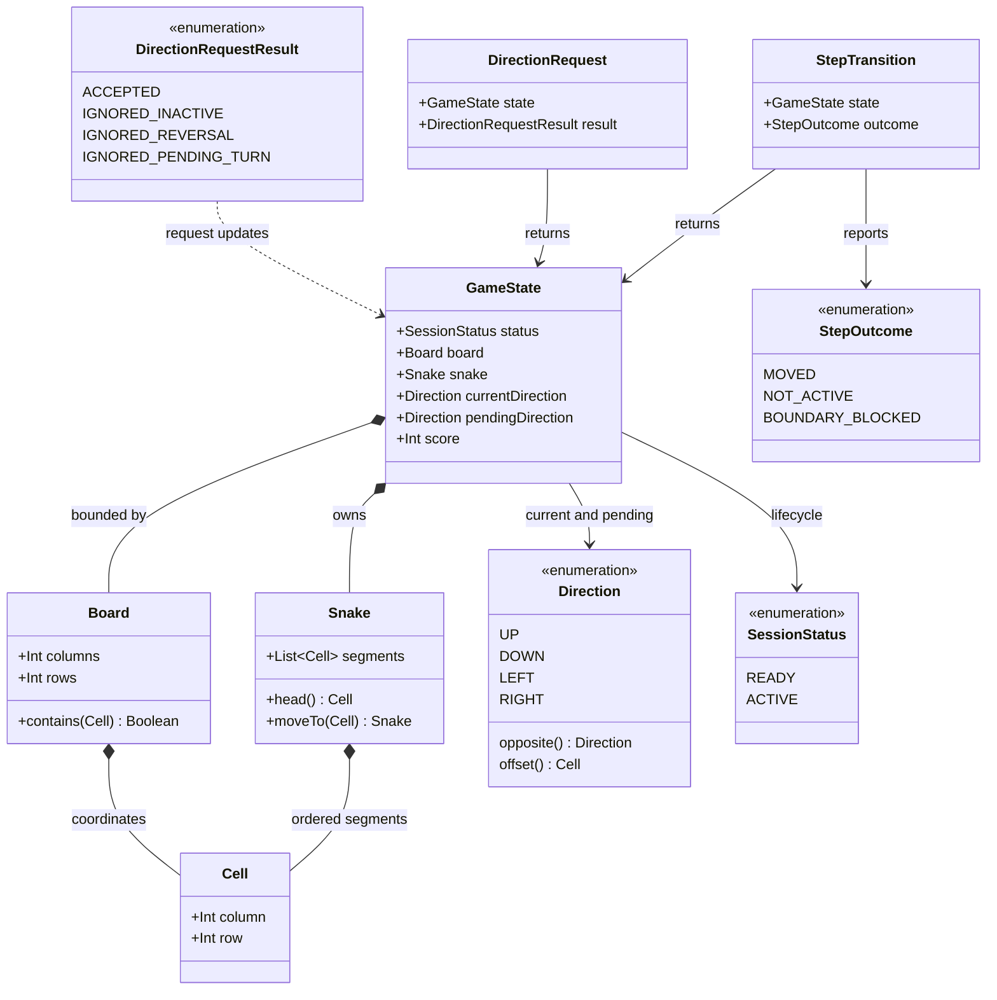

# Start and Control the Snake

## Requirements

Implement the first playable increment of a single-player Snake game so a player can start a session, see a bounded board with a deterministic three-segment snake and score `0`, and steer the continuously moving snake through one shared set of direction rules on desktop and touch-capable targets.

### In-scope behavior

- Present a clear pre-game view with a `Start New Game` action.
- Start a fresh session with a `20 x 20` bounded board, a three-segment snake, an initial direction of `RIGHT`, and current score `0`.
- Place the initial snake deterministically at the center: head `(10, 10)`, followed by `(9, 10)` and `(8, 10)`, with the head first in the body collection.
- Advance the snake by exactly one grid cell for each logical movement step.
- Accept `UP`, `DOWN`, `LEFT`, and `RIGHT` intents from keyboard or visible directional controls.
- Map desktop `ArrowUp`/`W`, `ArrowDown`/`S`, `ArrowLeft`/`A`, and `ArrowRight`/`D` to the same direction intents, case-insensitively for letter keys.
- Apply one accepted turn at the next movement step and continue in the last valid direction when no new input is supplied.
- Reject a direction that is directly opposite the current direction; an ignored request must not end or otherwise alter the session.
- Keep the board, snake, score, and controls usable as the available window or screen size changes.
- Give accepted touch input visible feedback by highlighting the pending direction until it is applied.

### Explicit decisions for this increment

- The supported baseline targets are JVM desktop and Android; additional Compose Multiplatform targets may reuse the same `commonMain` rules without creating target-specific gameplay behavior.
- A session is `READY` before the start action and `ACTIVE` after `startNewGame` completes. Direction input is ignored while `READY`.
- Movement uses a configurable logical interval of `150 ms`. Tests must drive a logical step directly rather than sleeping.
- Only the first valid direction request before a movement step is retained. Repeating that direction is idempotent; other requests before the step are ignored until the pending turn is applied.
- The board never wraps. A step whose next cell is outside the board returns a boundary-blocked result and leaves the state unchanged; boundary collision and game-over behavior belong to `STORY-001-003` and must not be implemented here.
- Food, snake growth, score increases, self-collision, game over, restart after game over, pause, resume, best-score retention, networking, accounts, and persistence are excluded. The score remains `0` throughout this increment.

### Definition of done

- All five story acceptance criteria are covered by deterministic common tests and the target interaction surfaces.
- The same sequence of direction requests and logical steps produces the same common state on desktop and Android.
- The application can be started, a new session can be selected, the board and score are visible, and the snake moves without an account or network connection.
- The domain module can be compiled and tested independently of Compose UI and platform event classes.

## Entities

- `GameState` is the serializable, platform-neutral snapshot used by the UI and controller. The snake's `segments` list is ordered from head to tail.
- `Board` owns only finite coordinate validation; it does not decide collision consequences.
- `Snake` moves by prepending the new head and dropping the tail, preserving exactly three segments in this story because food and growth are out of scope.
- `Direction` is the canonical language shared by keyboard and touch input.
- `DirectionRequest` and `StepTransition` pair the resulting state with an explicit outcome; normal player actions never use exceptions as control flow.

## Approach

1. **Shared deterministic domain model**:
   - Put `Cell`, `Board`, `Direction`, `Snake`, `GameState`, and movement rules in `commonMain` with no Compose, Android, desktop event, or wall-clock dependencies.
   - Represent each movement as a pure transition from one `GameState` to the next. This makes the one-cell rule, reversal invariant, and cross-target consistency directly testable.
   - Keep `score` in the state for the visible contract, initialize it to `0`, and do not introduce food or scoring logic in this increment.

2. **Single state owner and injected clock**:
   - Add a small common `GameController` that owns the current state, exposes a read-only state stream to the UI, accepts canonical direction intents, and advances the domain on logical ticks.
   - Inject a `MovementClock` or equivalent scheduler so production uses the `150 ms` interval while tests call `advance` synchronously without delays.
   - Serialize direction requests and movement ticks through the controller's state update mechanism so a rapid input sequence cannot bypass the one-pending-turn policy.

3. **Compose Multiplatform presentation boundary**:
   - Build one shared `GameScreen` in `commonMain` that renders `READY` and `ACTIVE` states, the bounded grid, the snake, score `0`, and the appropriate controls.
   - Keep desktop key event translation and target capability detection at the presentation/input boundary; both adapters call the same controller method with a `Direction`.
   - Render the board from grid coordinates rather than pixels. Compute a square board size from available constraints and preserve cell aspect ratio so resizing cannot change gameplay coordinates.
   - Use `BoxWithConstraints` to calculate a bounded board size before entering the scrollable content; keep the start action, feedback, and controls reachable in the viewport and reserve a stable one-line slot for transient accepted-turn feedback.

4. **Responsive and accessible controls**:
   - Show keyboard hints on desktop, a four-way visible D-pad on touch-capable targets, and both surfaces on hybrid targets when both capabilities are available.
   - Give every D-pad button a label, testable semantics, a minimum `48 dp` touch target, and a selected state that mirrors the accepted pending direction.
   - Consume recognized desktop key events while the active game surface is focused so arrow keys do not scroll the surrounding window; ignore unknown keys and input outside an active session.

5. **Greenfield project bootstrap**:
   - Create the smallest Kotlin Compose Multiplatform Gradle structure needed for shared domain code, shared UI, JVM desktop, Android, and common tests.
   - Replace the current TypeScript-only development-container assumptions with a verified JDK/Gradle setup (and Android SDK support if Android builds are enabled); do not add application logic to the TypeScript container configuration.
   - Pin build and plugin versions in the Gradle configuration and keep all target entry points thin so gameplay behavior cannot diverge.

## Structure

### Components

1. `composeApp/src/commonMain/.../game/model`: `Cell`, `Board`, `Direction`, `SessionStatus`, `Snake`, and `GameState`.
2. `composeApp/src/commonMain/.../game/rules`: pure direction acceptance and movement transitions, including `DirectionRequestResult` and `StepOutcome`.
3. `composeApp/src/commonMain/.../game/controller`: `GameController`, read-only UI state exposure, and the injected `MovementClock` contract.
4. `composeApp/src/commonMain/.../game/ui`: shared `GameScreen`, board renderer, score display, start action, and touch D-pad.
5. `composeApp/src/desktopMain/...`: desktop application entry point and key-event adapter.
6. `composeApp/src/androidMain/...`: Android application entry point and touch-capability integration.
7. `composeApp/src/wasmJsMain/...`: browser application entry point and browser capability integration.
8. `composeApp/src/commonTest/...`: domain, controller, input mapping, and state-transition tests.

### Dependencies

1. `GameScreen` translates recognized Compose key events through `KeyboardDirectionMapper` and renders its `DirectionControls`/`DirectionButton` touch surface; both input paths send the resulting `Direction` to `GameController`.
2. `GameScreen` observes `GameController` state and sends start and direction actions to it.
3. `GameController` invokes the pure rules for `startNewGame`, `requestDirection`, and `advance`.
4. `MovementClock` invokes `GameController.advance` at the configured interval and is cancelled with the screen/application lifecycle.
5. The domain model depends only on Kotlin standard-library types; it must not depend on Compose or platform UI classes.

### Architecture boundaries

1. **Domain boundary**: Owns board coordinates, snake ordering, lifecycle state, direction validation, one-cell movement, and explicit step outcomes. It must not render, schedule, persist, or detect later-story collisions.
2. **Controller boundary**: Owns mutable session state, action serialization, the movement clock lifecycle, and conversion of domain results into observable UI state.
3. **Presentation boundary**: Owns layout, colors, visual feedback, accessibility semantics, focus, and target-specific input adapters. It must not duplicate movement or reversal rules.
4. **Platform boundary**: Owns only application launch, key-event plumbing, touch capability information, and platform lifecycle integration.
5. **Future extension boundary**: Leave the step result and rule transition seam capable of adding food and collision outcomes in later stories without changing keyboard/touch semantics or the UI's coordinate model.

### State flow

`Start New Game` → `GameController.startNewGame()` → deterministic `ACTIVE` `GameState` → input adapter sends `Direction` → controller accepts at most one pending turn → clock calls `advance()` → shared rules move one cell → `GameScreen` renders the new state.

## Operations

### Create project scaffold - Kotlin Compose Multiplatform application

1. **Responsibility**: Establish a buildable greenfield project for the required shared game experience.
2. **Files and configuration**:
   - Create the Gradle settings, root build configuration, version catalog, Gradle wrapper, and `composeApp` module.
   - Configure Kotlin Multiplatform with `commonMain`, `commonTest`, `desktopMain`, `androidMain`, `wasmJsMain`, and corresponding test/build source sets.
   - Configure Compose Multiplatform dependencies only where UI is needed; keep the domain module free of UI dependencies.
   - Provide thin desktop, Android, and browser launchers that render the shared `GameScreen`.
   - Update `.devcontainer/Dockerfile` and `.devcontainer/devcontainer.json` so the documented container has the JDK/Gradle toolchain required by the project and no longer runs a failing `npm ci` for a missing `package.json`.
3. **Constraints**:
   - Use a single shared rules implementation for every target.
   - Keep versions pinned and make the default build non-network-dependent after dependencies are available.
   - Do not create food, collision, pause, persistence, or best-score modules as part of the scaffold.
4. **Completion criteria**: The project compiles common and target source sets, common tests can be executed, and each supported launcher reaches the shared game screen.

### Create domain primitives - board, coordinates, direction, and lifecycle

1. **Responsibility**: Define validated value types that make invalid coordinates and direction semantics explicit.
2. **Types and contracts**:
   - `data class Cell(val column: Int, val row: Int)`; equality is coordinate-based.
   - `data class Board(val columns: Int = 20, val rows: Int = 20)`; reject non-positive dimensions during construction and expose `contains(cell: Cell): Boolean` for `0 <= column < columns` and `0 <= row < rows`.
   - `enum class Direction { UP, DOWN, LEFT, RIGHT }`; expose a one-cell offset and `opposite()`.
   - `enum class SessionStatus { READY, ACTIVE }`.
   - `data class Snake(val segments: List<Cell>)`; require a non-empty list, keep the head at index `0`, and provide `head()` and `moveTo(nextHead: Cell)` that prepends the head and removes the last segment.
3. **Validation and errors**:
   - Reject an empty snake and invalid board dimensions with descriptive programmer/configuration errors.
   - Keep normal player input failures out of exception paths; those use the result types defined below.
4. **Completion criteria**: The types compile in `commonMain`, have no UI imports, and unit tests cover coordinate boundaries, direction opposites/offsets, and snake ordering.

### Implement game state initialization - `GameState` and `GameRules.startNewGame`

1. **Responsibility**: Create the deterministic initial playable session.
2. **Contract**:
   - `data class GameState(val status: SessionStatus, val board: Board, val snake: Snake, val currentDirection: Direction, val pendingDirection: Direction?, val score: Int)`.
   - `GameRules.startNewGame(board: Board = Board(20, 20)): GameState` returns `ACTIVE`, score `0`, `pendingDirection = null`, direction `RIGHT`, and segments `[Cell(10, 10), Cell(9, 10), Cell(8, 10)]` for the default board.
   - Validate that the deterministic three-cell arrangement is inside the supplied board; either reject a board too small for it or use a clearly documented centered arrangement for larger boards, while the product default remains exactly `20 x 20`.
3. **Business rules**:
   - Starting a new game creates a fresh three-segment snake and does not carry any prior state.
   - There is no food in this state and no score mutation operation in this story.
4. **Completion criteria**: Repeated calls return equivalent fresh states, the three cells are distinct and in bounds, and the initial head is visibly moving right.

### Implement direction acceptance - `GameRules.requestDirection`

1. **Responsibility**: Apply the common validation policy for keyboard and touch intents.
2. **Contract**: `GameRules.requestDirection(state: GameState, requested: Direction): DirectionRequest` returns the resulting state and one of `ACCEPTED`, `IGNORED_INACTIVE`, `IGNORED_REVERSAL`, or `IGNORED_PENDING_TURN`.
3. **Logic**:
   - If `state.status != ACTIVE`, return `IGNORED_INACTIVE` without changing any state.
   - If `requested == state.currentDirection.opposite()`, return `IGNORED_REVERSAL` without changing any state.
   - If `state.pendingDirection` is already non-null and differs from `requested`, return `IGNORED_PENDING_TURN` without changing any state; repeating the same pending direction is idempotent.
   - Otherwise set `pendingDirection = requested` and return `ACCEPTED`.
   - Do not move the snake when accepting an intent; the direction takes effect only in the next logical step.
4. **Completion criteria**: Tests prove that `RIGHT → LEFT` is ignored, valid `UP`/`DOWN`/`RIGHT` requests are accepted from a right-moving state, inactive input is ignored, and rapid conflicting input cannot queue two turns.

### Implement logical movement - `GameRules.advance`

1. **Responsibility**: Apply the pending direction and advance exactly one cell without introducing later collision behavior.
2. **Contract**: `GameRules.advance(state: GameState): StepTransition` returns the resulting state and `MOVED`, `NOT_ACTIVE`, or `BOUNDARY_BLOCKED`.
3. **Logic**:
   - If the state is not `ACTIVE`, return `NOT_ACTIVE` and the unchanged state.
   - Set the effective direction to `pendingDirection ?: currentDirection`; clear `pendingDirection` only when a movement transition succeeds.
   - Compute `nextHead = snake.head() + effectiveDirection.offset()`.
   - If `board.contains(nextHead)` is false, return `BOUNDARY_BLOCKED` with the entire state unchanged, including any pending direction; do not wrap and do not end the session in this story.
   - Otherwise create the next snake by moving to `nextHead`, retain the same length and score, and return `MOVED` with the effective direction as `currentDirection`.
   - Do not inspect the body for collision, add food, grow the snake, or change score; those rules belong to later stories.
4. **Completion criteria**: Tests prove one-cell displacement, pending-direction application at the next step, continued movement with no new input, no movement for inactive state, and safe non-wrapping behavior at the board edge.

### Implement session controller and movement clock - `GameController`

1. **Responsibility**: Serialize user actions and clock ticks around the shared rules and expose observable state to Compose.
2. **Public contract**:
   - `val state: StateFlow<GameState>`.
   - `fun startNewGame()`.
   - `fun requestDirection(direction: Direction): DirectionRequestResult`.
   - `fun advanceForTest(): StepOutcome` for deterministic tests.
   - `fun startClock()` and `fun close()` for production lifecycle management.
3. **Logic**:
   - Initialize the controller in `READY` with score `0` and no active movement task; render the start action before a session begins.
   - `startNewGame` replaces state with `GameRules.startNewGame()` and starts exactly one clock job.
   - Each clock tick runs one `GameRules.advance` transition at the configured `150 ms` interval.
   - Use an atomic/single-owner state update so a direction request racing with a tick is applied either before that tick or on the following tick, never partially.
   - Ignore actions after `close` and cancel the clock job on lifecycle disposal.
4. **Completion criteria**: Controller tests verify ready/active transitions, one clock per session, deterministic `advanceForTest`, no movement in `READY`, and no state mutation after closure.

### Implement target input adapters - keyboard mapping and touch controls

1. **Responsibility**: Translate target events into canonical directions without reproducing game rules.
2. **Keyboard contract**: `KeyboardDirectionMapper.toDirection(key: GameKey): Direction?` maps arrows and `W/A/S/D` as specified, accepts upper- and lowercase letter representations, and returns `null` for unknown keys.
3. **Desktop integration**:
   - In shared `GameScreen`, make the active game surface focusable and request focus after `startNewGame`; translate recognized Compose `Key` values to `GameKey` values before calling `KeyboardDirectionMapper`.
   - Send recognized mappings to `GameController.requestDirection`; consume recognized events only while active; do not allow arrow-key scrolling to replace game input.
4. **Touch integration**:
   - Render `DirectionControls` using `DirectionButton` components labeled `Up`, `Down`, `Left`, and `Right`, with stable semantics labels and click handlers that send the corresponding direction.
   - Reflect `ACCEPTED` by highlighting the pending direction until the next movement step; leave the highlight unchanged for rejected requests.
   - Disable or make controls inert in `READY` and preserve a clear start action instead.
5. **Completion criteria**: Mapping tests cover every required key, unknown keys, case variants, and inactive input; Compose interaction tests verify each D-pad direction and accepted-feedback semantics.

### Build responsive game screen - `GameScreen`

1. **Responsibility**: Render the shared state and target-appropriate controls clearly at supported sizes.
2. **Layout**:
   - Show a labeled `Score: 0` value in both `READY` and `ACTIVE` states.
   - In `READY`, show a bounded preview or board area and a prominent `Start New Game` action; after starting, show the active board and controls.
   - Render exactly `columns * rows` logical cells, with the three snake segments visually distinct from the board and each other as needed to show head orientation.
   - Wrap the screen in `BoxWithConstraints` and calculate `boardSize` from finite `maxHeight` (falling back to `maxWidth`) and `maxWidth - 32.dp`; use a status/capability-aware height fraction (`0.44` in `READY`, `0.34` for touch, `0.58` for keyboard-only) so the square board and surrounding controls remain usable.
   - Place the state/action/control content in a vertically scrollable, `16.dp`-padded column and render `SnakeBoard` with the calculated square size after that content; preserve a `1:1` cell aspect ratio and keep controls outside the board's clipped region.
   - Always reserve one line for accepted-turn feedback. Render `Turn accepted: <direction>` when a pending direction exists and a non-breaking-space placeholder otherwise, with ellipsis for overflow, so feedback never moves the board when it appears or disappears.
   - Show keyboard instructions on desktop, visible D-pad controls on touch targets, and both when the target reports hybrid capability.
3. **Accessibility**:
   - Provide content descriptions for the board, snake direction, score, start action, and all directional controls.
   - Maintain at least `48 dp` touch targets and visible focus/pressed/selected states with sufficient contrast.
   - Do not communicate required state only through color.
4. **Completion criteria**: UI tests find the score label, start action, board, and target-specific controls; resizing keeps all three segments and controls visible and usable without changing the domain coordinates.

### Validate the increment - common and target tests

1. **Responsibility**: Demonstrate all acceptance criteria and prevent later-story behavior from leaking into this increment.
2. **Common domain tests**:
   - Starting creates an active `20 x 20` board, three unique in-bounds segments, direction `RIGHT`, and score `0`.
   - A step moves the head exactly one cell and retains three segments and score `0`.
   - No input causes continued movement in the last valid direction.
   - `UP`, `DOWN`, and `RIGHT` from a right-moving state apply at the next step; `LEFT` is ignored and does not end the session.
   - Unknown input, input before start, repeated pending input, and conflicting rapid input are handled deterministically.
   - Boundary attempts do not wrap or throw and produce the documented boundary-blocked result.
3. **Controller and UI tests**:
   - Verify that a touch tap produces accepted pending-direction feedback and that a rejected reversal does not change it.
   - Verify keyboard and touch adapters produce identical direction intents and equivalent state transitions.
   - Verify the screen shows score `0`, the three-segment snake, the start action, and target-appropriate controls.
4. **Build validation**:
   - Run common tests plus desktop, Android, and Wasm/browser compilation/tests when those targets are configured.
   - Do not use wall-clock sleeps; use manual/fake clocks, direct logical steps, or coroutine virtual time. Include a regression that verifies `CoroutineMovementClock` moves the snake one cell after the default `150 ms` interval under virtual time.
5. **Completion criteria**: All tests pass on the shared rules and every configured target compiles with no food, collision, pause, or persistence behavior introduced.

## Norms

1. **Kotlin and Compose structure**: Use idiomatic Kotlin data classes, sealed results, immutable state snapshots, and explicit nullability. Keep domain code in `commonMain`; use Compose only in UI source sets and platform APIs only in platform adapters.
2. **Dependency management**: Pin Kotlin, Compose, Gradle, and target plugin versions in the version catalog. Prefer the standard library and existing Compose primitives; do not add a service, database, network client, or third-party game engine.
3. **State and concurrency**: Expose read-only `StateFlow` or an equivalent observable state to UI. Update state through one serialized controller path, cancel clock jobs with lifecycle ownership, and never mutate a rendered list in place.
4. **Error handling**:
   - Treat reversal, inactive input, duplicate pending input, and boundary blocking as typed results or no-op state transitions, not user-visible exceptions.
   - Fail fast only for programmer/configuration errors such as non-positive board dimensions or an invalid initial snake.
   - Keep platform event handlers resilient to unknown keys and unavailable focus.
5. **Data validation**: Use zero-based coordinates consistently, preserve head-first snake ordering, validate all initial cells against the board, and keep score explicitly non-negative and fixed at `0` for this story.
6. **Timing**: Advance only on logical ticks from the injected clock; never move the snake once per rendered frame and never call `delay` directly from pure rules or tests. Tests may use coroutine virtual time to exercise the production clock without wall-clock sleeps.
7. **UI and accessibility**: Use stable semantics/test identifiers, meaningful browser-safe labels, minimum touch sizes, visible focus and pending-turn feedback, a reserved status line for transient feedback, and layout constraints that preserve a square board.
8. **Logging**: Do not log every movement step or player key. If lifecycle diagnostics are needed, log only start/close or unexpected configuration failures without sensitive data.
9. **Documentation and tests**: Document non-obvious boundary and pending-input decisions near the public contracts. Name tests after business behavior and keep acceptance coverage in `commonTest` so targets share the same assertions.

## Safeguards

1. **Functional constraints**:
   - A new session always renders a bounded board, exactly three snake segments, direction `RIGHT`, and current score `0`.
   - Each successful logical step changes the head by exactly one grid cell and preserves the last valid direction when no input arrives.
   - `LEFT` while moving `RIGHT` is ignored; it cannot alter the state or end the session by itself.
   - Keyboard and touch inputs must call the same direction acceptance rule and produce equivalent state transitions.
2. **Performance constraints**:
   - Use a configurable `150 ms` logical movement interval in production; input accepted before a tick must be reflected by that tick without waiting for an additional rendered frame.
   - Keep board rendering proportional to the fixed grid and avoid per-frame allocation of platform event or timer objects.
   - Maintain usable D-pad controls with a minimum `48 dp` target and preserve board readability at narrow supported sizes.
3. **Security constraints**: The story is offline and single-player; do not add accounts, analytics, network calls, remote configuration, or storage of player identity.
4. **Integration constraints**:
   - `commonMain` owns all direction, movement, board, and session rules.
   - Desktop, Android, and browser may differ only in launch/lifecycle/event plumbing and capability presentation.
   - Do not make Gradle, Compose, Android, or desktop classes visible from the pure domain contracts.
5. **Business rule constraints**:
   - Immediate reversal is invalid relative to the current direction.
   - At most one valid turn can be pending for a movement step; later conflicting requests cannot bypass reversal protection.
   - The snake starts with three segments and cannot grow in this increment.
   - The current score remains `0`; no food may be created or collected.
6. **Error-handling constraints**:
   - Expected player actions that are invalid or unavailable must be safe no-ops with typed internal results.
   - Boundary attempts must never wrap, index outside the board, crash, or silently create an invalid coordinate.
   - Do not expose stack traces or internal configuration details in the game view.
7. **Technical constraints**:
   - Use Kotlin Compose Multiplatform with a shared domain and shared screen; do not implement separate desktop and Android game loops.
   - Use deterministic state transitions and injected clocks so all acceptance tests run without real-time sleeps.
   - Leave explicit extension points for later food and collision stories, but do not implement their outcomes now.
8. **Data constraints**:
   - Default board dimensions are `20 x 20`; coordinates are zero-based and every initial segment is in bounds and unique.
   - The snake collection is head-first and contains exactly three cells for every successful step in this story.
   - Score is a non-negative integer initialized and retained as `0`.
9. **UI and boundary constraints**:
   - Before start, direction controls are inert and the player can identify how to start.
   - During play, the board, score, snake orientation, and target-appropriate controls are simultaneously discoverable.
   - Accepted touch input has visible selected feedback; rejected input must not present itself as accepted.
   - The accepted-turn feedback line must not shift the board or controls when it appears or disappears; directional controls use the literal labels `Up`, `Down`, `Left`, and `Right` for browser-compatible rendering.
   - No game-over, pause, best-score, restart-after-collision, food, or growth controls may appear in this increment.
