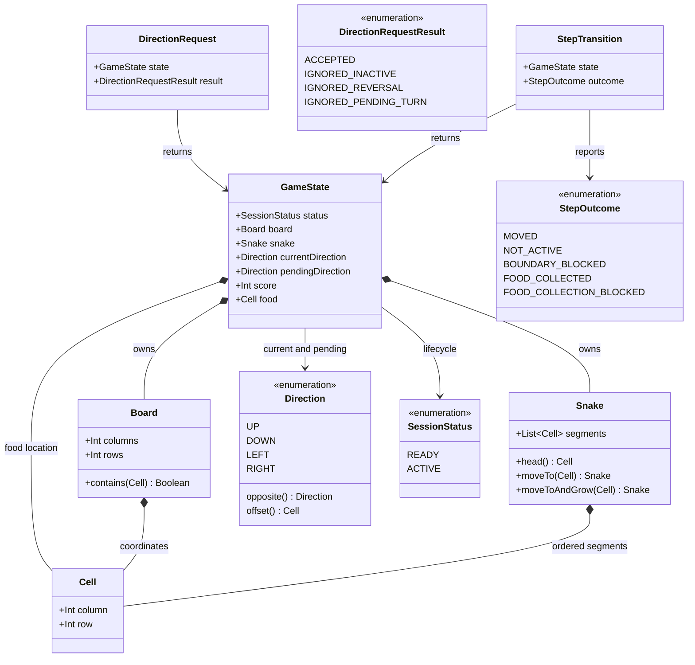

# Eat Food and Build Score

## Requirements

Extend the shared Snake session so that a player has exactly one visible, valid food target and each successful collection atomically grows the snake by one segment and increases the current score by `10`.

### In-scope behavior

- Add one authoritative food location to the immutable `GameState`; represent it as a `Cell` rather than introducing a wrapper entity for a single coordinate.
- Create the food during `GameRules.startNewGame` and replace it after every successful collection.
- Keep the food location inside `Board` and strictly outside every current snake segment.
- Use one bounded random placement policy in `commonMain`: scan rows from `0` through `board.rows - 1` and columns from `0` through `board.columns - 1`, collect the cells not occupied by the snake, and select one with the supplied common `Random` source.
- Preserve the existing one-cell movement and accepted-direction behavior when the next head is not food.
- When the next head enters the food cell, retain the old tail while adding the new head, add exactly `10` to `score`, and select a replacement food cell from the resulting snake occupancy as one logical transition.
- Render the food marker through the existing shared `SnakeBoard` and keep the current reactive score display; use a visual treatment distinct from the green snake and the board.
- Keep all gameplay decisions in `commonMain` so Android, desktop JVM, and browser targets observe equivalent state transitions.

### Explicit decisions for this increment

- The `GameState` invariant is that `food` is always one non-null `Cell` inside the board and not contained in `snake.segments`, including the `READY` snapshot used by the existing controller preview.
- For the default `20 x 20` board, the common rules select the food from all unoccupied cells using the supplied `Random` source. A seeded source makes the position repeatable for tests; it is not generated independently by a UI or platform entry point.
- “Reachable within the bounded board” means the food is a valid, unoccupied in-bounds cell. Path-finding, obstacles, and self-collision consequences are not introduced because they belong to the later collision story.
- A collection is committed only when a replacement cell exists after growth. If a manually constructed or near-capacity state has no free replacement cell, return a typed `FOOD_COLLECTION_BLOCKED` transition with the state unchanged; do not add a game-over status, silently remove food, loop while searching, or overlap the snake.
- Starting a game on a board that has no free cell after the initial three-segment snake is rejected as an invalid board configuration, preserving the exactly-one-food invariant.
- The existing `READY`/`ACTIVE` lifecycle, `150 ms` clock, direction rules, boundary blocking, and current score presentation remain in force.

### Explicitly out of scope

- Self-collision consequences, boundary game-over behavior, restart after game over, pause/resume, levels, power-ups, bonus scoring, multiple food items, best-score retention, persistence, accounts, networking, and target-specific gameplay rules.

### Definition of done

- A fresh session exposes exactly one food cell selected from the in-bounds cells absent from the three-segment snake.
- A successful food step produces one immutable state publication containing the grown snake, score increased by exactly `10`, the applied direction, and one replacement food cell.
- Two successful collections preserve both increments, resulting in five snake segments from the initial three and a current score of `20`.
- Ordinary movement, pending-turn behavior, inactive no-ops, and boundary blocking retain their existing semantics and never mutate score or food incorrectly.
- Common tests cover valid placement, invalid placement state, collection, replacement, accumulation, blocked capacity, and regression movement behavior; configured targets compile against the shared implementation.
- The shared screen visibly distinguishes one food marker and keeps the score immediately synchronized with the collection state.

## Entities

- `GameState` remains the single platform-neutral snapshot observed by `GameController` and `GameScreen`; its `food` cell is the authoritative target rather than a value inferred by rendering.
- `Cell` is reused for both coordinates and the food location. Do not add a `Food` data class, repository, service, or persistence layer for a single active coordinate.
- `Snake` retains head-first ordering. `moveTo` keeps its existing tail-dropping behavior, while `moveToAndGrow` retains the old tail for a collection step.
- `StepTransition` reports whether a step moved normally, collected food, was blocked by the board, or was safely prevented by replacement-capacity exhaustion.
- `DirectionRequest`, `Board`, `Direction`, and lifecycle semantics remain existing concepts; their contracts must not be reimplemented separately for food.

## Approach

1. **Extend the shared immutable session model**:
   - Add one non-null `food: Cell` field to `GameState` and validate that it is in the associated `Board` and absent from the snake.
   - Initialize and replace food only in `GameRules`, preserving `GameController` as the state owner and `GameScreen` as a state consumer.
   - Keep the model free of Compose, Android, desktop, browser, clock, and random-generator dependencies; keep randomness in common rules/controller injection rather than UI or platform code.

2. **Use bounded random placement**:
   - Implement one private common-rule helper that scans every board coordinate in row-major order, collects unoccupied cells, and selects one with the supplied common `Random` source.
   - Use the helper after initial snake creation and after the grown snake has been computed; never select a coordinate by unchecked retries or by platform-specific randomness.
   - Treat an absent result as a capacity condition. Reject an initial board with no free cell and safely block a pathological collection that cannot leave one replacement target, without changing session status.

3. **Make collection one atomic progression**:
   - Determine the effective direction using the existing pending-turn policy, calculate the next head, and retain the existing boundary no-op precedence.
   - For a food-reaching step, construct the grown snake, find a replacement against that grown occupancy, and then publish one `GameState` containing the new snake, `score + 10`, cleared pending direction, effective current direction, and replacement food.
   - For a non-food step, continue using `Snake.moveTo`, preserve score and food, and return `MOVED`.
   - Do not expose intermediate states where score, growth, or food replacement disagree.

4. **Preserve controller and cross-target behavior**:
   - Keep `GameController`'s `MutableStateFlow.update` path as the single state publication boundary; its clock and input APIs continue to call the shared rules.
   - Return the new step outcomes through `advanceForTest` without adding a second food loop or target-specific controller behavior.
   - Keep Android, desktop JVM, and Wasm/browser entry points thin and unchanged except for any required shared-state rendering compilation updates.

5. **Render an immediately recognizable target**:
   - Draw one food marker from `state.food` in the existing `SnakeBoard` after the board/grid and before or alongside the non-overlapping snake cells.
   - Choose a stable high-contrast warm color or shape that is visibly distinct from both the pale board and green snake; do not communicate the target only through color.
   - Extend board semantics to describe the single food item while retaining the existing score semantics and responsive layout.

6. **Verify the business transition in common tests**:
   - Test the pure rules for initial placement, normal movement, immediate collection, replacement exclusion, repeated accumulation, direction application, inactive behavior, boundary behavior, and capacity exhaustion.
   - Test controller publication with the injected random source and manual clock for repeatable logical steps; do not use wall-clock sleeps.
   - Add or extend available Compose semantics/smoke coverage so the score and one food marker are discoverable without creating target-specific gameplay rules.

## Structure

### Components

1. `composeApp/src/commonMain/kotlin/com/example/snake/game/model/GameState.kt`: immutable session snapshot with the existing lifecycle, board, snake, direction, score, and one validated food cell.
2. `composeApp/src/commonMain/kotlin/com/example/snake/game/model/Snake.kt`: head-first body operations, retaining `moveTo` and adding the smallest growth operation required by collection.
3. `composeApp/src/commonMain/kotlin/com/example/snake/game/rules/GameRules.kt`: initialization, bounded random free-cell selection, direction handling, boundary handling, normal movement, and atomic food collection.
4. `composeApp/src/commonMain/kotlin/com/example/snake/game/rules/StepOutcome.kt` and `StepTransition.kt`: typed step results carrying the complete resulting state.
5. `composeApp/src/commonMain/kotlin/com/example/snake/game/controller/GameController.kt`: single mutable state owner, state-flow publication, input serialization, and clock lifecycle; no duplicate food logic.
6. `composeApp/src/commonMain/kotlin/com/example/snake/game/ui/GameScreen.kt`: existing score and board presentation extended with the food marker and food-aware board semantics.
7. `composeApp/src/commonTest/kotlin/com/example/snake/game/GameRulesTest.kt`: common domain and state-invariant coverage.
8. `composeApp/src/commonTest/kotlin/com/example/snake/game/GameControllerTest.kt`: clock-driven state propagation and collection outcome coverage where the existing controller seam permits it.

### Dependencies

1. `GameRules.startNewGame` creates the initial `GameState` and obtains its food from the shared bounded random-placement helper using the supplied `Random` source.
2. `GameRules.advance` calls `Board.contains`, `Snake.head`, `Snake.moveTo`, and `Snake.moveToAndGrow`; it selects replacement food with the supplied `Random` source before constructing the successful collection state.
3. `GameController` calls `GameRules.requestDirection` and `GameRules.advance` inside its existing serialized `_state.update` blocks and exposes the resulting immutable snapshot through `StateFlow`.
4. `SnakeApp` continues collecting `GameController.state` and passes it to `GameScreen`; no UI component calculates or stores food independently.
5. `GameScreen.SnakeBoard` reads `state.food` and renders it using the same board coordinate-to-pixel conversion as the snake.
6. The domain model and rules depend only on Kotlin/common types; Compose and platform event classes remain outside gameplay contracts.

### Architecture boundaries

1. **Domain boundary**: Owns food validity, bounded random placement, growth, score increments, step outcomes, and all state-transition invariants. It does not render, schedule, persist, or implement future collision consequences.
2. **Controller boundary**: Owns mutable state publication and movement-clock lifecycle. It delegates all food decisions to `GameRules` and publishes collection as one `StateFlow` update.
3. **Presentation boundary**: Owns food shape/color, board semantics, score text, layout, and accessibility. It never detects collection from pixels or changes the score.
4. **Platform boundary**: Owns only launch, lifecycle, input plumbing, and capability reporting. Equivalent movement sequences must not use different food-placement or collection code; repeatable tests provide equivalent common random sources.
5. **Capacity boundary**: Handles the finite-board no-replacement condition as a typed, non-terminal blocked transition; it must not leak into the later game-over status model.

### State flow

`startNewGame` → active `GameState` with one randomly selected free-cell food → input request optionally sets `pendingDirection` → clock calls `GameRules.advance` → boundary check → normal `moveTo` or food `moveToAndGrow` plus `score + 10` and random replacement selection → one `StepTransition` publication → `GameScreen` renders the matching score, snake, and one food marker.

## Operations

### Update session model - `GameState`

1. **Responsibility**: Represent the complete state needed to render and progress one active session, including the authoritative food target.
2. **Contract**: Preserve the existing fields and add `val food: Cell` to the data class, for example:
   - `data class GameState(val status: SessionStatus, val board: Board, val snake: Snake, val currentDirection: Direction, val pendingDirection: Direction?, val score: Int, val food: Cell)`
3. **Validation**:
   - Retain `require(score >= 0)`.
   - Add `require(board.contains(food))` with a descriptive configuration error.
   - Add `require(food !in snake.segments)` with a descriptive invariant error.
   - Do not add a separate `Food` wrapper or introduce collision validation for the entire snake; those are not required by this story.
4. **State construction updates**:
   - Update every named `GameState` construction in `GameRulesTest`, `GameControllerTest`, and production code to supply a valid food cell.
   - Ensure the controller's `READY` state is still derived from a valid `startNewGame()` state, then copied to `READY` without losing food.
5. **Completion criteria**: Every state emitted or constructed by the feature contains exactly one in-bounds, non-overlapping food cell and retains immutable value semantics.

### Add snake growth primitive - `Snake.moveToAndGrow`

1. **Responsibility**: Support the one-segment increase required only when the next head reaches food.
2. **Contract**: Add `fun moveToAndGrow(nextHead: Cell): Snake` that returns `Snake(listOf(nextHead) + segments)`.
3. **Logic**:
   - Keep the new head at index `0`.
   - Retain every existing segment, including the current tail, so the result length is exactly `segments.size + 1`.
   - Leave `moveTo(nextHead)` unchanged: it must still prepend the head and drop the last segment for ordinary movement.
   - Do not add self-collision or duplicate-segment rules; the food cell is already validated as outside the old snake and collision consequences belong to the later story.
4. **Completion criteria**: Existing movement tests remain unchanged in behavior, and a growth test proves a three-segment snake becomes the expected four-segment head-first list.

### Implement bounded random placement - `GameRules.randomUnoccupiedCell`

1. **Responsibility**: Select a valid target from the bounded free-cell set without unbounded retry behavior.
2. **Contract**: Add a private helper equivalent to `private fun randomUnoccupiedCell(board: Board, snake: Snake, random: Random): Cell?`.
3. **Logic**:
   - Iterate `row` in `0 until board.rows` and `column` in `0 until board.columns`.
   - Construct `Cell(column = column, row = row)` for each coordinate and append it when `candidate !in snake.segments`.
   - Return `null` after the finite scan if no candidate exists; otherwise return `availableCells[random.nextInt(availableCells.size)]`.
   - Never loop indefinitely, use unchecked out-of-bounds coordinates, or select a marker independently in the UI.
4. **Completion criteria**: The helper selects only in-bounds cells outside the snake, is repeatable when equivalent seeded random sources are supplied, can select lower-row cells, and returns `null` for a completely occupied board.

### Update new-session initialization - `GameRules.startNewGame`

1. **Responsibility**: Start a fresh session with a valid target and score baseline.
2. **Contract**: Preserve `fun startNewGame(board: Board = Board(20, 20), random: Random = Random.Default): GameState` and its current centered three-segment arrangement, `RIGHT` direction, `null` pending direction, `ACTIVE` status, and score `0`.
3. **Logic**:
   - Build and validate the existing centered initial segments exactly as before.
   - Call `randomUnoccupiedCell(board, Snake(initialSegments), random)`.
   - Fail fast with a descriptive `IllegalArgumentException` if no free cell exists for the initial food; do not return a state with absent or overlapping food.
   - Construct the new `GameState` with the selected food cell and all existing initial values.
   - Do not carry score, snake growth, direction intent, or food from any previous state.
4. **Completion criteria**: Calls with equivalent seeded random sources return equivalent fresh states; default calls always select an in-bounds cell outside `(10, 10)`, `(9, 10)`, and `(8, 10)`, and the existing board-size validation remains intact.

### Extend logical progression - `GameRules.advance`

1. **Responsibility**: Apply one pending/current direction and produce the complete normal-move or collection transition.
2. **Contract**: Preserve `fun advance(state: GameState, random: Random = Random.Default): StepTransition` and existing `NOT_ACTIVE`, `MOVED`, and `BOUNDARY_BLOCKED` semantics; add `FOOD_COLLECTED` and `FOOD_COLLECTION_BLOCKED` to `StepOutcome`.
3. **Common logic**:
   - Return `StepTransition(state, NOT_ACTIVE)` unchanged when `state.status != ACTIVE`.
   - Use `state.pendingDirection ?: state.currentDirection` as the effective direction.
   - Compute the next head from the current head and the direction offset.
   - If the next head is outside the board, return `BOUNDARY_BLOCKED` with the entire state unchanged, including `pendingDirection`, score, snake, and food.
4. **Normal movement logic**:
   - If `nextHead != state.food`, call `state.snake.moveTo(nextHead)`.
   - Return `MOVED` with the effective direction, cleared pending direction, unchanged score, and unchanged food.
5. **Collection logic**:
   - If `nextHead == state.food`, call `state.snake.moveToAndGrow(nextHead)` first.
   - Call `randomUnoccupiedCell(state.board, grownSnake, random)` using the grown occupancy, not the old snake.
   - If the helper returns `null`, return `StepTransition(state, FOOD_COLLECTION_BLOCKED)` unchanged. This is a safe capacity guard, not a game-over transition.
   - Otherwise construct one copied state with `snake = grownSnake`, `score = state.score + 10`, `food = replacement`, `currentDirection = effectiveDirection`, and `pendingDirection = null`.
   - Return `FOOD_COLLECTED`; the replacement must differ from the collected location because that location is now the new head.
6. **Completion criteria**: No transition exposes growth without the score award, an award without replacement food, a food cell under the snake, or altered state for a blocked boundary/capacity case.

### Preserve controller state ownership - `GameController`

1. **Responsibility**: Continue serializing direction requests and logical ticks while exposing the new rule outcomes and state fields.
2. **Required changes**:
   - Keep `val state: StateFlow<GameState>`, `startNewGame`, `requestDirection`, `advanceForTest`, `startClock`, and `close` APIs, and allow the constructor to receive `random: Random = Random.Default` for placement injection.
   - Keep `startNewGame` and the `READY` snapshot based on `GameRules.startNewGame(random = random)` so each receives a fresh score, snake, and food.
   - Keep each tick inside the existing `_state.update` block and assign the entire `transition.state`; do not call separate updates for snake, score, and food.
   - Call `GameRules.advance(currentState, random = random)` and let `advanceForTest()` return `FOOD_COLLECTED` or `FOOD_COLLECTION_BLOCKED` without translating either into a game-over status.
   - Preserve one clock job, the `150 ms` default, inactive input behavior, and close cancellation.
3. **Completion criteria**: A clock tick that collects food makes the controller state simultaneously show the longer snake, score increase, and replacement food; closing the controller prevents later ticks from changing that snapshot.

### Render the target - `GameScreen.SnakeBoard`

1. **Responsibility**: Make the authoritative food cell visible and immediately distinguishable without duplicating domain logic.
2. **Rendering logic**:
   - Keep the existing `cellWidth` and `cellHeight` coordinate conversion and draw the board background/grid as before.
   - Draw exactly one marker at the center of `state.food`, using a stable high-contrast color and/or shape distinct from `Color(0xFF1B5E20)`, `Color(0xFF43A047)`, and the board colors.
   - Render the food from `state.food` only; do not create a random marker, derive a second position, or draw a marker for every free cell.
   - Continue drawing the snake from `state.snake.segments`; the domain invariant guarantees the food and snake do not overlap.
3. **Accessibility and layout**:
   - Extend the board `contentDescription` to state that the bounded board contains exactly one food item, while retaining its dimensions and segment count.
   - Keep the existing `Score: ${state.score}` text and `Current score: ${state.score}` semantics so the score changes in the same recomposition as the board.
   - Preserve the square responsive board, scrolling layout, keyboard/touch controls, focus behavior, and all existing target capability handling.
4. **Completion criteria**: The `READY` and `ACTIVE` board rendering exposes one visually distinct food target, and a collected location is absent from the rendered food because the state now contains only the replacement cell.

### Validate food progression - common and target tests

1. **Responsibility**: Demonstrate every acceptance criterion and prevent later-story behavior from leaking into this increment.
2. **Mandatory common rule tests**:
   - Fresh initialization creates one food cell, selects a valid free cell using the supplied random source, keeps it in bounds, and keeps it outside all three initial segments.
   - `GameState` rejects a food cell outside the board and a food cell equal to a snake segment.
   - Ordinary movement advances one cell, preserves snake length and score, and leaves food unchanged when the next head is not food.
   - A state with food one step ahead returns `FOOD_COLLECTED`, grows a three-segment snake to four, changes score from `0` to `10`, clears pending direction, and returns one in-bounds replacement outside the grown snake.
   - A pending valid turn that enters food collects using the effective direction; an invalid reversal remains ignored.
   - Two explicitly arranged collection steps produce five segments from the three-segment start and score `20`, without resetting the first award.
   - Boundary blocking and inactive advancement remain unchanged and do not award, grow, replace, or discard pending direction.
   - A four-cell board with three occupied snake cells and one food cell safely returns `FOOD_COLLECTION_BLOCKED` when growth would leave no replacement cell, with the original state unchanged and no game-over status.
   - Repeated initialization and replacement selection with equivalent seeded/custom sources are repeatable, finite, and never choose an occupied or out-of-bounds cell; coverage also demonstrates that a lower-row cell can be selected.
3. **Controller tests**:
   - Use the existing manual movement clock and virtual time patterns; never sleep.
   - Verify that a collection tick publishes one state containing the new score, new snake length, and replacement food, and that the returned outcome is `FOOD_COLLECTED`.
   - Retain regressions for one clock per start, ready/inactive behavior, direction requests, and no state mutation after close.
4. **Presentation tests or smoke coverage**:
   - Extend the available Compose semantics/smoke test harness, if present, to find the score and board description containing one food item.
   - Verify the food marker is drawn from the state coordinate and remains distinct at narrow supported sizes; do not add a platform-specific game rule or a new test dependency solely to inspect pixels.
5. **Build validation**:
   - Run all relevant common tests and compile/test every configured Android, desktop JVM, and Wasm/browser target that the project supports.
   - Confirm there are no new dependencies, no wall-clock timing in tests, and no collision/game-over behavior introduced.
6. **Completion criteria**: The full relevant test suite passes, all configured targets compile, and all five story acceptance criteria are demonstrable from the shared rules, controller, and screen.

## Norms

1. **Kotlin and state modeling**: Follow the existing Kotlin data-class, enum, immutable-copy, naming, indentation, and import conventions. Reuse `Cell` for the food coordinate and avoid a wrapper object or abstraction that does not carry additional required behavior.
2. **Shared implementation**: Keep placement, collection, growth, score, and capacity decisions in `commonMain`; platform source sets may only provide launch, lifecycle, and input plumbing.
3. **State publication**: Treat `GameState` as an immutable snapshot. Apply collection through one `StateFlow` update so Compose cannot observe a partially changed snake, score, or food.
4. **Placement**: Use the finite row-major scan to build the current free-cell set, then select one cell with an injected common `Random`; do not use `Math.random`, platform-specific random sources, retry loops, timers, or UI coordinates.
5. **Result handling**:
   - Represent normal player and capacity outcomes with `StepOutcome` values and unchanged-state transitions where appropriate.
   - Reserve exceptions for programmer/configuration errors such as invalid board dimensions, an invalid initial arrangement, or a manually constructed invalid food invariant.
   - Do not turn capacity exhaustion into a new session status or expose stack traces in the game view.
6. **Movement and timing**: Keep one-cell logical movement, accepted pending-turn semantics, boundary no-op behavior, the configurable `150 ms` production interval, and direct/virtual-time tests. Never move from a Compose frame or use real sleeps in tests.
7. **Rendering and accessibility**: Reuse the existing square board coordinate conversion, responsive layout, and score semantics. Give the food a stable high-contrast visual treatment and mention the one-food invariant in board semantics; never rely on color alone for required state.
8. **Testing**: Name tests after business behavior, keep rule invariants and seeded random scenarios in `commonTest`, arrange adjacent food through valid state construction rather than pixel or event simulation, and include both negative and near-capacity cases.
9. **Dependencies and logging**: Use existing Kotlin, Compose, and coroutine dependencies only. Do not add a database, service, network client, game engine, analytics, or per-tick/player-input logging.
10. **Documentation**: Document only non-obvious public or boundary decisions, especially bounded random placement with injectable common randomness and the non-terminal `FOOD_COLLECTION_BLOCKED` capacity guard, matching the existing comment frequency and style.

## Safeguards

1. **Functional constraints**:
   - Every valid `GameState` has exactly one `food` cell inside its board and outside its snake.
   - Every successful collection adds exactly one segment and exactly `10` points, replaces food, and publishes those changes together.
   - The collected cell is never the replacement cell because the grown head occupies it.
   - Normal movement retains the existing snake length, score, and food; direction and boundary behavior cannot regress.
   - The active screen renders exactly one food marker and the current score from the same state snapshot.
2. **Performance constraints**:
   - Placement must inspect at most `board.columns * board.rows` candidates, select from the resulting finite list, and never retry indefinitely.
   - A collection performs one bounded scan and one immutable transition; it must not start a coroutine, add a clock, or update state field-by-field.
   - Preserve the existing `150 ms` logical movement interval and responsive board sizing without frame-driven gameplay.
3. **Security and privacy constraints**: Keep the feature offline and single-player. Do not add accounts, network calls, remote configuration, persistence, analytics, or identity data.
4. **Integration constraints**:
   - `GameRules` is the only authority for placement, collection, growth, and score mutation.
   - `GameController`, `GameScreen`, Android, desktop, and browser code must not independently generate or infer food.
   - Keep the domain contracts free of Compose, Android, desktop, browser, and wall-clock types.
5. **Business rule constraints**:
   - Initial score is `0`; each collection increments the current score by exactly `10`, and repeated collections accumulate.
   - Initial snake length is `3`; after two committed collections its length is `5`.
   - Initial and replacement targets are selected from all unoccupied cells using the supplied common random source; equivalent seeded sources produce equivalent selections, while different random values may choose different valid rows.
   - A food-reaching step is committed only when a replacement target can be selected after growth; otherwise it is a typed unchanged-state capacity block, not game over.
   - Collision consequences, pause, restart-after-game-over, bonus scoring, power-ups, levels, and multiple targets remain absent.
6. **Error-handling constraints**:
   - Invalid board dimensions, an initial snake that does not fit, and an initial board with no free food cell fail fast as configuration errors.
   - Invalid manually constructed food state fails validation rather than being silently repaired.
   - Boundary blocking, inactive progression, and replacement-capacity exhaustion are safe typed transitions with no partial mutations.
   - Do not expose internal exception messages, stack traces, or implementation details through the UI.
7. **Technical constraints**:
   - Preserve existing public APIs unless adding the minimal `Snake.moveToAndGrow` operation and the two explicit step outcomes is required.
   - Do not add a platform-specific random source, repository, service, persistence model, or separate platform game loop; use the injectable common `kotlin.random.Random` source owned by the rules/controller path.
   - Keep transitions reproducible with an injected seeded source and testable without sleeping.
8. **Data constraints**:
   - Coordinates are zero-based; `0 <= column < columns` and `0 <= row < rows` for food.
   - The food cell must not equal any member of `snake.segments` before or after a transition.
   - `score` remains a non-negative integer and is changed only by `+10` on `FOOD_COLLECTED`.
   - The snake collection remains head-first, and a committed collection increases its size by exactly one.
9. **UI and boundary constraints**:
   - The board, score, snake, and one food target remain discoverable in both `READY` and `ACTIVE` presentations.
   - Food must be visibly distinct from the board and both snake colors, with semantics that identify the presence of one target without relying only on hue.
   - The food marker must use board coordinates and remain aligned with cells when the responsive board is resized.
   - No food, score, growth, or placement behavior may be implemented in keyboard mapping, touch controls, platform launchers, or Compose callbacks.