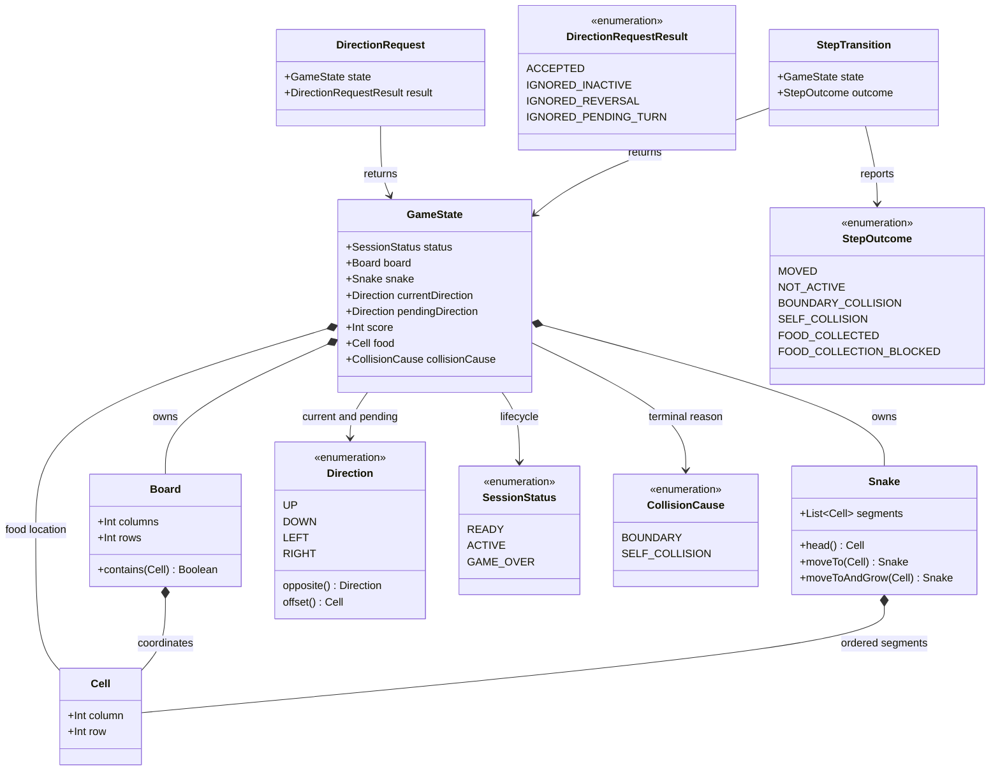

# Finish and Restart a Game

## Requirements

Extend the shared Snake session so that boundary and self-collisions produce an understandable terminal result, preserve the final score, and let the player restart a clean game from the existing game view.

### Scope and behavior

- Add an explicit terminal lifecycle state to the existing `READY`/`ACTIVE` session model.
- Detect an attempted next head outside the `Board` as a boundary collision; the board must remain bounded and must not wrap.
- Detect an attempted next head contained in any current `Snake.segments` cell as a self-collision, including the tail cell; use the literal current-body policy and do not add a moving-tail exception.
- Preserve the last valid snake layout, score, and food in the terminal snapshot while recording the collision cause; do not render an out-of-bounds or duplicate collision segment.
- Keep the terminal snapshot immutable and absorbing: clock ticks and direction requests cannot move the snake, collect food, change the score, or clear the cause.
- Show a same-view game-over presentation containing an explicit game-over label, a textual boundary or self-collision explanation, the final score, and a restart action.
- Reuse the existing fresh-session initialization contract for restart: a three-segment centered snake, `Direction.RIGHT`, no pending direction, score `0`, and exactly one in-bounds food cell outside the snake.
- Keep all lifecycle, collision, score, food, and movement decisions in `commonMain` so Android, desktop JVM, and Wasm/browser targets share the same behavior.

### Acceptance behavior

1. **Boundary collision**: When an active snake attempts to move beyond any board edge, publish one terminal state with the boundary cause, stop the movement clock, leave the snake stopped, and render a clear game-over message.
2. **Self-collision**: When an active snake with at least four segments targets any occupied body cell, publish one terminal state with the self-collision cause, stop the movement clock, leave the snake stopped, and render a clear game-over message.
3. **Final score**: A terminal transition from a state with score `30` retains `30` in the observable state and keeps it visible beside the game-over result; the result identifies how to start another game.
4. **Fresh restart**: Activating restart replaces the terminal snapshot with a newly initialized active state containing three segments, score `0`, and one valid food cell that is in bounds and unoccupied.
5. **Input blocking**: Direction requests and directional controls after game over are inert; repeated keyboard presses, touch taps, and clock ticks leave the terminal state unchanged until restart.

### Explicit decisions

- Represent the lifecycle as `SessionStatus.READY`, `SessionStatus.ACTIVE`, or `SessionStatus.GAME_OVER`, and represent a terminal reason as `CollisionCause.BOUNDARY` or `CollisionCause.SELF_COLLISION`.
- Make `GameState.collisionCause` nullable only for non-terminal states: `READY` and `ACTIVE` require `null`, while `GAME_OVER` requires a non-null cause. Retain the existing score, board, snake, direction, and food invariants.
- Evaluate the effective direction and next head first, then check board containment, then current-body occupancy, then food collection. Food is already outside the current body, so a body collision must never be mistaken for collection.
- On collision, retain the pre-step snake, score, and food, clear `pendingDirection`, set `status` and `collisionCause`, and return a typed collision outcome. The attempted cell is an event target, not a new segment in the terminal snapshot.
- Replace the old boundary no-op meaning with a terminal boundary outcome. Preserve `FOOD_COLLECTION_BLOCKED` as a non-terminal capacity result when a grown snake leaves no replacement food cell.
- Use the existing `GameController.startNewGame()` as the restart operation; cancel or invalidate the old movement job before installing the new state and ensure exactly one clock is active afterward.

### Explicitly out of scope

- Best-score retention, score persistence, accounts, networking, or external services.
- Pause/resume, lives, continues, undo, recovery, levels, power-ups, or alternative collision rules.
- Board wrapping, obstacles, path-finding, target-specific gameplay logic, or a second food item.
- A separate repository, service, navigation route, application restart, or complex wrapper entity for a single collision cause or food coordinate.

### Definition of done

- Every collision direction at every board edge terminates the active session without wrapping and exposes `CollisionCause.BOUNDARY`.
- Every attempted entry into any occupied pre-step body cell, including the tail, exposes `CollisionCause.SELF_COLLISION` without duplicating or moving the terminal snake.
- The terminal score and cause remain stable across later ticks and all input surfaces.
- Restart produces a valid active state with exactly three snake segments, score `0`, one unoccupied in-bounds food cell, and one movement schedule.
- Common rules and controller tests cover both causes, score `30` retention, terminal no-ops, restart, stale/repeated ticks, food-capacity regression, and existing movement/collection behavior.
- The shared screen renders the final score, readable cause text, and an accessible restart action in the same view on all configured targets.

## Entities

- `GameState` remains the single platform-neutral session snapshot consumed by `GameController` and `GameScreen`; `collisionCause` is the authoritative explanation for a terminal state rather than a value inferred from a stopped clock or rendered pixels.
- `Cell` remains the value type for coordinates and food. Do not introduce `Food`, `Collision`, or result-wrapper entities when the existing `Cell` and enum types express the requirement.
- `Snake` retains head-first ordering and its existing `moveTo`/`moveToAndGrow` behavior. Collision detection reads the existing segment list before either movement operation.
- `StepTransition` continues to return the complete resulting state and a typed `StepOutcome`; collision outcomes are expected domain results, not exceptions.
- `DirectionRequest` and `DirectionRequestResult` retain their current contract. A request against `READY` or `GAME_OVER` returns `IGNORED_INACTIVE` and the unchanged state.

## Approach

1. **Extend the shared immutable lifecycle**:
   - Add `GAME_OVER` to `SessionStatus` and add a small `CollisionCause` enum in the existing model package.
   - Add a nullable `collisionCause` to `GameState` with an invariant coupling it to `status`; retain validation for non-negative score and unoccupied in-bounds food.
   - Keep `READY` derived from a valid fresh game, so the controller preview continues to satisfy the food invariant without a second initialization path.

2. **Make `GameRules` the collision authority**:
   - Keep effective-direction buffering and one-cell movement unchanged for active non-collision steps.
   - In `advance`, calculate `nextHead`, reject an out-of-bounds target as `BOUNDARY_COLLISION`, then reject any target in the pre-step segment list as `SELF_COLLISION`.
   - Construct terminal states atomically with the cause and no movement; leave food and score untouched. Use the existing collection path only after both collision checks pass.
   - Make inactive `advance` and direction requests safe no-ops, including for `GAME_OVER`, so the controller and UI cannot bypass the domain gate.

3. **Keep clock ownership in `GameController`**:
   - Continue publishing through the existing `MutableStateFlow` update path and delegate all progression to `GameRules`.
   - On a collision outcome, cancel and clear the movement job so terminal sessions do not consume periodic ticks. Cancellation must be safe when a collision is advanced directly through `advanceForTest`.
   - On `startNewGame`, stop any prior job before replacing state, then start one clock only for the new active state. If the implementation needs a generation/session token to reject a tick racing with restart, keep that token private to the controller and test it through the manual clock.

4. **Present the terminal result in `GameScreen`**:
   - Keep the score text outside the lifecycle branch so the final score remains visible in `READY`, `ACTIVE`, and `GAME_OVER` states.
   - Add an exhaustive game-over branch with a prominent `Game Over` label, cause-specific text such as `The snake hit the boundary` or `The snake hit its body`, and a `Restart Game` button wired to the existing `onStart` callback.
   - Hide or disable directional controls in the terminal branch, keep the keyboard handler active only for `ACTIVE`, and expose cause and restart semantics as text/accessibility state rather than relying only on color.
   - Continue rendering the valid terminal board snapshot and its one food marker; do not infer the cause in `SnakeBoard`.

5. **Verify shared behavior before target packaging**:
   - Extend common rule tests for each collision edge, body position, cause, score preservation, collision precedence, and terminal no-ops.
   - Extend controller tests with a manual clock for terminal cancellation, ignored input, restart invariants, one-clock ownership, and a tick racing or queued around restart.
   - Preserve existing collection, `FOOD_COLLECTION_BLOCKED`, direction-buffering, and seeded-food tests; compile the Android, desktop JVM, and Wasm/browser consumers against the changed common contracts.

## Structure

### Inheritance relationships

1. `MovementClock` remains the only scheduling interface; `CoroutineMovementClock` remains its production implementation and the manual clock remains the test implementation.
2. `SessionStatus`, `CollisionCause`, `Direction`, `DirectionRequestResult`, and `StepOutcome` are enums with no inheritance hierarchy or platform-specific subclasses.
3. `GameState`, `StepTransition`, and `DirectionRequest` remain immutable Kotlin data holders; use `copy` for transitions rather than mutable session objects.
4. No controller, service, repository, persistence, or error-wrapper hierarchy is introduced for collision handling.

### Components

1. `composeApp/src/commonMain/kotlin/com/example/snake/game/model/SessionStatus.kt`: extend the lifecycle enum with `GAME_OVER`.
2. `composeApp/src/commonMain/kotlin/com/example/snake/game/model/CollisionCause.kt`: define the two user-understandable terminal causes, `BOUNDARY` and `SELF_COLLISION`.
3. `composeApp/src/commonMain/kotlin/com/example/snake/game/model/GameState.kt`: retain the immutable session snapshot and validate the status/cause relationship alongside existing board, food, and score invariants.
4. `composeApp/src/commonMain/kotlin/com/example/snake/game/rules/StepOutcome.kt`: replace the non-terminal boundary result with typed boundary and self-collision outcomes while retaining collection and inactive outcomes.
5. `composeApp/src/commonMain/kotlin/com/example/snake/game/rules/GameRules.kt`: own initialization, direction acceptance, boundary checks, body occupancy checks, terminal transitions, movement, growth, score, and food replacement.
6. `composeApp/src/commonMain/kotlin/com/example/snake/game/controller/GameController.kt`: own the single `StateFlow`, restart transition, movement-job lifecycle, and clock cancellation; do not duplicate collision logic.
7. `composeApp/src/commonMain/kotlin/com/example/snake/game/ui/GameScreen.kt`: render the lifecycle branches, final score, cause-specific game-over text, restart action, and inert terminal controls.
8. `composeApp/src/commonMain/kotlin/com/example/snake/game/ui/SnakeApp.kt`: continue passing `GameController.startNewGame` as the start/restart callback; change only if the shared callback contract requires a naming update.
9. `composeApp/src/commonTest/kotlin/com/example/snake/game/GameRulesTest.kt`: cover pure state and transition behavior, including all terminal rules.
10. `composeApp/src/commonTest/kotlin/com/example/snake/game/GameControllerTest.kt`: cover clock-backed publication, terminal cancellation, input blocking, and restart ownership.

### Dependencies

1. `GameRules.startNewGame` creates a valid active `GameState` with `collisionCause = null`; `GameController` derives its `READY` preview with `copy(status = READY)`.
2. `GameRules.requestDirection` checks `state.status == ACTIVE` before applying the existing reversal and pending-turn rules.
3. `GameRules.advance` calls `Board.contains`, `Snake.head`, and `state.snake.segments.contains(nextHead)` before calling `Snake.moveTo` or `Snake.moveToAndGrow`.
4. `GameController.requestDirection` and `GameController.advanceForTest` remain the only mutable-state entry points and publish the immutable rule result through `_state.update`.
5. The movement collector invokes the controller advance path; a terminal outcome cancels the same job and does not create a replacement job until `startNewGame` is called.
6. `SnakeApp` collects `GameController.state` and passes the snapshot to `GameScreen`; the presentation never computes collisions, score, food placement, or restart state.
7. `GameScreen` maps `CollisionCause` to stable human-readable text and renders the existing `SnakeBoard` from the terminal snapshot.
8. All domain and controller changes use Kotlin common types; Compose, Android, desktop, browser, and clock APIs remain outside the rule model.

### Architecture boundaries

1. **Domain boundary**: Owns lifecycle validity, collision precedence, body occupancy policy, terminal state creation, score/food invariants, movement, and typed outcomes. It must not render or schedule.
2. **Controller boundary**: Owns mutable state publication, restart replacement, movement-clock cancellation, and single-job ownership. It must not calculate coordinates or collision causes independently.
3. **Presentation boundary**: Owns layout, text, color, semantics, focus, keyboard/touch affordances, and restart button wiring. It must not detect collision from pixels or mutate `GameState`.
4. **Platform boundary**: Owns launch and input capability plumbing only. Android touch, desktop keyboard, and browser input must call the same direction and restart callbacks.
5. **Testing boundary**: Uses seeded `Random` and injected manual `MovementClock` for deterministic transitions; no wall-clock sleeps or target-specific rule copies are allowed.

### State flow

`READY` → `startNewGame` → `ACTIVE` → direction request optionally sets `pendingDirection` → clock calls `GameRules.advance` → boundary check or body check → `GAME_OVER` with cause and unchanged final board, or normal movement/food collection → one `StepTransition` publication → `GameScreen` renders the matching result → restart cancels the old clock and replaces the state with a fresh `ACTIVE` session.

## Operations

### Update lifecycle model - `SessionStatus`, `CollisionCause`, and `GameState`

1. **Responsibility**: Represent whether a session is ready, active, or terminal and preserve the exact reason for a terminal collision.
2. **Definitions**:
   - Add `GAME_OVER` to `SessionStatus` without renaming `READY` or `ACTIVE`.
   - Create `CollisionCause` with exactly `BOUNDARY` and `SELF_COLLISION`.
   - Add `val collisionCause: CollisionCause? = null` as the final `GameState` field so existing named constructions remain source-compatible while new terminal constructions can be explicit.
3. **Validation**:
   - Retain `require(score >= 0)`, `require(board.contains(food))`, and `require(food !in snake.segments)`.
   - Require `(status == SessionStatus.GAME_OVER) == (collisionCause != null)`; reject an active or ready state with a cause and a game-over state without one.
   - Do not require the terminal attempted cell to be in the snake, because boundary targets are outside the board and self-collision snapshots intentionally retain the last valid snake.
4. **Construction updates**:
   - Set `collisionCause = null` explicitly in `GameRules.startNewGame` where it improves clarity.
   - Update all manually constructed `GameState` instances in common tests to use a null cause for non-terminal states and a matching cause for terminal cases.
5. **Completion criteria**: Every state produced by production rules and tests obeys the lifecycle/cause invariant and retains immutable value semantics.

### Define collision outcomes - `StepOutcome` and `StepTransition`

1. **Responsibility**: Expose expected step results without exceptions and carry the complete post-step snapshot.
2. **Enum contract**:
   - Retain `MOVED`, `NOT_ACTIVE`, `FOOD_COLLECTED`, and `FOOD_COLLECTION_BLOCKED`.
   - Replace `BOUNDARY_BLOCKED` with `BOUNDARY_COLLISION` because an edge attempt is now terminal.
   - Add `SELF_COLLISION`.
3. **Transition contract**: Keep `StepTransition(state: GameState, outcome: StepOutcome)` unchanged unless a compile-safe naming adjustment is required; the collision cause must be carried by `state.collisionCause`, not by a second parallel result field.
4. **Completion criteria**: A boundary or body collision returns exactly one typed terminal outcome and a state whose status and cause agree; capacity blocking remains active and non-terminal.

### Implement collision-aware progression - `GameRules.advance`

1. **Responsibility**: Apply one logical movement step and be the sole authority for boundary and self-collision decisions.
2. **Contract**: `fun advance(state: GameState, random: Random = Random.Default): StepTransition` remains platform-neutral and deterministic for a supplied random source.
3. **Execution order**:
   - If `state.status != SessionStatus.ACTIVE`, return `StepTransition(state, StepOutcome.NOT_ACTIVE)` without changing any field.
   - Select `effectiveDirection = state.pendingDirection ?: state.currentDirection` and calculate one `nextHead` from the current head and direction offset.
   - If `!state.board.contains(nextHead)`, return a terminal copy with `status = GAME_OVER`, `collisionCause = BOUNDARY`, and `pendingDirection = null`, plus `BOUNDARY_COLLISION`.
   - Otherwise, if `nextHead in state.snake.segments`, return a terminal copy with `status = GAME_OVER`, `collisionCause = SELF_COLLISION`, and `pendingDirection = null`, plus `SELF_COLLISION`. Check every segment, including the tail, before any tail-dropping movement.
   - Otherwise, run the existing food branch. For food, call `moveToAndGrow`, choose a replacement from the resulting occupied snake, and retain `FOOD_COLLECTION_BLOCKED` unchanged if no replacement exists.
   - Otherwise, call `moveTo(nextHead)`, apply the effective direction, clear the pending direction, retain score and food, and return `MOVED`.
4. **Terminal-state helper**: Centralize the collision copy construction in a private helper such as `gameOver(state, cause)` so both collision paths preserve the same score, food, board, and snake policy.
5. **Completion criteria**: Collision checks precede collection and movement, no boundary wraps, no collision segment is appended, and a second `advance` on the terminal result returns `NOT_ACTIVE` with the same state.

### Preserve inactive input semantics - `GameRules.requestDirection`

1. **Responsibility**: Prevent direction changes when a session is ready or finished while retaining active reversal and pending-turn rules.
2. **Behavior**: Keep the existing leading `state.status != SessionStatus.ACTIVE` gate so `GAME_OVER` returns `DirectionRequest(state, IGNORED_INACTIVE)`.
3. **Completion criteria**: Requests after either collision leave status, cause, snake, score, food, current direction, and pending direction unchanged; no new `IGNORED_GAME_OVER` result is needed.

### Enforce terminal clock ownership - `GameController`

1. **Responsibility**: Publish rule transitions, stop progression at game over, and restart with one fresh clock.
2. **`startNewGame()` behavior**:
   - Return immediately when `closed` is true.
   - Cancel and clear any existing `movementJob` before replacing the state, including when this call is used as restart.
   - Set `_state.value = GameRules.startNewGame(random = random)` and call `startClock()` once; the existing `startClock` guard must prevent duplicate jobs.
3. **`advanceForTest()` behavior**:
   - Preserve the existing closed-controller `NOT_ACTIVE` behavior and `_state.update` serialization.
   - Apply `GameRules.advance` exactly once and return its outcome.
   - After publishing a state with `status == GAME_OVER`, cancel and clear the movement job. Make this safe when called manually and when called by the movement collector itself.
   - If restart can race with a queued collector emission, capture a private session/clock generation in the collector and reject emissions from older generations before they can mutate the newly started state.
4. **`startClock()` behavior**: Start only when the controller is open, the current state is `ACTIVE`, and no active movement job exists. Do not start a clock for `READY` or `GAME_OVER`.
5. **Close behavior**: Keep cancellation and scope shutdown idempotent; closing near a collision must not publish a terminal update after disposal.
6. **Completion criteria**: A collision causes one terminal publication and no further periodic movement; restart returns to `ACTIVE`, starts exactly one new schedule, and a subsequent tick advances only the new snake.

### Add terminal presentation - `GameScreen`

1. **Responsibility**: Make the terminal result clear and actionable without changing the existing composable callback contract:
   - `state: GameState`
   - `capabilities: InputCapabilities`
   - `onStart: () -> Unit`
   - `onDirection: (Direction) -> Unit`
2. **Lifecycle branches**:
   - Keep the `READY` branch and `Start New Game` button unchanged in meaning.
   - Keep the active direction feedback, touch controls, keyboard hint, board, and score behavior for `ACTIVE`.
   - Add a `GAME_OVER` branch with `Text("Game Over")`, a cause-specific sentence, and `Button(onClick = onStart) { Text("Restart Game") }`.
3. **Cause mapping**: Map `CollisionCause.BOUNDARY` to text explaining that the snake hit the board boundary and `CollisionCause.SELF_COLLISION` to text explaining that the snake hit its body. Use exhaustive enum handling and no color-only explanation.
4. **Final result**: Leave the existing score text outside the branch, add or preserve a semantic description identifying it as the final score in game over, and keep rendering the terminal `SnakeBoard` snapshot.
5. **Input and accessibility**:
   - Render `DirectionControls` and the active keyboard hint only in the active branch.
   - Keep `handleKeyboardEvent` returning without dispatching for non-active states; optionally disable root focusability outside `ACTIVE` while preserving the existing capability checks.
   - Give the game-over status and restart button useful semantics so keyboard, touch, and assistive technology users can identify the result and action.
6. **Completion criteria**: Both causes are readable, score `30` remains visible, restart is available in the same view, and no UI path mutates state directly or infers collisions from drawing.

### Wire the existing application boundary - `SnakeApp`

1. **Responsibility**: Continue collecting controller state and route start/restart and direction callbacks to the shared screen.
2. **Behavior**: Keep `GameController.startNewGame` as the callback supplied to `GameScreen.onStart`; the same callback starts the initial game from `READY` and restarts from `GAME_OVER`.
3. **Constraints**: Do not add navigation, a second controller, a second movement loop, or platform-specific collision logic.
4. **Completion criteria**: Android, desktop, and Wasm entry points compile and show the same terminal branch from the same `GameState` contract.

### Extend common rule coverage - `GameRulesTest`

1. **Responsibility**: Prove the collision state machine and preserve prior movement/food contracts.
2. **Boundary cases**:
   - Build valid active states with the head at the right, left, top, and bottom edge and assert the next outward step returns `BOUNDARY_COLLISION`.
   - Assert each result has `status = GAME_OVER`, `collisionCause = BOUNDARY`, unchanged snake, score, food, board, and no pending direction; assert no wraparound coordinate appears.
3. **Self-collision cases**:
   - Build a valid four-or-more-segment state whose next head targets an interior segment and assert `SELF_COLLISION` with `CollisionCause.SELF_COLLISION`.
   - Include a target equal to the tail to lock in the literal all-segments occupancy policy.
   - Assert the terminal snapshot does not call `moveTo`, duplicate a cell, award food, or change score.
4. **Final score and precedence**: Start from a valid state with score `30`, trigger each cause, and assert `30` remains visible in the state. Ensure an out-of-bounds target is classified as boundary before any other branch.
5. **Terminal absorption**: Advance the terminal state again and request every direction; assert `NOT_ACTIVE`/`IGNORED_INACTIVE` and exact state equality after each operation.
6. **Regression coverage**: Keep normal movement, pending turns, food collection, repeated scoring, seeded replacement, `FOOD_COLLECTION_BLOCKED`, initial-state invariants, and invalid-state tests passing. Update the old boundary no-op assertion to the new terminal contract.
7. **Completion criteria**: Tests use `Random(seed)` or explicit valid food cells, avoid sleeps, and cover both positive and negative paths without weakening existing assertions.

### Extend controller lifecycle coverage - `GameControllerTest`

1. **Responsibility**: Prove that state publication and the injected clock respect terminal and restart boundaries.
2. **Terminal clock test**:
   - Start a controller with `ManualMovementClock`, tick a state to an edge, and tick once more to produce game over.
   - Assert one terminal state, the expected cause, the final score, and no additional state change after repeated ticks or direction requests.
   - Assert the clock is not left as an active progression source and no second terminal publication occurs.
3. **Restart test**:
   - Invoke `startNewGame()` from game over with a deterministic random source.
   - Assert `ACTIVE`, three segments, `Direction.RIGHT`, null pending direction, score `0`, one in-bounds food cell outside the snake, and exactly one additional clock start.
   - Tick once and assert only the new snake moves; a queued or stale tick from the old session must not alter the fresh baseline before its own tick.
4. **Input/close regression**: Assert game-over direction requests return `IGNORED_INACTIVE`, closed controllers retain their existing no-op behavior, and starting twice never creates competing clocks.
5. **Completion criteria**: Tests use `runTest`, `StandardTestDispatcher`, and the existing manual clock; they do not rely on production delays or platform event injection.

### Validate presentation and target integration - shared UI and builds

1. **Responsibility**: Verify that the new state contract is rendered consistently without adding target-specific game rules.
2. **UI checks**: Exercise or inspect the existing Compose semantics path for `Game Over`, both cause messages, final score `30`, `Restart Game`, and the absence/inertness of direction controls after game over. If the existing project has no Compose UI test harness, keep cause text in a small common pure mapping and cover that mapping with common tests rather than adding a new platform test dependency.
3. **Build checks**: Compile production and test source for the configured Android, desktop JVM, and Wasm/browser targets and run all relevant common/controller tests.
4. **Completion criteria**: No platform entry point owns collision logic, no target loses the terminal cause, and all existing score, food, input, and lifecycle behavior outside this story remains intact.

## Norms

1. **Common-first implementation**: Put lifecycle, cause, transition, collision, restart-state construction, and invariants in `commonMain`; do not branch on platform or input source in the domain rules.
2. **Immutable state**: Keep `GameState`, `StepTransition`, and `DirectionRequest` immutable. Use `copy` for status/cause and preserve one coherent state publication per logical step.
3. **Exhaustive domain contracts**: Use enum values and exhaustive `when` expressions for `SessionStatus`, `CollisionCause`, and `StepOutcome`; do not encode game over as a magic string, boolean, or scheduler side effect.
4. **Expected failure handling**: Represent collisions and inactive requests as typed outcomes. Reserve `require`/`IllegalArgumentException` for invalid model construction such as an impossible food or lifecycle/cause combination; never throw for a normal player collision.
5. **State ownership**: Keep `GameController` as the only mutable state owner and use its existing `StateFlow`/`MutableStateFlow.update` path. UI callbacks delegate to controller methods and never mutate or reconstruct a session.
6. **Clock discipline**: Maintain at most one movement job per controller, cancel it at terminal state and before restart replacement, and use injected `MovementClock` plus deterministic test scheduling rather than wall-clock sleeps in tests.
7. **Randomness discipline**: Keep food placement in `GameRules` using the supplied common `Random`; preserve the row-major available-cell scan and never generate restart food in a UI or platform entry point.
8. **Presentation clarity**: Explain both causes with text and semantics, preserve score visibility, and do not rely on color, a stopped animation, or an empty control surface as the only game-over signal.
9. **Accessibility and layout**: Preserve the existing focus, scroll, minimum touch target, and semantic conventions; make the restart action reachable on keyboard and touch surfaces and keep the final status discoverable to assistive technologies.
10. **Test style**: Follow existing Kotlin test naming and assertions, seed random sources where position matters, construct valid `GameState` fixtures, and retain regression assertions for movement, collection, capacity, and inactive behavior.
11. **Documentation and scope**: Match the surrounding Kotlin style and comment frequency. Document the all-segments collision policy where the rule is implemented, but do not add unrelated refactors or future gameplay features.

## Safeguards

1. **Functional constraints**:
   - An outward next head at any of the four board edges yields `GAME_OVER` with `CollisionCause.BOUNDARY`; wrapping is forbidden.
   - A next head contained in any pre-step snake segment yields `GAME_OVER` with `CollisionCause.SELF_COLLISION`; the tail is included.
   - A collision transition changes only lifecycle/cause and terminal bookkeeping such as clearing the pending turn; it does not move or grow the snake, award score, or replace food.
   - `GAME_OVER` is absorbing for `advance`, `requestDirection`, keyboard input, touch input, and periodic ticks until `startNewGame` is invoked.
   - Restart is available inside `GameScreen` and restores the three-segment, score-zero, one-food fresh-session contract.
2. **Performance constraints**:
   - Publish at most one `GameState` transition for each logical clock tick and do not run a second movement loop during restart.
   - Stop periodic clock work after game over rather than repeatedly scheduling no-op terminal ticks.
   - Keep collision evaluation bounded by the current snake length and avoid unbounded coordinate-search retries; retain the existing finite scan for food placement.
3. **Security and privacy constraints**:
   - No external data, credentials, persistence, networking, or sensitive information is introduced by this story.
   - Cause text must expose only the game result; do not surface internal exceptions, coroutine details, or implementation state to the player.
4. **Integration constraints**:
   - Preserve the existing `GameController.state`, `startNewGame`, `requestDirection`, `advanceForTest`, `GameScreen`, `GameRules`, `StepTransition`, and `StepOutcome` integration seams unless a compile-safe outcome name update is required.
   - Keep `GameState` valid for the controller's `READY` preview and for terminal snapshots; food must always be inside the board and outside the snake.
   - Android, desktop JVM, and Wasm/browser must consume the same common transition and cause values; no target may implement a separate collision detector.
5. **Business-rule constraints**:
   - Preserve the score at its pre-collision value, including `30`, and never carry it into a restarted session.
   - Keep `FOOD_COLLECTION_BLOCKED` active and non-terminal when no replacement cell exists after growth; do not conflate capacity with collision.
   - Do not retain a best score or add any out-of-scope recovery behavior.
6. **Error-handling constraints**:
   - Expected boundary and self-collision events must be represented by `StepOutcome` and `CollisionCause`, not exceptions.
   - Invalid manually constructed states must fail at the model boundary with descriptive validation errors.
   - UI failure behavior must remain safe and readable; it must not display a raw exception or silently convert a terminal state back to active.
7. **Technical constraints**:
   - Use Kotlin common code and the existing Compose Multiplatform architecture; do not add a repository, service, persistence layer, or external dependency for this feature.
   - Keep collision detection before `Snake.moveTo`/`moveToAndGrow`, and keep restart state construction centralized in `GameRules.startNewGame`.
   - Ensure job cancellation and any stale-tick guard are idempotent, safe on controller close, and compatible with the injected `MovementClock`.
8. **Data constraints**:
   - `score` remains non-negative; a collision never increments it.
   - `food` remains exactly one non-null in-bounds `Cell` outside `snake.segments` in every published state, including `READY`, `ACTIVE`, and `GAME_OVER`.
   - `collisionCause` is null for `READY`/`ACTIVE` and non-null for `GAME_OVER`; no contradictory lifecycle snapshot may be emitted.
   - The terminal snake remains a valid head-first list from the last safe step; no out-of-bounds or duplicate collision segment is stored.
9. **API and UI boundary constraints**:
   - `GameRules.advance` returns typed outcomes with the resulting immutable state; `GameController` publishes that state atomically through `StateFlow`.
   - `GameScreen` must show a textual cause, final score, and an in-view restart button for every terminal cause.
   - Directional callbacks must be harmless after game over, and the restart callback must be the only path that returns the session to `ACTIVE`.