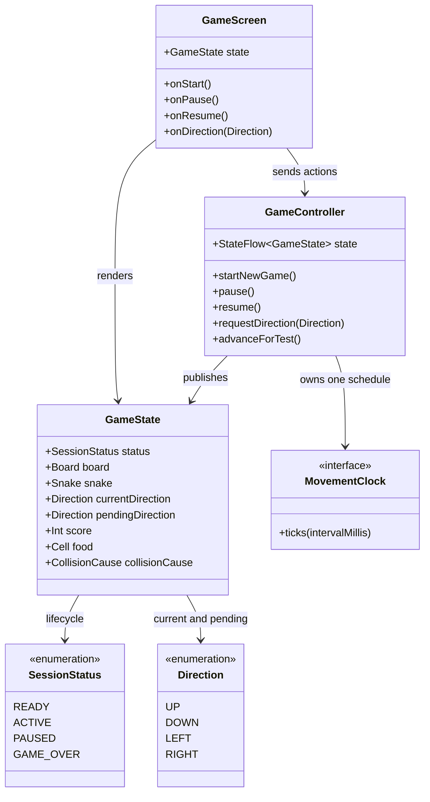

# Pause and Resume Play

## Requirements

Extend the shared Kotlin Compose Multiplatform Snake session so that an active game can be paused and resumed without losing its board, snake, food, score, direction state, or current-session identity. Pausing must stop all gameplay progression and present a clear in-view paused state, while game over remains terminal until restart.

### In-scope behavior

- Add an explicit non-terminal `PAUSED` lifecycle state alongside the existing `READY`, `ACTIVE`, and `GAME_OVER` states.
- Allow pause only from an active session through a visible in-view pause control on supported targets and the `P`/`Space` keyboard shortcut where keyboard input is available.
- Preserve the complete immutable session snapshot when pausing: board, snake positions and length, food cell, current score, current direction, and any already accepted pending direction.
- Stop logical movement while paused. Elapsed paused time must not move the snake, collect food, replace food, award score, or create movement catch-up on resume.
- Ignore new directional requests while paused rather than queueing a hidden turn; preserve any direction intent that was already accepted before pause.
- Show a visually distinct and accessible `Paused` state without obscuring the score or losing the current board context.
- Expose a clearly visible in-view resume action that returns the same paused session to `ACTIVE`.
- Resume with one normal movement schedule and the preserved state; do not create a fresh session or alter movement speed or difficulty.
- Keep pause and resume behavior in shared `commonMain` rules and controller contracts so Android, desktop JVM, and Wasm/browser targets produce equivalent outcomes.
- Keep `GAME_OVER` absorbing: after a collision, restart remains the next gameplay action and pause cannot change the terminal snapshot.

### Explicit decisions for this increment

- Represent pause with `SessionStatus.PAUSED`; do not add a separate `isPaused` flag or infer pause from whether `MovementClock` happens to be running.
- `GameRules.pause` changes only an `ACTIVE` state's lifecycle to `PAUSED`; every other status returns the unchanged state. `GameRules.resume` changes only a `PAUSED` state back to `ACTIVE`; every other status returns the unchanged state.
- The existing `GameState` fields remain authoritative. Pausing and resuming do not clear `pendingDirection`, change `currentDirection`, move the snake, relocate food, or mutate score.
- `GameRules.requestDirection` and `GameRules.advance` retain their existing inactive no-op behavior for `PAUSED` and `GAME_OVER`; a paused direction request returns `IGNORED_INACTIVE` and the exact unchanged snapshot.
- A pause transition invalidates and stops the current movement schedule. Resume starts at most one new schedule; a stale tick from before pause must not advance the resumed session.
- The first movement step after resume follows the normal configured interval of `150 ms`; elapsed paused time is discarded rather than replayed.
- The visible pause control is available in the active branch on every target that can play the game; the resume control is available in the paused branch in the same view. The keyboard shortcut is an additional pause path for keyboard-capable targets, not a replacement for visible discoverability.
- `P` and `Space` are accepted on key-down while the session is `ACTIVE` and are consumed by the focused game surface. They are not directional inputs and do not change a paused session; resume is provided by the visible action.
- Directional controls and directional keyboard input are hidden, disabled, or inert in the paused presentation; no paused input may be applied on resume unless it was accepted before pausing.
- Pausing in `READY` or `GAME_OVER`, resuming in any non-paused state, and repeating an already completed lifecycle action are safe unchanged-state no-ops.
- Automatic pausing for application backgrounding, window minimization, device rotation, or browser visibility changes is not introduced; restoration after application closure remains out of scope.

### Explicitly out of scope

- Persisting or restoring a paused session after the application is closed.
- Automatic platform-lifecycle pause/resume behavior not initiated by the player.
- Changing movement speed, difficulty, board dimensions, or rules while paused.
- Best-score retention, lives, undo, recovery, or any new game-over behavior.
- Multiplayer synchronization, networking, accounts, analytics, or external services.
- A separate pause screen, navigation route, or platform-specific gameplay loop.

### Definition of done

- All four story acceptance criteria are covered by deterministic common rule/controller tests and target-appropriate interaction/presentation checks.
- An active state with score `20` can be paused through the visible control and the supported desktop shortcut, and the exact board, snake, food, score, and direction snapshot remains observable with a clear `Paused` state.
- At least three manual or virtual movement intervals and any directional requests leave a paused state exactly unchanged, including score and food.
- Resuming returns the same snapshot to `ACTIVE`, starts exactly one movement schedule, and advances only from the preserved position and direction on a later normal tick.
- Pause requests cannot change `GAME_OVER`; the existing final score and restart action remain visible and actionable in the game view.
- Existing start, direction, food, collision, restart, close, stale-tick, and cross-target behavior remains intact.
- Common code compiles for the configured Android, desktop JVM, and Wasm/browser consumers without a persistence layer or new gameplay dependency.

## Entities

- `GameState` remains the one immutable, platform-neutral snapshot. `PAUSED` is lifecycle information; no `PausedSession` wrapper or duplicate state store is introduced.
- `Board`, `Snake`, `Cell`, `Direction`, food, score, and `CollisionCause` remain existing concepts. Their invariants and meanings do not change when the lifecycle is paused.
- `GameController` remains the single mutable state owner and the owner of movement-clock lifecycle. It exposes pause and resume actions but does not duplicate movement, food, scoring, or collision rules.
- `GameScreen` remains the shared presentation boundary. It renders active, paused, ready, and game-over states and routes visible actions to the controller without reconstructing session state.
- `MovementClock` remains an execution dependency. Its cancellation or restart is an implementation of lifecycle progression, not the authoritative representation of pause.

## Approach

1. **Extend the shared immutable lifecycle**:
   - Add `PAUSED` to the existing `SessionStatus` enum without renaming or reordering the existing business meanings.
   - Keep `GameState.collisionCause` null for `READY`, `ACTIVE`, and `PAUSED`, and non-null only for `GAME_OVER`; retain board, food, score, and snake invariants.
   - Preserve every gameplay field across pause/resume by changing only the lifecycle status in the transition.

2. **Make pause and resume shared rule transitions**:
   - Add common lifecycle transitions that accept only their valid source status and return unchanged states for all other statuses.
   - Keep `GameRules.advance` and `GameRules.requestDirection` guarded by `ACTIVE`, making paused progression and input safe no-ops even if a caller bypasses the UI or a late clock emission arrives.
   - Preserve a pending turn that was accepted before pause; reject all new direction requests while paused so resume cannot contain hidden player input.

3. **Keep clock ownership in `GameController`**:
   - Publish the paused snapshot through the existing serialized state-flow path, then stop or invalidate the active movement schedule.
   - Use the controller's existing session-generation/stale-tick boundary to ensure a tick from before pause cannot advance a paused or newly resumed session.
   - Resume only from `PAUSED`, start one clock for the current generation, and retain the existing `150 ms` interval and single-job guard.
   - Preserve terminal cancellation, restart replacement, and close behavior; a pause must never create a second controller or clock loop.

4. **Unify pause input across targets**:
   - Add `P` and `Space` to the common keyboard-action mapping at the input boundary, while leaving direction mapping and direction rules unchanged.
   - Route the visible pause action and recognized keyboard shortcut to the same controller pause operation. Keep platform launchers limited to capability reporting.
   - Keep the shortcut active only for a focused keyboard-capable game surface and consume recognized key-down events so browser or desktop scrolling is not substituted for the game action.

5. **Present the paused session in the existing game view**:
   - Add an exhaustive paused branch to the current `GameScreen` lifecycle rendering.
   - Keep the score and `SnakeBoard` driven by the preserved `GameState`; show a textual `Paused` status and a visible `Resume` action with useful semantics.
   - Keep the paused state visually distinct without relying only on color or covering the score. Avoid showing active directional affordances as if they were usable while paused.
   - Preserve the existing ready and game-over branches, including the final score and restart action; pause must not appear as an alternative to restart after game over.

6. **Verify deterministic state and target behavior**:
   - Add pure common tests for valid and invalid pause/resume transitions, exact snapshot preservation, inactive input, pending-direction preservation, and terminal protection.
   - Add controller tests with the existing manual clock and coroutine virtual time for three-plus paused intervals, ignored directional input, cancellation, resume timing, one-clock ownership, stale ticks, restart, and close.
   - Add keyboard mapping/handler coverage for `P` and `Space`, and presentation semantics or smoke coverage for the paused label, score, board, and resume action where the project test harness permits.
   - Compile all configured target source sets and retain regressions for movement, food, collision, restart, and inactive behavior.

## Structure

### Inheritance relationships

1. `SessionStatus`, `Direction`, `DirectionRequestResult`, and `StepOutcome` remain enums with no platform-specific subclasses or pause hierarchy.
2. `GameState`, `StepTransition`, and `DirectionRequest` remain immutable data holders; pause/resume transitions use immutable copies rather than mutable session objects.
3. `MovementClock` remains the only scheduling abstraction; `CoroutineMovementClock` and the existing manual clock remain the production/test implementations.
4. No persistence, repository, service, navigation, or error-wrapper hierarchy is introduced for pausing.

### Components

1. `composeApp/src/commonMain/kotlin/com/example/snake/game/model/SessionStatus.kt`: add `PAUSED` to the existing lifecycle enum.
2. `composeApp/src/commonMain/kotlin/com/example/snake/game/model/GameState.kt`: retain the complete immutable snapshot and existing collision-cause, food, board, and score invariants.
3. `composeApp/src/commonMain/kotlin/com/example/snake/game/rules/GameRules.kt`: own valid pause/resume transitions and retain active-only movement and direction gates.
4. `composeApp/src/commonMain/kotlin/com/example/snake/game/controller/GameController.kt`: expose pause/resume actions, preserve one state owner, stop/invalidate the clock on pause, and restart one clock on resume.
5. `composeApp/src/commonMain/kotlin/com/example/snake/game/input/GameKey.kt`: extend the common key vocabulary for `P` and `Space` without changing existing direction keys.
6. `composeApp/src/commonMain/kotlin/com/example/snake/game/ui/GameScreen.kt`: render the paused branch, visible pause/resume actions, shortcut handling, focus behavior, and accessible state semantics.
7. `composeApp/src/commonMain/kotlin/com/example/snake/game/ui/SnakeApp.kt`: pass the controller's pause/resume callbacks to the shared screen while retaining the existing state collection and disposal ownership.
8. `composeApp/src/androidMain`, `composeApp/src/desktopMain`, and `composeApp/src/wasmJsMain`: keep launchers and capability declarations thin; do not add target-specific pause rules.
9. `composeApp/src/commonTest/kotlin/com/example/snake/game/GameRulesTest.kt`: cover pure lifecycle, input, progression, and snapshot-preservation behavior.
10. `composeApp/src/commonTest/kotlin/com/example/snake/game/GameControllerTest.kt`: cover clock-backed pause/resume, elapsed-time freezing, stale ticks, single-job ownership, restart, and close.
11. `composeApp/src/commonTest/kotlin/com/example/snake/game/KeyboardDirectionMapperTest.kt` or a focused common input test: cover the new pause key vocabulary while retaining all direction mappings.

### Dependencies

1. `GameRules.pause` and `GameRules.resume` consume and return the existing `GameState`; they do not depend on Compose, Android, desktop, browser, coroutine, or clock types.
2. `GameRules.requestDirection` accepts new directions only for `ACTIVE`; `PAUSED`, `READY`, and `GAME_OVER` return the existing `IGNORED_INACTIVE` result and unchanged state.
3. `GameRules.advance` progresses only `ACTIVE`; a paused or terminal state returns `NOT_ACTIVE` with exact state equality.
4. `GameController.pause` and `GameController.resume` publish lifecycle transitions through the same `_state.update` owner used for direction and movement transitions.
5. The movement collector invokes the controller advance path; pause invalidates the prior generation and resume captures a generation for exactly one new collector.
6. `GameScreen` observes one `GameState`, maps recognized keyboard events to pause or direction callbacks, and never changes state fields directly.
7. `SnakeApp` remains the bridge between `GameController.state` and `GameScreen`; platform entry points continue to provide only `InputCapabilities` and application lifecycle wiring.
8. Common tests use the existing manual movement clock, `StandardTestDispatcher`, `runTest`, deterministic random sources, and direct state transitions rather than wall-clock sleeps.

### Architecture boundaries

1. **Domain boundary**: Owns lifecycle validity, pause/resume eligibility, inactive gates, snapshot invariants, direction state, movement, food, score, and collision outcomes. It does not render or schedule.
2. **Controller boundary**: Owns mutable state publication, pause/resume action serialization, movement-job cancellation/restart, session-generation invalidation, and close/restart lifecycle. It does not calculate coordinates or gameplay outcomes independently.
3. **Presentation boundary**: Owns layout, text, visual distinction, semantics, focus, keyboard shortcut translation, and visible pause/resume actions. It does not mutate or reconstruct `GameState`.
4. **Platform boundary**: Owns launch, capability reporting, and platform event plumbing only. Android, desktop JVM, and Wasm/browser must consume the same common pause semantics.
5. **Testing boundary**: Proves lifecycle and clock behavior through common deterministic tests; target checks verify presentation and key plumbing without duplicating gameplay rules.

### State flow

`READY` → `startNewGame` → `ACTIVE` → visible pause or `P`/`Space` → `PAUSED` with the exact gameplay snapshot and no active progression → visible resume → `ACTIVE` with the same snapshot → normal clock step → existing movement, food, or collision transition. A collision from `ACTIVE` leads to `GAME_OVER`; pause requests are inert there, and restart replaces the terminal snapshot with a fresh active session.

## Operations

### Extend lifecycle model - `SessionStatus` and `GameState`

1. **Responsibility**: Represent paused play as a distinct non-terminal lifecycle without duplicating or serializing gameplay data.
2. **Contract**:
   - Retain `READY`, `ACTIVE`, and `GAME_OVER` with their existing meanings.
   - Add `PAUSED` as the only new lifecycle value.
   - Retain all existing `GameState` fields and immutable value semantics; do not add a pause timestamp, saved-session object, or persistence identifier.
3. **Validation**:
   - Retain non-negative score, in-bounds food, and food-not-on-snake validation.
   - Retain the invariant that `collisionCause` is null for `READY`, `ACTIVE`, and `PAUSED`, and non-null for `GAME_OVER`.
   - Do not clear or rewrite `pendingDirection` merely because the status becomes `PAUSED`.
4. **Completion criteria**: Every production transition and manually constructed test fixture has a valid lifecycle/cause combination, and copying a state to `PAUSED` changes no gameplay field.

### Add lifecycle transitions - `GameRules.pause` and `GameRules.resume`

1. **Responsibility**: Provide the shared business authority for entering and leaving the paused lifecycle.
2. **Contract**:
   - `pause(state: GameState): GameState` returns `state.copy(status = PAUSED)` only when `state.status == ACTIVE`; otherwise it returns the exact `state` unchanged.
   - `resume(state: GameState): GameState` returns `state.copy(status = ACTIVE)` only when `state.status == PAUSED`; otherwise it returns the exact `state` unchanged.
   - No transition changes board, snake, food, score, current direction, pending direction, or collision cause.
3. **Interaction with existing rules**:
   - Keep `requestDirection` inactive for `PAUSED`, so no direction request can alter the preserved snapshot.
   - Keep `advance` inactive for `PAUSED`, so direct calls and late clock ticks cannot move or score.
   - Keep `GAME_OVER` inactive and absorbing; pause and resume cannot clear its cause or reopen it.
4. **Completion criteria**: Tests prove active-to-paused and paused-to-active transitions, unchanged-state no-ops for `READY`/`GAME_OVER`/already-valid states, exact preservation of a pending turn, and no movement or input mutation while paused.

### Preserve inactive progression and input - `GameRules.advance` and `GameRules.requestDirection`

1. **Responsibility**: Ensure the paused lifecycle is safe even when UI scheduling or input code is bypassed.
2. **Progression behavior**:
   - Retain the existing leading active-status gate in `advance`; `PAUSED` returns `StepTransition(state, NOT_ACTIVE)` without evaluating direction, board, food, or collision.
   - Preserve the existing behavior for `READY` and `GAME_OVER`, including terminal state absorption and collision-cause retention.
   - Do not add a paused-specific score, food, or step outcome when the existing inactive result expresses the contract.
3. **Input behavior**:
   - Retain the existing inactive-status gate in `requestDirection`; a paused request returns `DirectionRequest(state, IGNORED_INACTIVE)`.
   - Do not clear an already pending direction in response to a paused request; the request must be an exact unchanged-state operation.
4. **Completion criteria**: Repeated direct advances and every direction request against a paused fixture return inactive results and preserve exact equality, including after three or more simulated movement intervals.

### Enforce clock ownership - `GameController.pause` and `GameController.resume`

1. **Responsibility**: Coordinate lifecycle transitions with the single movement schedule while retaining the existing `StateFlow` owner and stale-generation safeguards.
2. **Pause behavior**:
   - Return without side effects when the controller is closed or the current state is not `ACTIVE`.
   - Publish one paused `GameState` through the existing serialized update path; do not publish separate field updates.
   - Invalidate the active clock generation and cancel/clear the current movement job after or as part of the pause transition. A late emission from the old collector must be rejected or observe the paused inactive gate.
   - Do not reset the interval, random source, session state, score, or food.
3. **Resume behavior**:
   - Return without side effects when the controller is closed or the current state is not `PAUSED`.
   - Publish one active state that is equal to the paused state in every gameplay field.
   - Start exactly one clock for the resumed session using the existing configured interval; the normal start guard must prevent repeated resume calls from creating additional jobs.
   - Do not apply an immediate catch-up step. The next movement occurs on a later normal clock tick.
4. **Race and lifecycle behavior**:
   - Serialize pause/resume with direction requests and clock ticks through the existing state-update owner; a concurrent action is ordered before or after one logical tick, never partially applied.
   - Ensure a stale pre-pause tick cannot move the paused state or cause a duplicate first step after resume.
   - Preserve existing `startNewGame` cancellation/generation behavior, so restart from game over still creates one fresh active clock and close remains idempotent.
5. **Completion criteria**: Manual-clock tests demonstrate no state change after multiple paused ticks and input requests, exactly one additional clock start on a valid resume, no additional starts for invalid/repeated actions, correct first post-resume movement, stale-tick rejection, and unchanged terminal behavior.

### Extend pause keyboard mapping - `GameKey` and `GameScreen`

1. **Responsibility**: Translate keyboard pause shortcuts at the input boundary without placing lifecycle rules in platform code.
2. **Mapping**:
   - Add common key values for `P` and `SPACE` alongside the existing arrow and W/A/S/D values.
   - Map Compose `Key.P` and `Key.Space` to those values; unknown keys remain unmapped.
   - Keep the existing direction mapper unchanged for all direction keys and preserve case-insensitive letter behavior where already supported by the event API.
3. **Event handling**:
   - Handle recognized pause shortcuts only on key-down events while the session is `ACTIVE` and keyboard capability is enabled.
   - Dispatch both keys to the same pause callback and consume the recognized event so it does not scroll or activate an unrelated focused control.
   - Return without dispatching for `READY`, `PAUSED`, `GAME_OVER`, key-up events, unknown keys, and non-keyboard targets.
   - Preserve active direction handling and its existing focus semantics; directional input remains inactive in `PAUSED`.
4. **Completion criteria**: Common mapping/handler tests cover `P`, `Space`, unknown keys, non-active states, key-up events, and regression behavior for every existing directional key.

### Add visible pause and resume actions - `GameScreen`

1. **Responsibility**: Make pause state and resume action discoverable in the same game view on every supported target.
2. **Callback contract**:
   - Preserve existing `state`, `capabilities`, `onStart`, and `onDirection` callback meanings.
   - Add explicit `onPause: () -> Unit` and `onResume: () -> Unit` callbacks, or an equivalent contract that keeps pause and resume transitions distinct and testable.
   - Wire callbacks from `SnakeApp` directly to the controller; the screen must not construct a new state.
3. **Lifecycle presentation**:
   - In `ACTIVE`, show a clearly labeled pause action in the current game view for both keyboard and touch-capable targets, while retaining score, board, and existing target-appropriate controls.
   - In `PAUSED`, show a textual `Paused` status and a clearly labeled resume action in the same view. Keep the score visible and keep the current board/snake/food rendered from the unchanged state.
   - Do not show an active-looking pause control in `READY` or `GAME_OVER`; retain the existing start/restart actions and terminal cause presentation.
   - Hide or disable directional controls and active keyboard hints while paused so the presentation does not suggest that directional input will take effect.
4. **Focus, layout, and semantics**:
   - Keep the keyboard surface focusable for active play and ensure the shortcut path has a predictable focus boundary; do not let the added status/action displace the score or make the board unreachable at supported sizes.
   - Add meaningful text and accessibility semantics for `Paused`, the current score, and the resume action. The state must be understandable without relying only on color or a stopped animation.
   - Preserve existing board coordinate rendering, food/snake display, game-over score semantics, minimum touch-target conventions, and responsive scrolling layout.
5. **Completion criteria**: UI/smoke checks can identify the pause action in `ACTIVE`, the paused status and resume action in `PAUSED`, the unchanged score and board context, and the absence or inertness of pause/direction actions in `GAME_OVER`.

### Wire shared application callbacks - `SnakeApp` and platform entry points

1. **Responsibility**: Keep application composition thin while making pause/resume available to the shared screen.
2. **Behavior**:
   - Continue remembering one `GameController`, collecting its read-only state, and closing it through `DisposableEffect`.
   - Pass controller pause and resume actions to `GameScreen` alongside the existing start and direction callbacks.
   - Keep Android touch, desktop keyboard, and Wasm/browser hybrid capability values unchanged unless a platform event adapter requires a compile-safe key mapping update.
3. **Constraints**:
   - Do not create a controller per lifecycle branch, a second movement clock, a platform-specific pause implementation, or application-close restoration.
   - Do not infer paused state by inspecting coroutine jobs in the UI; render from `GameState.status`.
4. **Completion criteria**: All configured launchers compile against the extended shared screen contract and expose equivalent pause/resume state transitions.

### Extend common lifecycle coverage - `GameRulesTest`

1. **Responsibility**: Prove pause semantics independently of Compose and wall-clock scheduling.
2. **Required tests**:
   - Build an active fixture with score `20`, known board/snake/food/direction state, and optionally a pending accepted turn; pause it and assert only `status` changes to `PAUSED`.
   - Resume that paused fixture and assert exact equality for every gameplay field, status `ACTIVE`, and no new session identity or reset.
   - Assert pause on `READY` and `GAME_OVER`, resume on `READY`/`ACTIVE`/`GAME_OVER`, and repeated pause/resume requests are unchanged-state no-ops.
   - Assert `advance(paused)` returns `NOT_ACTIVE` with exact state equality and cannot collect food, grow, collide, or change score.
   - Assert every direction request against `PAUSED` returns `IGNORED_INACTIVE` and leaves current and pending direction unchanged.
   - Assert resuming a state with a pending direction preserves that intent so normal active progression applies the pre-pause accepted turn once, while a direction requested during pause is never applied.
   - Retain all existing initialization, movement, food, collision, game-over, restart-related pure rule, and invalid-state tests.
3. **Completion criteria**: Tests use valid fixtures, deterministic random sources where food is involved, exact state comparisons where preservation is required, and no sleeps or UI event simulation for domain behavior.

### Extend controller lifecycle coverage - `GameControllerTest`

1. **Responsibility**: Prove that paused time and clock ownership do not change the shared session.
2. **Required scenarios**:
   - Start a controller with `ManualMovementClock`, advance to a state with score `20` or arrange an equivalent valid snapshot, pause it, and capture the paused state.
   - Tick at least three times and submit several directional requests, including a reversal and a valid turn; assert the state remains exactly equal to the captured paused state and no additional scoring or food collection occurs.
   - Assert a valid pause cancels or invalidates the active movement source, repeated pause does not start/cancel additional schedules unexpectedly, and the clock start count does not increase during paused time.
   - Resume once and assert the state is active with the preserved board, snake, food, score, current direction, and pending direction. Assert repeated resume does not create a second clock.
   - Tick after resume and assert exactly one normal step from the preserved position; elapsed paused ticks must not be replayed.
   - Emit or queue a stale tick around pause/resume and assert it cannot move the paused state or add an extra movement to the resumed session.
   - Drive a session to `GAME_OVER`, request pause, tick, and request directions; assert terminal state, cause, score, snake, food, and restart behavior remain unchanged.
   - Retain existing start/restart, terminal cancellation, closed-controller, one-clock, collection, and stale-generation regressions.
3. **Completion criteria**: Tests use `runTest`, `StandardTestDispatcher`, the existing manual clock, and deterministic random sources; no production delay or real-time waiting is used.

### Validate presentation and target integration - shared UI and builds

1. **Responsibility**: Demonstrate that the lifecycle is visible and actionable without adding platform-specific gameplay rules.
2. **UI checks**:
   - Verify `ACTIVE` exposes a pause action and the current score; `PAUSED` exposes a readable paused status, the same score, the same board context, and a resume action.
   - Verify directional controls and active keyboard hints are not presented as active while paused, and game-over still exposes restart rather than pause/resume.
   - Verify recognized `P`/`Space` events dispatch pause only from active keyboard-capable state and do not dispatch direction or pause after game over.
   - If no Compose UI test harness exists, keep the state text/shortcut mapping in testable common functions and add the smallest semantics/smoke coverage supported by the existing project rather than a new platform test dependency.
3. **Build checks**:
   - Compile production and test source for Android, desktop JVM, and Wasm/browser configurations.
   - Run all relevant common rule, controller, input, and available presentation tests.
4. **Completion criteria**: The same sequence of valid moves, food collections, pause, elapsed time, input, and resume yields equivalent common state across targets, and all existing gameplay behavior remains intact.

## Norms

1. **Common-first implementation**: Keep lifecycle transitions, inactive gates, snapshot preservation, and pause/resume semantics in `commonMain`; platform source sets may only provide launch and event/capability plumbing.
2. **Immutable state**: Treat `GameState` as a complete snapshot. Use immutable copies for status transitions and publish one coherent state update; never save individual gameplay fields in the UI or controller outside the snapshot.
3. **Explicit lifecycle contracts**: Use the `PAUSED` enum value and exhaustive status handling. Do not encode pause as a magic string, boolean plus status, null clock, or animation flag.
4. **Rule ownership**: `GameRules` is the only authority for pause eligibility, inactive progression, direction acceptance, movement, food, score, and collision behavior. The UI must not freeze coordinates or calculate score.
5. **Controller ownership**: Keep `GameController` as the only mutable state owner. Use its existing state-flow update path to serialize pause/resume with direction requests and clock ticks.
6. **Clock discipline**: Maintain at most one movement job per controller. Invalidate/cancel on pause, start at most one on resume, retain the configured `150 ms` interval, and reject stale emissions.
7. **Input discipline**: Normalize `P` and `Space` with the common key vocabulary, consume recognized events only in the active keyboard surface, and keep all direction input inert while paused or game over.
8. **Presentation clarity**: Show textual paused status, score, and an in-view resume action. Use contrast and semantics rather than relying only on a dimmed board, color, or absence of animation.
9. **Accessibility and layout**: Preserve the existing focus, scrolling, semantics, and minimum touch-target conventions. Ensure the pause/resume action is reachable and the score is not obscured at supported sizes.
10. **Testing**: Name tests after business behavior, use exact snapshot assertions for preservation, virtual/manual clocks for timing, deterministic fixtures for score/food, and retain all prior regressions.
11. **Documentation and scope**: Document the non-obvious choice to preserve pre-pause pending direction and ignore new paused input near the shared rule boundary. Do not add lifecycle persistence, automatic background pause, or unrelated gameplay features.

## Safeguards

1. **Functional constraints**:
   - Only `ACTIVE` can transition to `PAUSED`; only `PAUSED` can transition to `ACTIVE` through resume.
   - Pause changes no board, snake, food, score, current direction, pending direction, or collision cause.
   - While paused, at least three movement intervals, all clock emissions, and all directional inputs leave the snapshot unchanged.
   - A valid resume restores the same gameplay snapshot and does not apply elapsed-time movement or hidden paused input.
   - `GAME_OVER` remains absorbing for pause, resume, advance, direction requests, keyboard events, touch actions, and ticks until restart.
   - The active view exposes pause; the paused view exposes resume; the game-over view exposes restart and no usable pause action.
2. **Performance constraints**:
   - Paused sessions must not keep performing normal movement, food, score, or collision work on every interval.
   - Resume must not create more than one movement collector, and stale collectors must be rejected without advancing state.
   - Preserve the existing `150 ms` logical cadence and do not replace logical ticks with frame-driven movement or wall-clock sleeps in tests.
3. **Security and privacy constraints**:
   - Keep the game offline and single-player. Do not add accounts, network calls, storage, analytics, remote configuration, or player identity data.
   - Expose only the player-facing paused state and score; do not display coroutine, clock-generation, or internal exception details.
4. **Integration constraints**:
   - Preserve existing `GameController.state`, `startNewGame`, `requestDirection`, `advanceForTest`, `startClock`, `close`, `GameRules.advance`, `GameRules.requestDirection`, `GameScreen`, and `SnakeApp` seams unless a compile-safe callback/key extension is required.
   - Keep `MovementClock` and session-generation ownership in the controller; do not make the UI inspect or control jobs directly.
   - Keep Android, desktop JVM, and Wasm/browser on the same common lifecycle and transition rules.
5. **Business-rule constraints**:
   - Pause applies only to an active session and must retain current score, food, board, snake, and direction state.
   - Directional input while paused does not move, score, collect, or queue a new turn.
   - Resume continues the same session; it does not reset current score, snake growth, food placement, or direction.
   - Collision, restart, food collection, score accumulation, and best-score behavior retain their existing story contracts; pause must not convert any of them into a new outcome.
6. **Error-handling constraints**:
   - Invalid lifecycle actions are safe unchanged-state no-ops, not exceptions or user-visible errors.
   - Expected late ticks and inactive inputs are absorbed by typed/state-gated behavior.
   - Invalid manually constructed model states continue to fail at the model boundary with descriptive validation errors.
   - The UI must not silently convert `PAUSED` or `GAME_OVER` back to `ACTIVE` because a clock or key event was received.
7. **Technical constraints**:
   - Use Kotlin Compose Multiplatform and existing coroutine/flow dependencies; do not add a game engine or persistence library.
   - Keep pause/resume transitions deterministic and testable without sleeping or platform event injection.
   - Make cancellation, generation invalidation, resume startup, controller close, and repeated actions idempotent.
8. **Data constraints**:
   - A paused state has the same valid board, snake, food, score, current direction, pending direction, and collision-cause relationship as the source active state.
   - `score` remains non-negative; no paused tick or input can change it.
   - `food` remains exactly one in-bounds cell outside the snake in every published state, including `PAUSED`.
   - `collisionCause` remains null for `PAUSED` and non-null only for `GAME_OVER`.
9. **UI and boundary constraints**:
   - `Paused` and resume are textually discoverable in the same view, and the score remains visible beside the preserved board.
   - Keyboard pause shortcuts are available only where keyboard capability is declared; touch users always have the visible action.
   - Direction controls and direction keyboard events are inert while paused, and pause is inert after game over.
   - No platform launcher, key mapper, touch button, or Compose callback may independently freeze, move, score, or reconstruct the session.