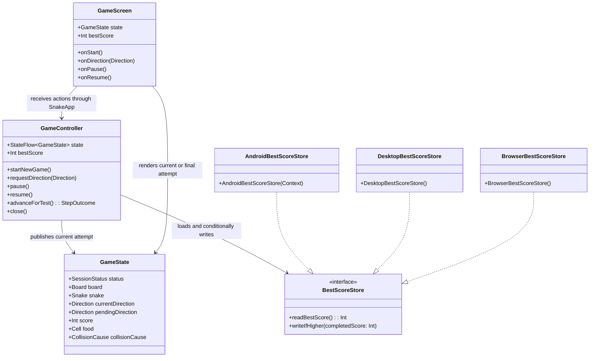

# Preserve the Best Score

Derived from: `spdd/analysis/STORY-001-005-202608231525-Analysis-preserve-the-best-score.md`

## Requirements

Extend the shared Kotlin Compose Multiplatform Snake game so that the highest score from a completed local session is retained as a personal best across restarts and later launches on the same target, while the current attempt score remains an independent value and the game remains offline and single-player.

### In-scope behavior

- Keep `GameState.score` as the score of the current attempt, including its final value after `GAME_OVER`; do not replace it with a maximum or add the personal record to the session snapshot.
- Load one non-negative local best score when `GameController` is constructed. Interpret missing, malformed, negative, or unavailable stored data as `0` so the game can still open.
- Evaluate a completed score only on the established `ACTIVE` to `GAME_OVER` transition. Food collection, an active or paused high score, pause, resume, restart, application close, and a discarded session must not establish a record.
- Replace the in-memory and durable best only when the completed score is strictly greater than the current best. Equal and lower completions must leave the record unchanged and must not trigger a replacement write.
- Preserve a lower completed attempt's final score beside the higher best score; never display only `max(currentScore, bestScore)`.
- Reset only the current attempt when `startNewGame` is called. A fresh attempt starts with score `0` while the loaded/in-memory best remains unchanged.
- Show the current or final score and the best score together in `READY`, `ACTIVE`, `PAUSED`, and `GAME_OVER`, with distinct visible labels and accessibility descriptions.
- Persist the record locally for Android, desktop JVM, and Wasm/browser targets through injected target adapters. Do not add accounts, networking, synchronization, leaderboards, or cross-device sharing.

### Acceptance contract

#### AC1: A player with no history starts at zero

**Given** the player has no completed session on the target
**When** the game view is opened
**Then** the current score and best score are both shown as `0`.

#### AC2: A new high score is recorded

**Given** the current best score is `40`
**When** the player completes a session with a score of `50`
**Then** the best score changes to `50` and the new value is visible with the final result.

#### AC3: A lower score does not replace the best score

**Given** the current best score is `50`
**When** the player completes another session with a score of `30`
**Then** the best score remains `50` while the completed session's final score remains `30`.

#### AC4: Restart resets only the current score

**Given** the best score is `50` and a game-over state is displayed
**When** the player starts a new session
**Then** the current score is `0` and the best score remains `50`.

#### AC5: The best score survives a later launch

**Given** the player has established a best score of `50`
**When** the player closes and later reopens the application on the same target
**Then** the best score is still shown as `50` before the next session is completed.

### Explicit decisions for this increment

- Treat `SessionStatus.GAME_OVER` as the single completed-session boundary. Do not infer completion from score changes, pause, resume, controller destruction, or application lifecycle callbacks.
- Keep persistence out of `GameRules`. `GameRules.advance` remains the authority for movement, food, score progression, and terminal state construction; `GameController` applies the best-score policy after receiving the terminal transition.
- Keep the record separate from `GameState`. The controller owns the loaded scalar and exposes it to the screen; no `bestScore` field, session wrapper, saved snake snapshot, or restore token is added to `GameState`.
- Update the controller's in-memory best and complete the durable `writeIfHigher` call before publishing the terminal `GameState` so the final result is rendered with the new best. A failed write must not discard the in-memory result or block the final-score presentation.
- Keep the existing `GameController.state: StateFlow<GameState>` as the single UI invalidation flow and expose `bestScore` as a controller-owned read-only scalar. `SnakeApp` reads the scalar while collecting `state`; do not create two independently collected presentation flows that can show a mismatched pair.
- Make the persistence contract injectable. Common tests use an in-memory fake and never require Android preferences, JVM user preferences, browser APIs, a network, or a real clock.
- Make each target adapter max-preserving and failure-safe: a candidate write may never lower a value already stored by that adapter, and storage exceptions fall back to the safe in-memory behavior rather than escaping into gameplay.
- Use stable application-local namespaces: Android application preferences, the desktop user's preferences node, and the current browser origin's `localStorage`. Clearing app/site data, uninstalling, changing browser origin, or changing desktop users may legitimately reset the record to `0`.

### Explicitly out of scope

- Restoring the previous `GameState`, snake, food, pending direction, pause state, current score, or game-over snapshot after close or relaunch.
- Online leaderboards, score sharing, accounts, profiles, authentication, cloud synchronization, cross-device records, analytics, or network access.
- Achievements, rankings, rewards, lives, difficulty changes, board changes, score-rule changes, or a new game-over mechanism.
- A new persistence framework or serialization layer for one integer.
- Automatic promotion of an unfinished active or paused score, including promotion during `close`, `pause`, `resume`, `startNewGame`, or application backgrounding.
- A user-facing storage-error screen or blocking retry workflow; the game remains playable and reports only the safe score state.
- A cross-process or cross-tab transaction protocol beyond each adapter's max-preserving read/write operation. The normal one-controller application path must be correct; best-effort non-downgrade behavior is sufficient for incidental concurrent instances.

### Definition of done

- A fresh controller and view expose current score `0` and best score `0` before a session is completed.
- A deterministic controller sequence that ends with a higher final score updates the best in memory, writes it once through the injected store, and renders the final score beside that best.
- Lower and equal completed scores leave the best unchanged, do not issue a replacement write, and preserve the completed attempt's own final score.
- A controller can restart from game over with current score `0` while retaining the best, and a newly constructed controller using the same store reloads that best without restoring the old session.
- Active and paused scores above the stored record are not persisted until a later game-over transition; closing such a controller leaves the fake store unchanged.
- Missing, malformed, negative, unavailable, and failed-write storage cases do not crash startup or terminal presentation; the non-negative in-memory invariant remains intact.
- Current/final and best values have distinct visible text and semantics in every lifecycle branch, including the lower-score game-over case.
- Common tests cover store policy, terminal-only evaluation, restart, relaunch loading, pause/close exclusion, failure fallback, stale/repeated terminal ticks, and existing movement regressions.
- Android, desktop JVM, and Wasm/browser production and test source sets compile with only existing platform facilities and dependencies; no network or persistence library is introduced.

## Entities

- `GameState` remains the immutable, platform-neutral snapshot for exactly one attempt. Its `score` remains non-negative and is never replaced by the record.
- The personal best is a non-negative `Int` owned by `GameController`; it is intentionally a scalar rather than a new entity wrapper because the requirement needs no metadata, profile, timestamp, or history.
- `BestScoreStore` is the narrow common persistence boundary. It reads one normalized record and accepts only a strictly higher completed candidate.
- `AndroidBestScoreStore`, `DesktopBestScoreStore`, and `BrowserBestScoreStore` are target-local implementations of the same contract. They do not contain gameplay or completion rules.
- `GameScreen` receives both values for presentation, but it never computes, persists, or mutates either value. `SnakeApp` remains the composition bridge.
- `GameRules`, `SessionStatus`, `MovementClock`, `Board`, `Snake`, and collision concepts retain their existing meanings and relationships.

## Approach

1. **Separate the completed record from the current session**:
   - Preserve `GameState.score` and all existing `GameRules` transitions unchanged.
   - Add a minimal common `BestScoreStore` interface and inject one store into `GameController`.
   - Load and normalize the record before the controller's initial ready state is exposed; initialize the current attempt through the existing fresh-session path with score `0`.
   - Keep the best as a controller-owned scalar so restart and close cannot accidentally serialize or reset session data.

2. **Evaluate only the terminal transition**:
   - In the controller's existing `advanceForGeneration` state-update path, recognize an `ACTIVE` source whose `GameRules.advance` result is `GAME_OVER`.
   - Compare the terminal state's unchanged final score with the loaded best. If and only if `finalScore > bestScore`, update the in-memory scalar and call `BestScoreStore.writeIfHigher(finalScore)`.
   - Perform no record operation for food collection, ordinary movement, `PAUSED`, `READY`, an already terminal state, restart, or close.
   - Keep record evaluation in the same serialized transition boundary as generation checks and terminal clock cancellation so stale ticks and immediate restarts cannot clear or downgrade the record.

3. **Use a failure-safe, max-preserving local contract**:
   - Define `readBestScore(): Int` to return a non-negative value or the safe baseline `0`; controller construction must remain usable if a store read throws.
   - Define `writeIfHigher(completedScore: Int)` to ignore invalid candidates, re-read or otherwise preserve the adapter's existing higher value, and never overwrite with a lower/equal value.
   - Treat a write exception or a negative/malformed stored value as a persistence limitation, not a gameplay error. Retain a valid new best in memory for the current result and do not expose internal exception details in the UI.
   - Avoid a persistence library: use Android `SharedPreferences`, JVM `java.util.prefs.Preferences`, and browser `window.localStorage` behind the common interface.

4. **Wire target storage at the existing composition boundary**:
   - Extend `SnakeApp` to accept a `BestScoreStore` and construct `GameController` with it while retaining one remembered controller and its disposal behavior.
   - Pass `AndroidBestScoreStore(applicationContext)` from `MainActivity`, `DesktopBestScoreStore()` from the desktop launcher, and `BrowserBestScoreStore()` from the Wasm launcher.
   - Keep platform launchers responsible only for constructing storage and declaring input capabilities; all completion, comparison, and UI behavior remains common.

5. **Present two explicit score values**:
   - Extend `GameScreen` with a `bestScore: Int` input and render it beside the current attempt score in every lifecycle branch.
   - Use `Current score: N` in `READY`, `ACTIVE`, and `PAUSED`; use `Final score: N` in `GAME_OVER`; always show `Best score: N` as a separate visible value.
   - Give the two values distinct semantics nodes/content descriptions so assistive technology can distinguish an attempt/final result from the personal record.
   - Preserve the existing board, lifecycle text, pause/resume behavior, collision message, restart action, focus behavior, and target-specific controls.

6. **Verify behavior through deterministic common tests and target compilation**:
   - Test the pure store contract with an in-memory fake that records reads and writes, including strict maximum behavior and malformed/negative normalization.
   - Drive controller state through deterministic movement and collision sequences rather than setting a hidden best or sleeping. Test higher, lower, equal, zero, restart, relaunch, active/paused close, write failure, and repeated/stale terminal events.
   - Keep existing rule, controller, input, pause/resume, food, collision, restart, close, and stale-generation regressions.
   - Compile Android, desktop JVM, and Wasm/browser source sets and run all available common and desktop tests; do not introduce target-specific gameplay implementations.

## Structure

### Inheritance relationships

1. `BestScoreStore` is the only new common interface and defines local best-score read and max-preserving write behavior.
2. `AndroidBestScoreStore`, `DesktopBestScoreStore`, and `BrowserBestScoreStore` implement `BestScoreStore` in their respective target source sets; they are not subclasses of a shared platform base class.
3. `GameState` remains an immutable data class, and `GameController` remains the mutable lifecycle owner. No `BestScoreRecord`, repository hierarchy, service layer, or session wrapper is introduced.
4. Existing `MovementClock`, `GameRules`, `StepTransition`, `DirectionRequest`, and model enums retain their current interfaces and inheritance relationships.

### Components

1. `composeApp/src/commonMain/kotlin/com/example/snake/game/persistence/BestScoreStore.kt`: define the common store contract and the shared non-negative normalization helper used by the controller and adapters.
2. `composeApp/src/commonMain/kotlin/com/example/snake/game/controller/GameController.kt`: load the best at construction, expose `bestScore`, evaluate only the `ACTIVE` to `GAME_OVER` edge, preserve it across restart, and keep storage failures from breaking play.
3. `composeApp/src/commonMain/kotlin/com/example/snake/game/ui/SnakeApp.kt`: accept the injected store, construct one controller, collect its existing state flow, and pass the controller's best scalar to the screen.
4. `composeApp/src/commonMain/kotlin/com/example/snake/game/ui/GameScreen.kt`: accept and render current/final and best scores with distinct labels and accessibility semantics in all four lifecycle branches.
5. `composeApp/src/androidMain/kotlin/com/example/snake/game/persistence/AndroidBestScoreStore.kt`: use stable app-local `SharedPreferences` storage with safe parsing, max-preserving writes, and failure fallback.
6. `composeApp/src/desktopMain/kotlin/com/example/snake/game/persistence/DesktopBestScoreStore.kt`: use a stable user-scoped `java.util.prefs.Preferences` node with safe reads, max-preserving writes, and failure fallback.
7. `composeApp/src/wasmJsMain/kotlin/com/example/snake/game/persistence/BrowserBestScoreStore.kt`: use stable origin-local `window.localStorage` with safe string parsing, max-preserving writes, and failure fallback.
8. `composeApp/src/androidMain/kotlin/com/example/snake/MainActivity.kt`, `composeApp/src/desktopMain/kotlin/com/example/snake/Main.kt`, and `composeApp/src/wasmJsMain/kotlin/com/example/snake/Main.kt`: construct and inject their target store without adding target-specific gameplay logic.
9. `composeApp/src/commonTest/kotlin/com/example/snake/game/BestScoreStoreTest.kt`: cover common normalization and fake-store max/write semantics without platform APIs.
10. `composeApp/src/commonTest/kotlin/com/example/snake/game/GameControllerTest.kt`: cover lifecycle-boundary evaluation, persistence, restart/relaunch, failure, and stale/repeated event behavior while retaining existing clock tests.
11. `composeApp/src/commonTest/kotlin/com/example/snake/game/GameScreenTest.kt` or the smallest existing presentation seam supported by the project: verify score labels/semantics if a Compose harness exists; otherwise test extracted pure label functions and retain compile/manual checks for the composable.
12. Existing `GameRulesTest.kt` and other gameplay tests: retain all current rules and regressions; do not move score progression or collision decisions into persistence code.

### Dependencies

1. `GameController` depends on `GameRules`, `MovementClock`, coroutine/flow types, and the injected `BestScoreStore`; `GameRules` must not depend on the store, Compose, Android, JVM preferences, browser APIs, or controller state.
2. `GameController` reads the store once during construction, keeps the normalized scalar in memory, and invokes `writeIfHigher` only for a strictly higher terminal score.
3. `GameController.state` remains the observable session flow. The controller updates `bestScore` before publishing a new terminal state, and `SnakeApp` reads both from one composition invalidated by that state flow.
4. `SnakeApp` depends on the common store interface and creates one controller with the target-provided implementation; `GameScreen` depends only on immutable `GameState`, the best `Int`, capabilities, and callbacks.
5. Platform entry points depend on their own adapter and the existing common `SnakeApp`; no platform entry point calls `GameRules` or writes a score directly.
6. Target adapters depend only on their platform-local storage facilities and Kotlin standard/platform APIs already available to the corresponding source set.
7. Common tests use fake stores, `ManualMovementClock`, `StandardTestDispatcher`, `runTest`, deterministic `Random` sources, and existing test helpers; no test depends on wall-clock delays or real persistent user data.

### Architecture boundaries

1. **Domain boundary**: `GameRules` owns current score progression, collision, `GAME_OVER`, restart initialization, pause/resume, and all session invariants. It never reads or writes a best score.
2. **Controller boundary**: `GameController` owns mutable session publication, the in-memory personal best, terminal-edge evaluation, store invocation, movement-job lifecycle, generation invalidation, restart, and close. It does not calculate movement or render text.
3. **Persistence boundary**: `BestScoreStore` and its target implementations own one local scalar's durable read/write behavior, normalization, stable namespace, and platform exception containment. They do not know session status or UI.
4. **Presentation boundary**: `GameScreen` owns labels, layout, accessibility semantics, lifecycle presentation, focus, and controls. It displays both values exactly as supplied and never computes a maximum or persists data.
5. **Composition boundary**: `SnakeApp` connects target storage and input capabilities to the shared controller/screen while retaining controller remembrance and disposal. Launchers provide platform dependencies only.
6. **Testing boundary**: Common tests prove business and controller behavior with fakes and deterministic clocks; target compilation and, where available, adapter smoke tests prove platform wiring without duplicating gameplay rules.

### State and persistence flow

`GameController` construction → `BestScoreStore.readBestScore()` → normalize to `0` or a non-negative value → create the existing ready session with current score `0` → render `Current score: 0` and `Best score: loadedValue` → active movement changes only `GameState.score` → an `ACTIVE` to `GAME_OVER` transition compares the final score → a strict increase updates memory and calls `writeIfHigher` before terminal state publication → render current/final score and best together → restart creates a fresh current session with score `0` and leaves best unchanged → close performs no promotion → a later controller reads only the persisted scalar and starts a new ready session.

## Operations

### Define the common persistence contract - `BestScoreStore`

1. **Responsibility**: Provide the smallest injectable common boundary for one local personal-best integer without exposing platform storage APIs to `GameRules`, the UI, or common tests.
2. **Public contract**:
   - `fun readBestScore(): Int`
     - Return the stored non-negative record, or `0` when no value exists, the value is malformed, the value is negative, or the underlying storage cannot be read.
     - Never make controller construction fail because local storage is unavailable.
   - `fun writeIfHigher(completedScore: Int)`
     - Ignore a negative candidate.
     - Preserve the existing stored value when `completedScore` is lower than or equal to it.
     - Persist exactly the candidate when it is strictly higher than the existing value.
     - Keep platform storage failures contained; the method must not make terminal gameplay or final-score presentation fail.
3. **Shared normalization**:
   - Add a small common helper such as `normalizeBestScore(value: Int): Int` that maps negative values to `0` and leaves valid non-negative `Int` values unchanged.
   - Target adapters parse text to `Int` with a non-throwing conversion before applying the same non-negative rule.
   - Do not introduce a record object, history list, timestamp, account identifier, serialization format, or migration framework.
4. **Completion criteria**: Common tests can inject a fake store, read a baseline without platform APIs, verify strict maximum semantics, count writes, and simulate read/write exceptions without crashing the controller.

### Integrate terminal best-score evaluation - `GameController`

1. **Responsibility**: Own the loaded/in-memory best and apply the completion policy exactly once at the existing terminal transition while preserving the current controller and clock seams.
2. **Constructor and state**:
   - Add a required `bestScoreStore: BestScoreStore` constructor dependency while retaining the existing scope, movement clock, interval, and random dependencies. Use named arguments at all call sites.
   - Read and normalize the store before exposing the initial state. Expose `val bestScore: Int` as a read-only controller-owned scalar; do not expose a mutable setter or a second independently collected score flow.
   - Retain `val state: StateFlow<GameState>` and the existing `readyState()` behavior. The initial/current score remains `0` and the initial status remains `READY`.
3. **Completion logic in `advanceForGeneration`**:
   - Preserve the current closed-controller and session-generation guards before invoking `GameRules.advance`.
   - Record only when the source state is `ACTIVE` and the returned transition state is `GAME_OVER`. Use the returned terminal state's `score` as the completed value; do not recalculate it.
   - If `completedScore > bestScore`, update the in-memory best and invoke `bestScoreStore.writeIfHigher(completedScore)` before the terminal `GameState` becomes observable.
   - If `completedScore <= bestScore`, leave the scalar unchanged and do not invoke the store write method.
   - Keep `StepOutcome`, terminal score, snake, food, collision cause, and clock-stop behavior unchanged.
   - If the read or write call throws despite the store contract, catch it at the controller persistence boundary. Keep a normalized in-memory best and publish the terminal state; never expose exception text to the player.
4. **Lifecycle exclusions and serialization**:
   - Do not evaluate or write on food collection, ordinary movement, `READY`, `PAUSED`, `resume`, `startNewGame`, `close`, or a stale generation.
   - Do not reset or reload the best during `startNewGame`; reset only the new session's `GameState.score` through `GameRules.startNewGame`.
   - Preserve the existing state-update/generation ordering so a stale terminal tick cannot overwrite a newer restart and repeated terminal advances cannot issue harmful duplicate writes.
   - Ensure any completion-side effect is ordered with the state publication and terminal clock cancellation; do not launch a detached persistence coroutine that can race restart or close.
5. **Composition coherence**:
   - Update the best scalar before assigning the terminal state to `_state`, so a recomposition caused by the terminal state reads the matching best.
   - Keep the scalar unchanged on all non-terminal state emissions. The screen must never derive best from `state.score` or call the store.
6. **Completion criteria**: Controller tests prove initial loading, strict higher update, lower/equal no-op, terminal final-score retention, restart preservation, no promotion on paused/active close, write-failure resilience, and stale/repeated terminal protection.

### Implement target-local stores - Android, desktop JVM, and Wasm/browser

1. **Android - `AndroidBestScoreStore`**:
   - Constructor: `AndroidBestScoreStore(context: Context)`; retain `context.applicationContext` so an activity recreation does not bind storage to a destroyed activity.
   - Use a stable `SharedPreferences` file name such as `snake_preferences` and a stable key such as `best_score`; do not include session state or a random identifier in the key.
   - Read with a safe default, normalize negative values, and catch preference/type/security failures to return `0`.
   - On `writeIfHigher`, validate the candidate, read the current normalized value, and write only the greater value. Use a durable completion-boundary write (`commit` or an equivalently ordered existing implementation) and ignore a failed result without throwing.
2. **Desktop JVM - `DesktopBestScoreStore`**:
   - Constructor: `DesktopBestScoreStore()`; use a stable `java.util.prefs.Preferences` user node scoped to the Snake application and a stable `best_score` key.
   - Read with default `0`, normalize negatives, and contain `SecurityException`, `IllegalStateException`, `BackingStoreException`, or equivalent preference failures.
   - On `writeIfHigher`, preserve a higher existing value, write only a strict increase, flush where supported, and keep failures non-fatal.
3. **Wasm/browser - `BrowserBestScoreStore`**:
   - Constructor: `BrowserBestScoreStore()`; use `window.localStorage` through the existing `kotlinx.browser` dependency and a stable origin-local key such as `com.example.snake.best_score`.
   - Parse with `toIntOrNull`, map missing/malformed/negative values to `0`, and catch storage access/security/quota exceptions around both reads and writes.
   - On `writeIfHigher`, read the current value in the same operation, write only a strict increase, and never replace a higher value with a lower candidate.
4. **Common adapter constraints**:
   - Keep all three adapters synchronous from the controller's perspective so the initial view has a value before the first score render and terminal ordering is deterministic.
   - Use no account, network, encryption key, shared preference library, database, or new persistence dependency for this scalar.
   - Keep storage identity stable within the target's normal application/origin/user scope, while documenting that uninstall, cleared site data, changed origin, or changed desktop user may reset the record.
5. **Completion criteria**: Each target adapter implements the common contract, compiles in its source set, normalizes invalid data, does not downgrade an existing value, and cannot crash startup or terminal presentation on expected storage failure.

### Wire storage through application composition - `SnakeApp` and launchers

1. **`SnakeApp` contract**:
   - Extend `fun SnakeApp(capabilities: InputCapabilities, bestScoreStore: BestScoreStore)` without creating a store internally or falling back to in-memory storage in production composition.
   - Remember exactly one `GameController(bestScoreStore = bestScoreStore)`, collect its existing `state`, and close it in the existing `DisposableEffect`.
   - Pass `state = state`, `bestScore = controller.bestScore`, and all existing callbacks to `GameScreen`.
2. **Target wiring**:
   - Android: pass `AndroidBestScoreStore(applicationContext)` from `MainActivity` alongside touch capabilities.
   - Desktop: pass `DesktopBestScoreStore()` from the `Window` content alongside keyboard capabilities.
   - Wasm/browser: pass `BrowserBestScoreStore()` from the `ComposeViewport` content alongside hybrid capabilities.
3. **Constraints**:
   - Do not create a controller or store per lifecycle branch, per recomposition, per tick, or per score value.
   - Do not add target-specific completion checks, score comparisons, or UI labels to the launchers.
   - Preserve the existing input capability values, application lifecycle handling, pause/resume callbacks, and controller disposal behavior.
4. **Completion criteria**: All three launchers compile against the extended common API, each supplies its durable store exactly once per app composition, and relaunching the same target can read the previously written scalar.

### Present paired score information - `GameScreen`

1. **Responsibility**: Make the current/final attempt and personal best simultaneously visible and accessible without changing gameplay state or lifecycle behavior.
2. **Callback and data contract**:
   - Preserve `state: GameState`, `capabilities`, `onStart`, `onDirection`, `onPause`, `onResume`, and `modifier` semantics.
   - Add `bestScore: Int` as a read-only input. Treat the controller as the source of truth; do not compute `maxOf(state.score, bestScore)` in the composable.
3. **Visible labels**:
   - In `READY`, `ACTIVE`, and `PAUSED`, show `Current score: ${state.score}` and `Best score: $bestScore` as separate text elements.
   - In `GAME_OVER`, show `Final score: ${state.score}` and `Best score: $bestScore` as separate text elements, including when the final score is lower than the best.
   - Keep both values above or alongside the existing lifecycle content so the board, status, pause/resume action, collision message, and restart action remain reachable.
4. **Accessibility and validation**:
   - Give the current/final score and best score distinct semantics/content descriptions: `Current score: N` or `Final score: N`, and always `Best score: N`.
   - Preserve the existing `Paused`, `Game over`, button roles, focus behavior, scrolling layout, minimum touch target behavior, and keyboard/touch controls.
   - If a Compose UI test harness is available, assert both text values and semantics in ready, active, paused, new-record game-over, and lower-score game-over states. If it is not available, keep label construction in small testable common functions and perform compile/manual semantics checks without adding a new UI dependency.
5. **Completion criteria**: A user can distinguish an attempt/final score from the record without color or animation, and no lifecycle branch hides, renames ambiguously, or replaces either value.

### Add deterministic persistence and lifecycle tests

1. **Common store tests - `BestScoreStoreTest`**:
   - Use a fake with configurable stored value, read failure, write failure, write count, and last candidate.
   - Assert missing/negative/malformed input normalizes to `0`, valid non-negative values are retained, lower/equal candidates do not write, and higher candidates replace exactly once.
   - Assert a failed read/write is absorbed according to the contract and cannot produce a negative best or throw into the caller.
2. **Controller initialization and presentation tests - `GameControllerTest`**:
   - Construct with an empty fake store and assert `READY`, current score `0`, and `bestScore == 0`.
   - Construct with a fake store containing `50` and assert a new controller starts with a new ready/current session at score `0` and `bestScore == 50`; do not restore the old snake, food, direction, pause state, or game-over state.
   - Complete a deterministic higher-scoring session and assert the final `GameState.score` is unchanged, `bestScore` equals the final score, and the fake recorded one higher write.
   - Complete a lower session against an existing best and assert final score remains lower, `bestScore` remains higher, and the fake recorded no replacement write. Repeat for an equal score where practical.
3. **Lifecycle exclusion tests**:
   - Collect food or arrange an active score above the stored best, then pause or close before collision; assert the stored fake remains unchanged.
   - Restart after both a record-setting and non-record game over; assert the fresh state has score `0`, the best remains unchanged, and restart itself performs no write.
   - Reconstruct a controller with the same fake after a completed record; assert only the scalar is restored and the new session is ready/current score `0`.
4. **Race and failure tests**:
   - Use the existing manual clock, generation behavior, and virtual dispatcher to emit stale/repeated terminal ticks; assert no downgrade, no extra lower write, and no state mutation after restart.
   - Make the fake read or write throw; assert controller construction or game over remains usable, the in-memory result is non-negative, and no internal failure text reaches presentation.
   - Retain all existing start, movement, food, collision, pause/resume, restart, one-clock, inactive-input, and close tests.
5. **Completion criteria**: Tests assert business outcomes and exact state equality where session preservation is required; they use no sleeps, production delays, platform preference state, browser storage, or weakened assertions.

### Validate target integration and regressions

1. **Build checks**:
   - Compile common metadata and test code plus Android, desktop JVM, and Wasm/browser production source sets using the existing Gradle configuration.
   - Run all relevant common and available desktop tests, including store, controller, rules, input, pause/resume, food, collision, restart, and close coverage.
   - Keep browser/Android limitations explicit if the environment lacks ChromeHeadless or an Android SDK; do not skip or weaken tests that can run.
2. **Manual/target checks where available**:
   - On a fresh target, open the view and confirm current/best are both `0`.
   - Complete a record-setting session, confirm the final and best labels match, restart, and confirm current resets while best remains.
   - Close and reopen the same target and confirm the best remains while the new current session is `0`/ready; confirm an unfinished active or paused score was not promoted.
3. **Completion criteria**: Common gameplay semantics remain equivalent across targets, local storage is the only retention mechanism, and no adapter or launcher introduces a second gameplay implementation.

## Norms

1. **Common-first design**: Keep record eligibility, strict comparison, controller ordering, and paired score meaning in `commonMain`; target source sets provide only local storage construction and APIs.
2. **Minimal abstraction**: Use one `BestScoreStore` interface and scalar `Int` state. Do not create a repository/service/DAO layer, history collection, record entity, persistence framework, or account model for this requirement.
3. **Dependency injection**: Pass the store through `SnakeApp` into `GameController`; production launchers must provide a target adapter explicitly, while tests provide fakes. Do not hide platform storage in common defaults or Compose `remember` state.
4. **Rule ownership**: `GameRules` remains the only authority for current score, food, movement, collision, restart, and session status. Best-score persistence must never be added to pure rules.
5. **Controller ownership**: `GameController` is the only mutable owner of the in-memory best. Update the scalar and durable store at the terminal boundary, preserve it on restart/close, and expose it read-only.
6. **Flow and publication discipline**: Retain `state: StateFlow<GameState>` as the UI invalidation flow; update the best before publishing a terminal state and never expose a separately collected flow that can render an inconsistent score pair.
7. **Storage discipline**: Every adapter normalizes to a non-negative `Int`, uses a stable target-local key/namespace, performs max-preserving writes, and contains expected API/security/quota failures.
8. **Failure behavior**: Storage errors are non-fatal and non-user-sensitive. Keep a valid in-memory best for the current controller, continue showing the final result, and do not display exception messages, paths, preference nodes, or browser error details.
9. **Lifecycle discipline**: Only an `ACTIVE` to `GAME_OVER` edge can promote a score. Pause/resume, stale ticks, restart, close, and relaunch must not restore or promote a current session snapshot.
10. **Presentation clarity**: Use explicit `Current score`, `Final score`, and `Best score` text. Preserve both values even when one is lower, and use semantics that distinguish them without relying on color, animation, or position alone.
11. **Platform wiring**: Keep Android, desktop JVM, and Wasm/browser entry points thin and equivalent. No launcher may calculate a score, inspect `SessionStatus`, or mutate a record directly.
12. **Testing**: Prefer named business-behavior tests, deterministic random fixtures, manual clocks, virtual dispatchers, fake stores, exact write-count assertions, and existing regression coverage. Never use real user preferences or browser storage in common tests.
13. **Documentation and scope**: Document the terminal-only and failure-safe choices at the persistence/controller boundary when the code is not self-evident. Do not add comments or features unrelated to best-score retention.

## Safeguards

1. **Functional constraints**:
   - The personal best starts at `0` when no valid durable value exists and is always non-negative.
   - Only a completed `ACTIVE` to `GAME_OVER` transition can establish or improve the best.
   - A candidate strictly greater than the current best updates memory and requests one max-preserving durable write; lower/equal candidates do not replace or rewrite it.
   - The final current score remains exactly the terminal `GameState.score`, even when it is lower than the best.
   - `startNewGame` resets current score and session fields through the established initializer but never clears, reloads, or rewrites the best.
   - Closing, pausing, resuming, abandoning, or relaunching does not restore or promote the previous session.
2. **Performance constraints**:
   - Read the scalar once at controller construction; do not access storage on every movement tick, frame, direction request, pause, or render.
   - Perform at most one completion write for a strictly higher terminal result in the normal controller path; do not launch an unbounded persistence job per tick.
   - Keep storage operations synchronous from controller ordering perspective so the initial best is available before first render and the terminal result cannot race restart.
   - Preserve the existing movement interval, clock ownership, and stale-generation behavior; best-score work must not alter movement, food, or collision cadence.
3. **Security and privacy constraints**:
   - Store only one local non-negative score under an application-local target namespace; do not collect identity, account, network, analytics, or unrelated personal data.
   - Do not expose preference paths, browser storage keys, exceptions, stack traces, or platform internals in visible text or accessibility descriptions.
   - Do not introduce network access, remote configuration, cross-origin sharing, or cross-device synchronization.
4. **Integration constraints**:
   - Preserve `GameState`, `GameRules`, `SessionStatus`, `MovementClock`, `GameController.state`, `startNewGame`, `requestDirection`, `pause`, `resume`, `advanceForTest`, `startClock`, `close`, and existing target capabilities unless the store injection and screen score parameter require an additive signature change.
   - Keep persistence behind `BestScoreStore`; no common code may import Android, JVM preference, browser, or Compose storage APIs.
   - Keep `SnakeApp` as the composition boundary and keep target launchers free of gameplay and completion policy.
   - Preserve the preceding pause/resume contract: a paused snapshot stays unchanged, paused time cannot promote a score, and a later launch restores only the scalar record.
5. **Business-rule constraints**:
   - Missing history means current `0` and best `0` in the opened view.
   - A completed `50` against best `40` yields final/current `50` and best `50`; a completed `30` against best `50` yields final/current `30` and best `50`.
   - A new session after best `50` yields current `0` and best `50`.
   - A completed zero-score session neither changes the default record nor causes an unnecessary write.
   - An active/paused score above the record remains unrecorded until that session reaches game over.
6. **Error-handling constraints**:
   - Expected missing, malformed, negative, unavailable, quota, security, preference, and browser-storage failures resolve to safe non-negative behavior rather than startup or gameplay exceptions.
   - A failed write may cause a later launch to lose the new record, but the current controller must retain the valid in-memory best and display the terminal result; do not falsify success with a lower stored value.
   - Invalid lifecycle actions, inactive inputs, stale ticks, and repeated terminal advances remain safe no-ops under existing typed/state-gated behavior.
   - The UI must not show internal failure details or silently replace the final score with the best.
7. **Technical constraints**:
   - Use existing Kotlin Compose Multiplatform, coroutines/flows, Android preferences, JVM preferences, and `kotlinx.browser` facilities; do not add a persistence framework, game engine, database, or network dependency.
   - Keep the contract synchronous, injectable, deterministic, and compilable in common, Android, desktop JVM, and Wasm/browser source sets.
   - Make read/write, controller construction, terminal evaluation, restart, close, and repeated actions idempotent where their business semantics require it.
8. **Data constraints**:
   - The stored representation is one integer or integer text value named by a stable application-local key; no session snapshot is serialized.
   - Values below `0`, absent values, malformed text, parse overflow, and read failures normalize to `0`.
   - A target adapter must not downgrade a higher existing value when processing a lower concurrent/sequential candidate.
   - `GameState.score` remains non-negative and independent of the best; all existing board, food, snake, collision-cause, and lifecycle invariants remain valid.
9. **UI and boundary constraints**:
   - `Current score: N`/`Final score: N` and `Best score: N` are separately visible and semantically discoverable in `READY`, `ACTIVE`, `PAUSED`, and `GAME_OVER`.
   - A lower final score remains visible as that attempt's result beside the higher best, and a new best is visible in the same terminal presentation.
   - The board, pause/resume controls, collision message, restart action, focus handling, and responsive scrolling remain available and target-appropriate.
   - No UI callback, platform launcher, storage adapter, clock tick, or Compose state may independently calculate, promote, clear, or restore a session score.