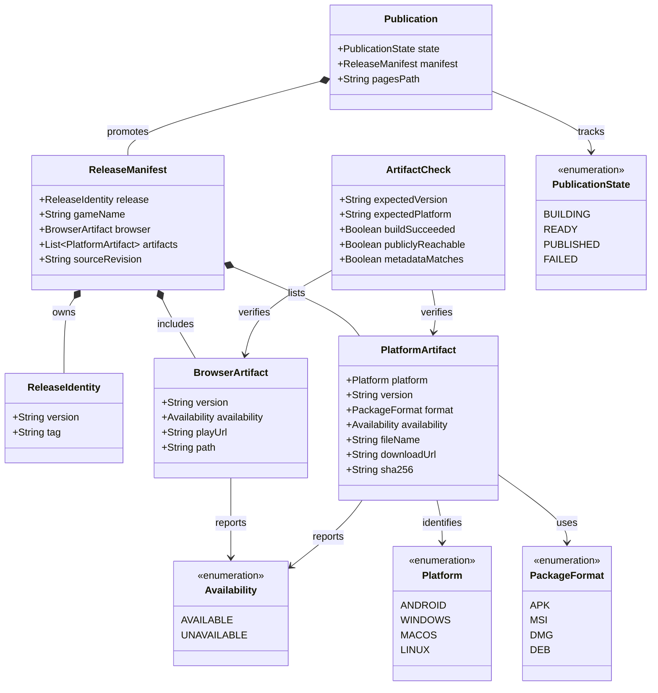

# Host the Browser Game and Provide Download Builds

## Requirements

Implement the release publication surface for the Snake game so an unauthenticated visitor can open the project's GitHub Pages site, play the browser build, and obtain the Android APK or supported desktop package for one coherent release. The browser experience must reuse the shared Kotlin Compose Multiplatform game rules and presentation boundary; this story must not duplicate or change gameplay behavior owned by the earlier Snake stories.

### In-scope behavior

- Publish a responsive, publicly readable GitHub Pages landing page for the `snake` project at the project Pages base path, with a configurable base path for a future custom domain.
- Show the game name `Snake`, the current release version `1.0.0`, a clear browser-play action, and a downloads section before a visitor selects an option.
- Add a browser target that launches the shared `SnakeApp` and permits a visitor to start and complete a game session without an account, installation, or network-backed gameplay service.
- Publish the Android APK and the Windows MSI, macOS DMG, and Linux DEB packages as versioned public GitHub Release assets when those artifacts are available.
- Label every native action with its platform and release version, and make the browser action identify the same release.
- Generate the page's visible actions from one authoritative release manifest so browser play and every displayed native link cannot come from different releases.
- Omit a platform whose artifact is intentionally unavailable for the current release, or show an explicit non-link unavailable status; never publish a broken current download link.
- Promote a new release as one validated Pages deployment only after its browser build, manifest, and available native assets are ready.
- Keep the page and actions usable from unauthenticated desktop and mobile browsers, including touch-capable browsers and project Pages URLs with a non-root path.

### Explicit decisions for this increment

- The default project Pages address is `https://mihbor.github.io/snake/`; the deployment must keep the project base path configurable rather than baking a domain-root assumption into the browser build.
- The canonical release identity is the Git tag and GitHub Release tag `v1.0.0`. The tag version is the only version used to generate the page, browser path, native asset names, and visible labels for that publication.
- Native artifacts are hosted as public assets on the matching GitHub Release, while GitHub Pages remains the discovery surface and hosts the browser distribution. Do not copy native binaries into the Pages repository artifact.
- Use the initial asset names `snake-1.0.0.apk`, `snake-1.0.0-windows.msi`, `snake-1.0.0-macos.dmg`, and `snake-1.0.0-linux.deb`. The naming rule must remain derivable from the canonical version and platform rather than from an unversioned `latest` URL.
- The browser distribution is published under a versioned Pages path such as `releases/1.0.0/play/`; the current landing page points to that exact path. Relative URLs must work when the site is served at `/snake/`.
- The release manifest is generated only after artifact readiness checks. It records intentionally unavailable platforms, but the default landing-page policy is to omit unavailable download links and optionally show a short `Not available for this release` status without an anchor.
- A failed build or failed public-link validation is a publication failure, not an unavailable platform. An artifact may be omitted only when the release configuration explicitly declares that platform unavailable.
- Android `versionName` and desktop `packageVersion` must both be `1.0.0` for this release. Android's numeric `versionCode` remains a separate positive integer and must be supplied consistently by release configuration.
- The hosting work may be prepared before the complete game prerequisite is finished, but the release must not be advertised as acceptance-complete until the browser, Android, and desktop targets all provide the complete game session required by `Epic-1 Snake Game`. Do not implement food, growth, collision, pause, restart, or best-score rules in this story.

### Definition of done

- An unauthenticated visitor opening the deployed project Pages URL sees `Snake`, `1.0.0`, a browser-play action, and a downloads section without signing in.
- The browser action opens the versioned browser build and the shared game can start and complete a session on keyboard-capable and touch-capable browsers once the gameplay prerequisite is complete.
- The Android, Windows, macOS, and Linux actions each resolve to a public asset for `1.0.0` when that platform is declared and built; missing platforms have no dead current link.
- A single validated manifest supplies the displayed version, browser location, platform availability, labels, and native URLs.
- Updating the release tag and artifacts produces a new current page and matching links without retaining stale artifact metadata as current.
- Common game tests and browser/landing-page release checks pass, and all configured production targets compile.

## Entities

- `ReleaseIdentity` is the canonical version boundary. Its `version` is semantic version `1.0.0` for the initial publication and its `tag` is `v1.0.0`; no artifact may carry a different release identity in the current manifest.
- `ReleaseManifest` is the page's authoritative input. It contains one browser record and at most one record per platform, includes only versioned public URLs, and carries the source revision used to build the release.
- `BrowserArtifact` represents the versioned Pages-hosted browser distribution, not a second browser implementation. Its path must resolve under the configured project base path.
- `PlatformArtifact` represents one public native package. `platform`, `format`, `fileName`, `downloadUrl`, and `version` must agree; `sha256` is generated for integrity diagnostics even if it is not a primary visitor action.
- `Availability.UNAVAILABLE` is an explicit publication state, not a failed URL. The renderer must not turn it into a clickable current download.
- `Publication` is the coordinated promotion of one manifest and one Pages site artifact. A new publication becomes current only after every required check succeeds.
- `ArtifactCheck` distinguishes a build failure, a version mismatch, a platform/name mismatch, and an inaccessible public asset so the workflow cannot silently downgrade a failed artifact to unavailable.

## Approach

1. **Reuse the shared game boundary for browser delivery**:
   - Add a browser target to the existing Kotlin Compose Multiplatform module and provide a thin browser entry point that renders the existing `SnakeApp` rather than a separate JavaScript or HTML game loop.
   - Give the browser both keyboard and touch capabilities so desktop browsers can use keyboard input and mobile browsers can use visible controls; keep direction, movement, and session rules in `commonMain`.
   - Preserve the current Android and desktop launchers and make browser-specific lifecycle, focus, viewport, and base-path behavior the only target boundary concerns.
   - Do not make the release story responsible for gameplay features that belong to `STORY-001-002` through `STORY-001-005`; use shared tests and a readiness gate to prove the prerequisite instead.

2. **Use one canonical release manifest**:
   - Derive the published version from the `v<version>` Git tag and pass it into Gradle, the browser path, native package names, GitHub Release asset URLs, and the generated landing page.
   - Centralize the local/default release version and Android numeric version code so `composeApp/build.gradle.kts` cannot keep divergent `1.0` and `1.0.0` values.
   - Generate a manifest containing only validated browser and native artifact records. The page renderer must consume this manifest rather than constructing platform links independently.
   - Keep URLs immutable for a release by using a versioned Pages path and GitHub Release tag asset paths; never use an unqualified `latest` URL for a current action.

3. **Keep Pages a small, accessible discovery surface**:
   - Use static HTML and CSS for the landing page so the page itself does not require Compose, authentication, a backend, or a runtime API call to discover the release.
   - Render a prominent browser-play action separately from the native downloads and show platform names, package formats, and `1.0.0` before selection.
   - Render only available artifact records as links. For an explicit unavailable record, render plain status text with the same platform label and no `href`.
   - Use relative browser and asset paths, a configured project base path, semantic headings and lists, keyboard focus styles, sufficient contrast, and responsive layout that remains readable on narrow mobile screens.

4. **Publish native artifacts through versioned GitHub Release assets**:
   - Build the Android release APK and the declared Windows MSI, macOS DMG, and Linux DEB packages from the same source revision and release version.
   - Upload only artifacts that have passed naming, version, format, checksum, and non-empty-file checks. Validate the public release URLs after upload rather than treating upload completion as public availability.
   - Keep platform availability explicit in release configuration. An intentionally unsupported platform can be marked unavailable; an expected platform with a failed build blocks publication.
   - Retain native binaries outside the Pages deployment so site updates remain small and historical release tags remain independently addressable.

5. **Promote releases with readiness checks and a single deployment**:
   - Use a tag-triggered GitHub Actions workflow to build the browser distribution and native matrix, create or update the matching GitHub Release, generate the manifest, validate every available public URL, and assemble one Pages deployment artifact.
   - Deploy the Pages artifact only after the manifest is internally coherent and all referenced assets are publicly reachable. Generate the current landing page and versioned browser directory in a staging directory, then deploy that directory as one unit.
   - Keep the previous current Pages deployment when a new release fails validation; never publish a page that names the new version while referencing partial or older artifacts.
   - Make the workflow safe to rerun for the same tag by replacing only the matching release assets and regenerating the same manifest, while refusing a tag whose version disagrees with build metadata.

## Structure

### Components

1. `composeApp/src/commonMain/kotlin/com/example/snake/game`: existing shared game model, rules, controller, input mapping, and `SnakeApp`; no release-specific gameplay rules belong here.
2. `composeApp/src/wasmJsMain/kotlin/com/example/snake`: browser application entry point that launches `SnakeApp` with keyboard and touch capabilities and honors the Pages base path.
3. `composeApp/build.gradle.kts`: browser target/distribution configuration, release-version propagation, and existing Android/desktop packaging configuration updated to consume the canonical version.
4. `release/release-config.json`: source configuration for the game name, Pages base path, supported platforms, package formats, and intentionally unavailable platforms; it must not contain mutable `latest` URLs.
5. `release/manifest.schema.json`: machine-readable contract for the generated manifest, including one release identity, browser path, platform records, availability, and integrity metadata.
6. `release/tools`: small deterministic validation/rendering utilities for manifest generation, version checks, link checks, and static landing-page assembly; utilities must fail closed on malformed or incomplete release data.
7. `site/index.template.html` and `site/styles.css`: static landing-page template and responsive presentation styles; generated output is staged for deployment rather than hand-edited per release.
8. `.github/workflows/release.yml`: coordinated tag-triggered build, artifact upload, manifest generation, readiness validation, and GitHub Pages deployment workflow.
9. `composeApp/src/commonTest/kotlin/com/example/snake/game`: existing shared gameplay tests; release validation tests/scripts should remain separate from pure game-rule tests.

### Dependencies

1. The browser entry point depends on `SnakeApp`, `GameController`, and the shared `commonMain` rules; it must not create alternative movement or collision logic.
2. The Gradle release version is consumed by Android `versionName`, desktop `packageVersion`, browser build metadata, and the release workflow's tag validation.
3. The release configuration feeds manifest generation; the manifest feeds the landing-page renderer and the link-validation step.
4. Native package tasks produce files consumed by the release upload step; uploaded asset URLs are consumed by post-upload public reachability checks.
5. The workflow generates a staged Pages directory containing the release page, styles, manifest, versioned browser distribution, and only the available current artifact links.
6. The landing page links to GitHub Release assets but does not depend on a GitHub API call, authentication token, account state, or online gameplay service at visitor runtime.

### Architecture boundaries

1. **Gameplay boundary**: `commonMain` owns the game state and complete-session rules shared by Android, desktop, and browser. Hosting code must not fork or reinterpret those rules.
2. **Browser boundary**: `wasmJsMain` owns browser launch, viewport/base-path integration, and browser lifecycle. It may select both keyboard and touch presentation capabilities but must call the same shared screen and controller.
3. **Packaging boundary**: Gradle and target build configuration own platform artifacts and their native version metadata. They must not know page layout or construct visitor-facing labels.
4. **Release metadata boundary**: The canonical tag and generated manifest own release identity, platform availability, artifact names, URLs, and checksums. No landing-page template may hard-code a release version or asset URL.
5. **Publication boundary**: The workflow owns staging, readiness checks, GitHub Release upload, and Pages promotion. It must not mutate a current manifest before all referenced assets are ready.
6. **Presentation boundary**: The static landing page owns discovery, labeling, accessibility, and responsive layout. The browser game owns play controls and gameplay UI after the visitor follows the play action.
7. **Security boundary**: No release secret, write token, signing credential, or repository-private URL may be emitted into the Pages artifact or browser bundle; visitor links use public HTTPS locations.

### Release data flow

`v1.0.0` tag → versioned Gradle/browser/native builds → artifact checks and GitHub Release upload → generated `ReleaseManifest` → staged Pages site with `releases/1.0.0/play/` → readiness validation → single current Pages deployment.

### Visitor flow

`https://mihbor.github.io/snake/` → static `Snake` release page → `Play in browser` → versioned browser distribution → shared `SnakeApp` → complete offline session; alternatively → platform-labeled GitHub Release asset for the same `1.0.0` tag.

## Operations

### Centralize release version and native package identity

1. **Responsibility**: Make Android, desktop, browser metadata, and publication inputs use one release version without changing gameplay.
2. **Files and configuration**:
   - Update `gradle.properties` or shared Gradle build logic with a canonical local `releaseVersion` default of `1.0.0` and a positive Android `releaseVersionCode`.
   - Update `composeApp/build.gradle.kts` so `android.defaultConfig.versionName` and `compose.desktop.application.nativeDistributions.packageVersion` read the canonical version; retain the numeric Android code as a separate validated value.
   - Accept a CI-supplied version for tag builds and fail if it is not valid semantic-version text or does not equal the `v<version>` tag.
3. **Validation rules**:
   - Android reports `versionName = 1.0.0`; desktop packages report `1.0.0`; no current artifact is labeled `1.0`.
   - Package file names are deterministic and include the canonical version and platform suffix.
   - A missing or conflicting version is a configuration error that stops publication before any current Pages deployment.
4. **Completion criteria**: A clean release build can prove the same `1.0.0` identity in Gradle metadata, browser metadata, manifest input, and all available native package names.

### Add the shared browser target and entry point

1. **Responsibility**: Produce a browser-consumable build of the existing shared application without a second game implementation.
2. **Files and configuration**:
   - Add the Compose Multiplatform browser target supported by the pinned Kotlin and Compose versions in `composeApp/build.gradle.kts`, with a browser distribution task and a thin `wasmJsMain` launcher.
   - Launch `SnakeApp(InputCapabilities(keyboard = true, touch = true))` from the browser entry point so keyboard-capable and touch-capable browsers receive usable controls.
   - Configure the generated browser HTML and resource paths for the project Pages base path `/snake/`, with a CI/property override for a custom domain or alternate repository path.
   - Keep `MainActivity` and desktop `Main.kt` as target launchers for the existing native application; do not move platform event code into release tooling.
3. **Behavioral contract**:
   - Opening the versioned browser path loads without authentication and reaches the shared game screen.
   - Browser play can start and complete the same game session and produces the same rules/outcomes as the native targets once the gameplay prerequisite is complete.
   - Browser assets resolve under both the local development root and the deployed project path; no absolute `/` asset reference may be required.
4. **Completion criteria**: The browser distribution builds with the repository's pinned toolchain, serves from a local static server, and passes a smoke check for game launch, start, controls, and a complete session.

### Define release configuration and manifest contract

1. **Responsibility**: Represent one release and its artifact availability in a format that both automation and the page can validate.
2. **Files and contracts**:
   - Define `release/release-config.json` with the game name, Pages base path, supported platform/package mapping, and explicit availability policy. Keep source configuration independent of a particular mutable GitHub Release URL.
   - Generate `release.json` in the staged Pages output according to `release/manifest.schema.json`.
   - Require `release.version = 1.0.0`, `release.tag = v1.0.0`, one available browser path, and unique platform records for the initial release.
   - For each available native artifact require `platform`, `format`, `version`, `fileName`, public tag-scoped `downloadUrl`, non-empty `sha256`, and `availability = AVAILABLE`.
   - For an intentionally unavailable platform require `availability = UNAVAILABLE` and omit or leave absent its download URL; the renderer must never emit an anchor for that record.
3. **Validation rules**:
   - Reject a version mismatch between any record and `release.version`, duplicate platforms, unsupported formats, unversioned URLs, missing browser output, malformed checksums, or a URL whose file name does not match its platform and version.
   - Reject an available record when its artifact was not built, uploaded, or confirmed publicly reachable.
   - Preserve `sourceRevision` and the release tag for diagnostics without exposing repository secrets.
4. **Completion criteria**: A fixture for a complete `1.0.0` release validates, a fixture with one explicit unavailable platform renders without a dead link, and mixed-version or failed-artifact fixtures fail before deployment.

### Build and verify release artifacts

1. **Responsibility**: Produce the browser, Android, and desktop files that the manifest may expose.
2. **Build operations**:
   - Build the browser distribution and stage it under `releases/<version>/play/`.
   - Build the Android release APK and the configured desktop MSI, DMG, and DEB packages from the same tag revision.
   - Rename or copy outputs into the canonical `snake-<version>-<platform>.<format>` names without altering package contents or silently accepting a different embedded version.
   - Calculate SHA-256 checksums and retain file-size and non-empty-file validation results for manifest generation and CI logs.
3. **Validation operations**:
   - Inspect Android package metadata and desktop packaging metadata for the canonical version.
   - Confirm each expected file is present and corresponds to exactly one platform record; do not use a successful build of one platform to populate another platform's record.
   - Treat an explicitly unavailable platform as a deliberate configuration result; treat an expected-but-missing output as a failed release.
4. **Completion criteria**: The staged browser output and every available native package are traceable to `v1.0.0`, have deterministic names, and are ready for public upload without placeholder files.

### Publish GitHub Release assets and validate public URLs

1. **Responsibility**: Make native packages publicly retrievable from immutable, versioned locations before the Pages page advertises them.
2. **Workflow operations**:
   - Trigger from a release tag and create or update only the matching GitHub Release.
   - Upload the canonical APK/MSI/DMG/DEB assets that are marked available; do not upload an asset under a misleading platform name.
   - Construct URLs from the repository, exact tag, and exact asset name, then generate checksums and manifest records from the uploaded files.
   - Validate each URL using an unauthenticated public request with redirects enabled and a successful response; verify the returned asset is non-empty and has the expected name where the host exposes it.
3. **Failure behavior**:
   - Stop before Pages deployment on upload errors, private/inaccessible assets, redirects to a different release, version mismatches, or checksum discrepancies.
   - Do not rewrite a failed expected platform as `UNAVAILABLE`; only explicit release configuration can do that.
   - Make reruns idempotent for the same tag by replacing matching assets or failing with a clear conflict instead of mixing old and new files.
4. **Completion criteria**: Every `AVAILABLE` native manifest record resolves publicly without authentication to the matching `v1.0.0` GitHub Release asset.

### Render the responsive public release page

1. **Responsibility**: Present the current release and its usable actions clearly before a visitor selects a link.
2. **Files and layout**:
   - Use `site/index.template.html` and `site/styles.css` to generate a static page from the validated manifest; do not make the visitor fetch a private API or execute release discovery against GitHub.
   - Show the game name, current version, a distinct `Play in browser` action, and a downloads section with separate Android, Windows, macOS, and Linux entries when available.
   - Include the release version in each action label or adjacent metadata, and show package format where it clarifies the download (`APK`, `MSI`, `DMG`, or `DEB`).
   - Render unavailable records as omitted entries by default or as explicit non-link status text; never render an empty, placeholder, or stale `href`.
   - Use semantic headings, lists, link text that names the platform, visible keyboard focus, sufficient contrast, responsive spacing, and controls that remain readable on narrow and rotated mobile screens.
3. **Completion criteria**: Static inspection of the generated `1.0.0` page finds all required labels and no mixed version; a partial manifest leaves available actions usable and produces no broken current download link.

### Deploy the browser site and current release atomically

1. **Responsibility**: Replace the current Pages publication only with one coherent, validated release surface.
2. **Workflow operations**:
   - Assemble a staging directory containing the generated landing page, `release.json`, styles, the versioned browser distribution, and no unvalidated current links.
   - Verify the landing page's browser URL and every available native URL against the same manifest before deployment; verify browser assets under the configured `/snake/` base path.
   - Deploy the complete staging directory through the repository's GitHub Pages workflow after native Release assets are public. Treat the Pages deployment as the final promotion step.
   - Keep versioned paths and release assets traceable to their tag. A newly generated current page must not point at an older path merely because that path is reachable.
3. **Failure and replacement rules**:
   - If staging, link validation, browser smoke checks, or deployment preparation fails, leave the previous current page unchanged and report the failed release.
   - A new successful deployment may replace the current page, but must not present an older manifest or unversioned `latest` link as current.
   - Do not require visitors to sign in; repository write credentials remain workflow-only and are never part of generated files.
4. **Completion criteria**: A fresh unauthenticated request to `https://mihbor.github.io/snake/` shows the same release identity as every current action, and a failed candidate release cannot become the visible current release.

### Validate the release story

1. **Responsibility**: Demonstrate the acceptance criteria and preserve the shared gameplay contract.
2. **Manifest and page tests**:
   - Validate that a complete fixture exposes `Snake`, `1.0.0`, one browser action, and the downloads section with Android, Windows, macOS, and Linux labels.
   - Validate that every visible action uses `1.0.0`, the browser path is versioned, native URLs use `v1.0.0`, and platform/file-format labels agree.
   - Validate that an unavailable platform is omitted or rendered without `href`, while other available records remain present and unchanged.
   - Validate that duplicate platforms, mixed releases, stale `latest` URLs, missing assets, invalid checksums, and private/unreachable URLs fail the generator.
3. **Browser and target checks**:
   - Serve the staged Pages directory locally under `/snake/` and confirm the landing page, CSS, `release.json`, browser entry point, and browser assets load with no root-path assumptions.
   - Run a browser smoke test at desktop and narrow touch viewport sizes: open the page, select browser play, start a session, use keyboard/touch controls, and complete a session without authentication or network gameplay.
   - Run the existing common game tests and compile the Android and desktop targets so the browser addition does not bypass or alter shared rules.
4. **Publication checks**:
   - After deployment, request the public Pages page without credentials and validate the displayed version and all current links.
   - Verify each available GitHub Release asset with an unauthenticated request and verify that no unavailable platform is presented as a current link.
5. **Completion criteria**: AC1–AC6 are covered by deterministic manifest/page checks plus browser and public-link smoke checks, and the gameplay prerequisite is explicitly green before advertising the release.

## Norms

1. **Shared implementation**: Keep gameplay state, rules, controller, and game presentation shared across Android, desktop, and browser; target source sets may only adapt launch, lifecycle, viewport, and input capability concerns.
2. **Version management**: Treat the exact Git tag version as canonical for a publication. Propagate it to all artifacts and generated metadata; never hand-edit one platform's version or use a mutable `latest` URL for a current action.
3. **Manifest discipline**: Generate the public manifest from validated build outputs. Keep availability explicit, platform records unique, and unavailable records non-clickable.
4. **Static-site design**: Prefer static HTML/CSS and versioned relative paths for the Pages surface. The landing page must work without a backend, account, GitHub API access, or a visitor-side release-discovery request.
5. **Base-path behavior**: Test both the local server root and the deployed `/snake/` project path. Do not assume that `/assets/...` or `/play/...` resolves correctly from a project Pages site.
6. **Accessibility and responsive layout**: Use semantic headings and links, platform-specific link text, visible focus, meaningful status text, sufficient contrast, and layouts that remain usable on desktop and mobile screens.
7. **Release workflow**: Build, upload, validate, generate, and deploy in that order. A readiness or public-link failure blocks promotion; it is never hidden by marking an expected artifact unavailable.
8. **Security**: Keep workflow tokens, signing credentials, and private repository data out of the browser bundle, manifest, logs, and Pages artifact. Use HTTPS public links and avoid adding analytics, accounts, or network gameplay services.
9. **Integrity**: Compute checksums for published native artifacts and retain source revision metadata. Do not silently replace a versioned asset with a different file during a rerun.
10. **Testing**: Keep pure manifest and rendering validation deterministic and local; use unauthenticated public checks only in release/deployment smoke validation. Run existing common gameplay tests and all configured target compilation checks.
11. **Scope control**: Do not add store distribution, automatic installation, update clients, online services, persistence, or new gameplay rules. Do not create fake or placeholder binaries to satisfy a page fixture.
12. **Failure visibility**: Use actionable workflow errors for tag/version mismatch, missing artifacts, unavailable public URLs, bad base paths, or partial staging. Do not expose internal stack traces or repository secrets to visitors.

## Safeguards

1. **Functional constraints**:
   - The current page always identifies `Snake` and exactly one canonical current release version.
   - Browser play, Android, Windows, macOS, and Linux options can only reference artifacts owned by that same release identity.
   - Every visible native link names its platform and resolves to a versioned public asset; unavailable platforms are omitted or clearly non-clickable.
   - Browser play uses the shared application and supports a complete offline session without sign-in once the gameplay prerequisite is ready.
   - A new release updates the manifest, browser path, labels, and links as one publication rather than mixing old and new records.
2. **Availability and performance constraints**:
   - The landing page is static and lightweight; it must not wait on GitHub API calls or a gameplay service before showing release actions.
   - Native downloads are served from public release assets rather than the Pages deployment, and the page should remain usable on mobile connections.
   - Browser assets must resolve from the project Pages base path and the page must remain readable without relying on a wide desktop viewport.
3. **Security constraints**:
   - All visitor-facing links use HTTPS and public, read-only locations; no authentication prompt is required for the page, browser game, or advertised downloads.
   - Workflow credentials, release-upload permissions, signing material, and private metadata must never enter `release.json`, HTML, JavaScript/Wasm resources, or public logs.
   - Do not add tracking, accounts, online gameplay, remote configuration, or a third-party binary host beyond the agreed public GitHub Release location.
4. **Integration constraints**:
   - `commonMain` remains the only owner of shared game behavior; `wasmJsMain`, `androidMain`, and `desktopMain` remain thin target boundaries.
   - Gradle package metadata and release-manifest metadata must be checked against the tag before Pages deployment.
   - GitHub Release asset upload must complete before the manifest can mark a native artifact available, and Pages deployment must be last.
   - A failed candidate publication must leave the previously deployed current page intact rather than exposing a partial manifest.
5. **Business rule constraints**:
   - The public page exposes one recognizable current release, not a mixed collection of per-platform versions.
   - Platform labels are understandable before selection and distinguish Android from Windows, macOS, and Linux.
   - A platform without a package is not represented by a broken current link.
   - The release-hosting story does not change gameplay rules, target support assumptions, or the single-player offline scope of the epic.
6. **Error-handling constraints**:
   - Treat version mismatch, duplicate platform, missing expected artifact, failed upload, inaccessible public URL, invalid base path, and failed browser smoke check as publication-blocking errors.
   - Treat only an explicit unavailable-platform declaration as `UNAVAILABLE`; never infer it from an unexpected build failure.
   - Keep visitor-facing failure states concise and actionable, and never show stack traces, workflow tokens, or internal paths on the public page.
7. **Technical constraints**:
   - Use the pinned Kotlin/Compose/Gradle toolchain and add only the browser target compatible with that toolchain.
   - Keep browser output, release assets, and the page manifest versioned and reproducible from a tag and source revision.
   - Prefer a single coordinated GitHub Actions workflow and a staged Pages deployment over independent manual edits that can drift.
8. **Data constraints**:
   - The release version is valid semantic version text and is identical in the tag, manifest, browser path, Android `versionName`, desktop `packageVersion`, asset names, and visible page labels.
   - Each platform appears at most once; each available platform has exactly one declared format and one public asset URL.
   - Checksums are generated from the exact uploaded files, and source revision metadata is retained for release diagnostics.
9. **UI and boundary constraints**:
   - The browser-play action is visually distinct from native downloads and uses link text that remains meaningful when read out of context.
   - Keyboard focus, touch activation, narrow screens, rotation, and project-path asset resolution are covered by validation.
   - The landing page must not imply that an unavailable platform is supported for the current release and must not expose stale historical assets as current.