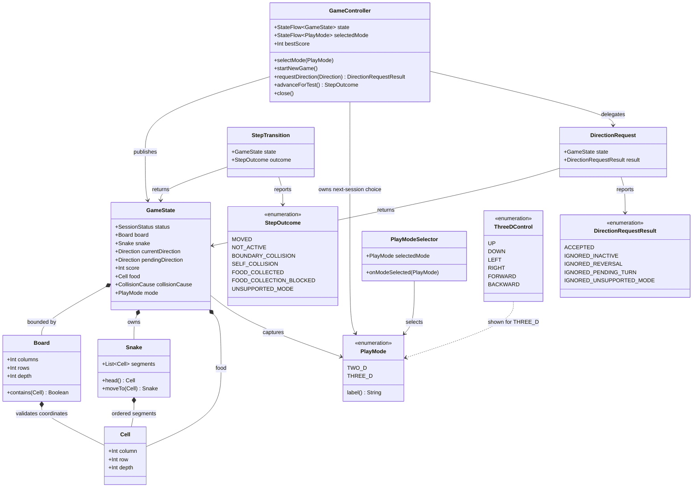

# Choose the 3D Play Mode

## Requirements

Implement `STORY-002-001` so a player can choose between the familiar 2D game and a bounded, visibly deep 3D initial session before play begins, while keeping the existing 2D rules, controls, lifecycle, and offline behavior intact.

### In-scope behavior

- Present mutually exclusive `2D` and `3D` choices in the existing pre-session and completed-game restart experience.
- Select `2D` by default for a newly created controller when no current-session choice exists; do not persist the choice across relaunches in this story.
- Apply the final pre-session or completed-game selection to the next `Start New Game` action.
- Expose the effective mode as part of the immutable `GameState` so the active session, renderer, and tests have one authoritative mode identity.
- Preserve the existing 2D initial board, three-segment snake, one unoccupied food cell, score `0`, direction, controls, and gameplay rules.
- Create a bounded `20 x 20 x 3` initial 3D space with zero-based depth coordinates, a three-segment snake on the middle depth layer, exactly one unoccupied food cell, and score `0`.
- Show a mode label and a mode-appropriate initial-space presentation when the session starts.
- Show visible 3D movement affordances for `Up`, `Down`, `Left`, `Right`, `Forward`, and `Backward` without implementing 3D movement in this story.
- Keep mode selection enabled at the `READY` and completed `GAME_OVER` boundaries. During `ACTIVE` and `PAUSED`, show the session's captured mode and make mode-selection attempts inert; after `GAME_OVER`, allow a choice for the next session without changing the completed session.
- Keep mode handling in shared `commonMain` code so desktop, Android, and Wasm/browser behave equivalently without accounts or network access.

### Explicit decisions for this increment

- `PlayMode` is a common enum with `TWO_D` and `THREE_D`; its player-facing labels are `2D` and `3D`.
- `2D` uses the existing `20 x 20` board with a single depth layer (`depth = 1`); all 2D cells have `depth = 0`.
- `3D` uses a `20 x 20 x 3` board; its centered initial head is `(10, 10, 1)`, followed by `(9, 10, 1)` and `(8, 10, 1)`, head first.
- The existing injected `Random` selects the initial food from every valid depth layer after excluding all snake segments; the exact food coordinate is not part of the player-facing contract.
- Selecting a mode in `READY` updates the ready preview to that mode, while selecting a mode in `GAME_OVER` updates only the next-session choice; neither action starts a clock or gameplay transition. Starting creates a fresh state, including a fresh valid food selection, with the selected mode captured in the active state.
- `GameController` owns the next-session selection and exposes it separately from `GameState.mode`; `GameState.mode` is the immutable identity of the current ready preview or active or completed session.
- A selection request is accepted while `GameState.status == READY` or after a session has completed with `GAME_OVER`. Requests during `ACTIVE` or `PAUSED` do not alter `_selectedMode`, `GameState.mode`, the board/space, snake, food, score, progress, or movement-clock generation; a `GAME_OVER` selection changes only `_selectedMode` and leaves the completed state unchanged.
- A 3D session is `ACTIVE` so it has the normal session identity and UI lifecycle, but the existing planar movement clock and planar direction requests must not move or mutate it. The 3D movement contract belongs to `STORY-002-002`.
- The 3D initial view uses existing Compose primitives and a layered/projection-style renderer; do not add a 3D engine, platform-specific renderer, account, network, or persistence dependency.
- Existing pause/resume, completion, restart, best-score, food, and collision behavior is not redesigned by this story. The new mode boundary must not corrupt those existing state or persistence paths.

### Acceptance criteria

- **AC1 — Both play modes are offered before a session**: When the application is open before a game starts, the player can clearly choose between `2D` and `3D`, and `2D` is selected by default when no previous choice exists.
- **AC2 — Selecting 3D opens a 3D session**: After selecting `3D` and starting a new game, the game opens in a bounded `20 x 20 x 3` play space with visible depth, a three-segment snake, exactly one food item on an unoccupied cell, current score `0`, and visible controls appropriate to 3D movement.
- **AC3 — Selecting 2D keeps the familiar start experience**: After selecting `2D` or leaving the default unchanged and starting a new game, the existing 2D board, three-segment snake, exactly one unoccupied food item, current score `0`, and existing 2D controls remain available.
- **AC4 — The mode does not change during an active session**: After a 3D session is active, attempts to choose `2D` leave the complete active 3D state unchanged; mode can be changed only at `READY` or at the later boundary after a session has finished.

### Out-of-scope behavior

- Do not implement 3D snake navigation, depth-direction semantics, food collection, score increases, 3D collision outcomes, or 3D progression.
- Do not change the existing 2D gameplay rules, board dimensions, initial arrangement, input mappings, pause/resume behavior, completion behavior, restart behavior, or best-score storage semantics.
- Do not persist the selected mode across application relaunches or make it mode-specific in `BestScoreStore`.
- Do not add target-specific mode coordinators or separate 2D and 3D game loops.

### Definition of done

- The shared domain exposes a validated mode-aware state and bounded depth coordinate without breaking existing two-argument `Cell`/`Board` usage.
- `READY` begins with `2D`, selection visibly updates the ready experience, completed-game selection visibly updates the next-session choice without hiding the final result, and `Start New Game` captures the final selection exactly once for the new session.
- Both modes satisfy the three-segment, one-unoccupied-food, in-bounds, and score-`0` initialization invariants; 2D regression behavior remains unchanged.
- A 3D session renders visible bounded depth and six clearly labeled 3D movement affordances but never moves through the new depth axis in this increment.
- Active-session mode-selection attempts are safe no-ops and cannot replace the captured mode or mutate any active session data; completed-game selection changes only the next-session choice and preserves the final snapshot.
- Common deterministic tests and relevant Compose tests cover all four acceptance criteria; every configured target compiles and the existing relevant tests pass.

## Entities

- `PlayMode` is the only allowed dimension choice. Keep the enum in the existing common model package and use explicit display labels rather than deriving user-visible text from enum names.
- `Cell` remains the value object used by both modes. Add `depth` with a default of `0` so existing 2D construction and equality expectations remain source-compatible; `depth` is a zero-based coordinate, not a pixel or renderer value.
- `Board` remains the finite coordinate validator. Add `depth` with a default of `1`; `contains` must validate all three axes. A one-layer board is the established 2D board, while a multi-layer board represents bounded 3D space.
- `Snake` remains an ordered head-first list of `Cell` values. Do not create a second 3D snake type or duplicate growth/movement operations.
- `GameState.mode` is the session-owned mode identity. It is present in the `READY` preview, copied into the fresh active state, and retained in the completed state; it cannot be rewritten by selector input after activation.
- `GameController.selectedMode` is the next-session choice. It defaults to `TWO_D`, is changed by `selectMode` in `READY` or `GAME_OVER`, and is not a substitute for the active or completed state's mode.
- `PlayModeSelector` is a presentation component with accessible selected/unselected semantics. It is rendered in the ready and completed-game experiences and is hidden or disabled during `ACTIVE` and `PAUSED`.
- `ThreeDControl` is a presentation vocabulary for the six visible 3D movement affordances. It must not add movement behavior, depth key mapping, or a second gameplay rule path in this story.
- `DirectionRequestResult.IGNORED_UNSUPPORTED_MODE` and `StepOutcome.UNSUPPORTED_MODE` are typed no-op outcomes for accidental use of the existing planar APIs with an active 3D state; they prevent silent planar movement while leaving a clear extension seam for the next story.

## Approach

1. **Extend the existing shared spatial model conservatively**:
   - Add one optional depth coordinate to `Cell` and one depth dimension to `Board`, preserving the current 2D constructor calls and using `depth = 1` as the 2D default.
   - Add `PlayMode` and `mode` to the existing immutable `GameState` rather than introducing a parallel session model or inferring the mode from rendering.
   - Keep `Snake`, `Direction`, food validation, score validation, collision state, and the established planar rules intact unless a mode guard is required to prevent accidental 3D movement.
   - Use `20 x 20 x 3` only as the default 3D initial space; validate custom spaces instead of scattering dimensions through the UI.

2. **Keep selection and session identity at the controller boundary**:
   - Let `GameController` own a `StateFlow<PlayMode>` for the next-session selection and a separate `StateFlow<GameState>` for the authoritative session snapshot.
   - Rebuild the `READY` preview when a mode is selected so the player can see the appropriate initial space before starting; after `GAME_OVER`, update only the next-session choice without replacing the completed snapshot, starting a clock, or mutating an active session.
   - Capture the selected mode before replacing the state in `startNewGame`; preserve the existing session-generation and clock-cancellation protections.
   - Start the existing movement clock only for 2D in this increment. A 3D state remains active and renderable but returns a typed unsupported result from planar advance/input paths until `STORY-002-002` defines its movement.

3. **Use one shared Compose screen with mode-specific presentation**:
   - Add the selector, selected state, and explicit `Mode: 2D`/`Mode: 3D` text to `GameScreen` without moving mode logic into platform entry points.
   - Reuse the current `SnakeBoard` for 2D. Add a lightweight `ThreeDSnakeBoard` using existing Compose `Canvas`/layout primitives to draw three bounded depth layers with offsets, grid outlines, labels or equivalent textual layer cues, and the snake/food in their actual layer.
   - Show the six 3D control labels in the active 3D presentation. Keep them visibly understandable and accessible but inert/disabled; do not route them through `GameController.requestDirection`.
   - Preserve responsive sizing, scrolling, focus, score/best-score presentation, target capability hints, and existing 2D D-pad semantics.

4. **Preserve target neutrality and verify behavior at shared boundaries**:
   - Keep desktop, Android, and Wasm/browser launchers thin; they continue to provide capabilities and persistence only.
   - Keep mode selection and initial-state construction in `commonMain` so identical selections produce equivalent state on every target.
   - Cover domain and controller behavior with deterministic common tests, UI semantics and rendering branches with Compose tests, and compile/test every configured target without wall-clock sleeps.

## Structure

### Components

1. `composeApp/src/commonMain/kotlin/com/example/snake/game/model/PlayMode.kt`: allowed mode values and stable user-facing labels.
2. `composeApp/src/commonMain/kotlin/com/example/snake/game/model/Cell.kt`: shared zero-based column, row, and depth coordinate.
3. `composeApp/src/commonMain/kotlin/com/example/snake/game/model/Board.kt`: validated finite columns, rows, and depth dimensions.
4. `composeApp/src/commonMain/kotlin/com/example/snake/game/model/GameState.kt`: immutable session snapshot including the captured `PlayMode`.
5. `composeApp/src/commonMain/kotlin/com/example/snake/game/rules/GameRules.kt`: mode-aware initialization, existing 2D transitions, food placement across valid depth, and typed 3D no-op guards.
6. `composeApp/src/commonMain/kotlin/com/example/snake/game/rules/DirectionRequestResult.kt` and `StepOutcome.kt`: explicit unsupported-mode outcomes without exceptions for expected player actions.
7. `composeApp/src/commonMain/kotlin/com/example/snake/game/controller/GameController.kt`: next-session selection, session capture, state publication, and mode-aware clock lifecycle.
8. `composeApp/src/commonMain/kotlin/com/example/snake/game/ui/GameScreen.kt`: selector, mode labels, existing 2D board path, layered 3D renderer, and mode-appropriate controls.
9. `composeApp/src/commonMain/kotlin/com/example/snake/game/ui/SnakeApp.kt`: collect and pass the controller's selected mode and selection callback to the shared screen.
10. `composeApp/src/commonTest/kotlin/com/example/snake/game`: common model, rules, controller, and UI regression/acceptance tests; extend existing test files where behavior already belongs there.

### Dependencies

1. `GameController.selectMode` invokes shared initialization to create a `READY` preview, or updates only the next-session choice from `GAME_OVER`, and publishes the selected mode separately.
2. `GameController.startNewGame` reads the selected mode once, calls `GameRules.startNewGame`, replaces the state, and invokes the existing clock lifecycle; the clock must remain disabled for `THREE_D` in this increment.
3. `GameRules.startNewGame` chooses the mode's default board, centers the three-segment snake at a valid depth, and chooses one unoccupied food cell with the injected `Random`.
4. `GameRules.requestDirection` and `GameRules.advance` continue to serve 2D and return typed unsupported-mode results for 3D rather than applying planar changes.
5. `SnakeApp` observes `GameController.state` and `GameController.selectedMode`; `GameScreen` sends mode selections only from `READY` or `GAME_OVER` to `onModeSelected` and sends existing 2D direction intents to `onDirection`.
6. `GameScreen` chooses `SnakeBoard` for `TWO_D` and `ThreeDSnakeBoard` for `THREE_D`; neither renderer owns session rules, random generation, or clock behavior.
7. Desktop, Android, and Wasm/browser entry points remain consumers of the same `SnakeApp` contract and must not construct or persist `PlayMode` independently.

### Architecture boundaries

1. **Domain model boundary**: Owns mode identity, validated three-axis coordinates, bounded board membership, immutable state, and compatibility defaults. It has no Compose, Android, desktop, browser, persistence, or network imports.
2. **Rules boundary**: Owns initialization invariants, food placement, existing 2D transitions, and typed rejection of unsupported 3D movement. It must not draw controls or decide layout.
3. **Controller boundary**: Owns the mutable next-session selection, session capture, observable state, clock generation, and action serialization. It is the only component allowed to coordinate selection with session creation.
4. **Presentation boundary**: Owns mode-selector semantics, labels, layered depth visualization, six 3D control affordances, responsive layout, focus, and target capability hints. It must not infer or mutate mode from pixels or duplicate rules.
5. **Persistence boundary**: `BestScoreStore` remains a single shared best-score boundary. No mode preference or mode-specific score storage is introduced.
6. **Platform boundary**: Target entry points continue to provide launch, lifecycle, and `InputCapabilities` only. No target may implement a separate mode or session flow.

### State flow

`GameController` starts with `selectedMode = TWO_D` and a `READY` 2D preview → `PlayModeSelector` calls `selectMode(THREE_D)` → controller publishes a `READY` 3D preview without a clock → `Start New Game` captures `THREE_D` → controller publishes a fresh `ACTIVE` 3D `GameState` → `GameScreen` renders `Mode: 3D`, the layered bounded space, initial snake, food, score `0`, and six inert 3D affordances → a completed session exposes the selector again, where `selectMode` changes only the next-session choice → the next `Start New Game` captures that choice → any planar input/tick is rejected without state mutation until the later 3D gameplay story.

## Operations

### Create mode-aware spatial primitives - `PlayMode`, `Cell`, and `Board`

1. **Responsibility**: Represent the two allowed play modes and validate both planar and bounded-depth coordinates while preserving existing 2D callers.
2. **Contracts**:
   - Add `enum class PlayMode { TWO_D, THREE_D }` in the existing model package and expose a stable label mapping of `TWO_D -> "2D"` and `THREE_D -> "3D"`.
   - Update `data class Cell` to `Cell(val column: Int, val row: Int, val depth: Int = 0)`; keep coordinate-based equality and zero-based axes.
   - Update `data class Board` to `Board(val columns: Int = 20, val rows: Int = 20, val depth: Int = 1)`; require all dimensions to be positive.
   - Implement `contains(cell: Cell): Boolean` as `0 <= column < columns`, `0 <= row < rows`, and `0 <= depth < depthDimension` using the board's depth property without ambiguous shadowing in code.
3. **Compatibility and validation**:
   - Existing `Cell(column, row)` and `Board(columns, rows)` construction must continue to compile and mean the current 2D coordinate/layer.
   - Do not add a second coordinate type, renderer coordinate, or 3D engine.
   - Add common tests for negative and upper-bound depth, positive-dimension validation, one-layer 2D containment, and multi-layer containment.
4. **Completion criteria**: The model compiles without UI/platform imports and existing 2D coordinate tests continue to pass.

### Extend immutable session state - `GameState`

1. **Responsibility**: Make the current mode observable and authoritative without changing existing state ownership or food/collision invariants.
2. **Contract**:
   - Add `val mode: PlayMode = PlayMode.TWO_D` to `GameState` in a source-compatible position for existing constructors where possible.
   - Retain `status`, `board`, `snake`, `currentDirection`, `pendingDirection`, `score`, `food`, and `collisionCause` unchanged.
   - Continue requiring `score >= 0`, `board.contains(food)`, food not present in `snake.segments`, and the existing `GAME_OVER`/`collisionCause` relationship.
   - Require `TWO_D` states to use a one-layer board and `THREE_D` states to use a board with at least two layers; the default 3D initializer uses exactly three.
3. **State semantics**:
   - In `READY`, `mode` describes the mode-aware preview corresponding to the current next-session selection.
   - In `ACTIVE`, `PAUSED`, and `GAME_OVER`, `mode` is the captured session identity and must not be updated by the selector.
4. **Completion criteria**: Tests can distinguish 2D and 3D snapshots directly from `GameState.mode`, and invalid mode/board combinations fail fast as configuration errors rather than being silently rendered.

### Implement mode-aware initial state - `GameRules.startNewGame`

1. **Responsibility**: Create a fresh valid session for either mode while preserving the established 2D initialization and food behavior.
2. **Public contract**:
   - Preserve the existing positional `board`/`random` call shape with `fun startNewGame(board: Board? = null, random: Random = Random.Default, mode: PlayMode = PlayMode.TWO_D): GameState`; callers select `mode` by name when needed.
   - If `board == null`, use `Board(20, 20, 1)` for `TWO_D` and `Board(20, 20, 3)` for `THREE_D`.
   - If a board is supplied, require `depth == 1` for `TWO_D` and `depth >= 2` for `THREE_D`; retain the existing positive-dimension validation.
3. **Initialization logic**:
   - Compute `headColumn = board.columns / 2`, `headRow = board.rows / 2`, and `headDepth = if (mode == TWO_D) 0 else board.depth / 2`.
   - Create `[Cell(headColumn, headRow, headDepth), Cell(headColumn - 1, headRow, headDepth), Cell(headColumn - 2, headRow, headDepth)]` in head-first order.
   - Reject a supplied board that cannot contain all three initial segments with a descriptive `IllegalArgumentException`/`require` failure, matching current behavior.
   - Select exactly one cell from the complete valid coordinate volume that is not occupied by the snake; retain injected randomness and throw the existing descriptive failure if no free cell exists.
   - Return `GameState(status = ACTIVE, board = effectiveBoard, snake = initialSnake, currentDirection = RIGHT, pendingDirection = null, score = 0, food = food, collisionCause = null, mode = mode)`.
4. **Preservation rules**:
   - For default `TWO_D`, preserve the existing `20 x 20`, `(10,10,0)`, `(9,10,0)`, `(8,10,0)` arrangement, score, direction, and seeded food candidate order.
   - For default `THREE_D`, validate a `20 x 20 x 3` board, middle-layer initial snake, exactly one in-bounds unoccupied food cell, and score `0`.
   - Keep the current food, growth, collision, pause, completion, and best-score transitions unchanged unless they need to preserve the new `mode` field through `copy` operations.
5. **Completion criteria**: Repeated seeded calls create equivalent but independent valid states for both modes, and every generated food coordinate satisfies all three board bounds and snake exclusion.

### Guard unsupported 3D use of existing planar rules - `requestDirection` and `advance`

1. **Responsibility**: Prevent this story's new 3D state from accidentally entering the existing 2D movement implementation while keeping later extension points explicit.
2. **Contracts**:
   - Add `IGNORED_UNSUPPORTED_MODE` to `DirectionRequestResult`.
   - Add `UNSUPPORTED_MODE` to `StepOutcome`.
   - In `GameRules.requestDirection(state, requested)`, preserve the existing inactive check first; when an active state has `mode == THREE_D`, return the unchanged state with `IGNORED_UNSUPPORTED_MODE` before applying reversal or pending-turn logic.
   - In `GameRules.advance(state, random)`, preserve the existing inactive check first; when an active state has `mode == THREE_D`, return `StepTransition(state, UNSUPPORTED_MODE)` unchanged before computing a planar offset.
3. **Boundary behavior**:
   - Do not add depth directions to the existing `Direction` enum or map forward/backward controls to planar directions.
   - Do not alter 2D `RIGHT`/`LEFT` reversal, pending-turn, food, collision, score, or boundary behavior.
   - A 3D no-op must preserve object equality for mode, board, snake, food, score, current direction, pending direction, status, and collision cause.
4. **Completion criteria**: Common tests prove that a 3D request and a direct 3D advance are typed no-ops, while all existing 2D rule tests retain their outcomes.

### Add next-session mode selection - `GameController`

1. **Responsibility**: Own the pre-session choice, capture it exactly at session creation, and prevent selector input from changing an active session.
2. **Public contract**:
   - Add `val selectedMode: StateFlow<PlayMode>` backed by a private `MutableStateFlow` initialized to `PlayMode.TWO_D`.
   - Add `fun selectMode(mode: PlayMode)`; it has no return value because invalid lifecycle usage is a safe no-op.
   - Retain `val state: StateFlow<GameState>`, `startNewGame`, `requestDirection`, `advanceForTest`, clock methods, best-score access, and `close`.
3. **Selection logic**:
   - If closed or `state.value.status` is neither `READY` nor `GAME_OVER`, return without changing `_selectedMode` or `_state`.
   - If the requested mode equals the current selection, return without regenerating the preview.
   - In `READY`, set `_selectedMode`, create `GameRules.startNewGame(mode = mode, random = random).copy(status = READY)`, and publish it as the new ready preview; do not create a movement job.
   - In `GAME_OVER`, set `_selectedMode` without replacing `_state`; the completed state, final score, collision cause, and captured session mode remain unchanged until `startNewGame` creates the next session.
   - Keep the selected mode session-local; controller construction/relaunch starts at `TWO_D` and no mode is read from `BestScoreStore` or another persistence mechanism.
4. **Start logic**:
   - In `startNewGame`, capture `_selectedMode.value` in a local variable before incrementing `sessionGeneration`, canceling the prior job, and replacing `_state`.
   - Create a fresh active state with `GameRules.startNewGame(mode = capturedMode, random = random)` so food and all session data are freshly initialized.
   - Keep the existing generation guard and call `startClock()` once after publishing the state; `startClock` must refuse to create a job when the active mode is `THREE_D`.
   - Leave `selectedMode` equal to the last accepted boundary choice after start; because selection is disabled during `ACTIVE` and `PAUSED`, it cannot disagree with the active session during this story, while a `GAME_OVER` choice is intentionally for the next session.
5. **Lifecycle and completion behavior**:
   - `close` cancels any 2D clock and prevents future mode or gameplay mutation as it already does.
   - Existing pause/resume and game-over transitions must preserve `GameState.mode`; do not add a separate mode lifecycle.
   - `advanceForTest` on an active 3D state returns `UNSUPPORTED_MODE` and leaves the snapshot unchanged; an active 3D session must not create a clock job.
6. **Completion criteria**: Controller tests verify default `2D`, ready and completed-game selection, final selection capture, one active mode identity, no clock for 3D, unchanged state after active/paused selection attempts, completed snapshot preservation, and no post-close mutation.

### Add mode selection and explicit mode presentation - `GameScreen`

1. **Responsibility**: Make mode choice understandable before start and after completion, and make the captured mode identifiable from session start without duplicating controller/rules logic.
2. **Public composable contract**:
   - Extend `GameScreen` with `selectedMode: PlayMode = state.mode` and `onModeSelected: (PlayMode) -> Unit = {}` while retaining existing `state`, `bestScore`, `capabilities`, `onStart`, `onDirection`, pause/resume, and modifier parameters.
   - `SnakeApp` must pass `controller.selectedMode.collectAsState()` and `controller::selectMode`; callers that do not need selection retain safe defaults for existing tests.
3. **`READY` and `GAME_OVER` layout and semantics**:
   - Render a mutually exclusive `PlayModeSelector` before `Start New Game` with literal visible labels `2D` and `3D`.
   - Mark the initial `2D` item selected through semantics and visible state without relying only on color; expose `Selected`/`Not selected` state descriptions and stable content descriptions such as `2D play mode` and `3D play mode`.
   - Give each choice a minimum `48 dp` interaction target and keyboard/assistive-technology reachable focus order.
   - Invoke `onModeSelected` only with the selected enum; keep the start/restart action and score labels available in both selection views.
   - Show `Selected mode: 2D` or `Selected mode: 3D` so the choice is understandable without inspecting the preview.
4. **Active and later lifecycle states**:
   - Show `Mode: 2D` or `Mode: 3D` in `ACTIVE` and retain that label in `PAUSED`/`GAME_OVER` views that render a session.
   - Render an enabled selector in `READY` and `GAME_OVER`; after `GAME_OVER`, its choice represents only the next session and must not replace the final result. Do not render an enabled selector during `ACTIVE` or `PAUSED`; if a selector remains in the composition for layout continuity, mark it disabled and do not call its callback.
   - Preserve current score, best score, pause/resume, completion, restart, and existing target-specific control presentation.
5. **Keyboard and 2D controls**:
   - Keep the current keyboard focus and `KeyboardDirectionMapper` path for `TWO_D` unchanged.
   - When `state.mode == THREE_D`, do not route arrow/WASD events to `onDirection`; pause handling may remain as already implemented, but no planar direction request may mutate a 3D state.
6. **Completion criteria**: Compose tests find both mode choices, selected-state semantics, default selection, explicit session mode text, a usable completed-game selector, and inert selection during `ACTIVE`/`PAUSED`; existing 2D screen tests continue to find the same score, start, board, and control elements.

### Render bounded depth and 3D control affordances - `ThreeDSnakeBoard` and `ThreeDControl`

1. **Responsibility**: Satisfy the visible-depth and control-discoverability part of AC2 using the existing shared Compose rendering stack without implementing 3D gameplay.
2. **`ThreeDSnakeBoard` behavior**:
   - Branch from the existing board renderer when `state.mode == THREE_D`; keep the existing `SnakeBoard` path byte-for-byte equivalent in behavior for one-layer 2D states where practical.
   - Render all `state.board.depth` bounded layers as square grid planes or an equivalent layered projection with a consistent visible offset/outline so depth is discernible at narrow and wide supported sizes.
   - Draw the food and each snake segment on the plane identified by `cell.depth`, using the same head-first coloring distinction as the 2D board; never flatten depth while drawing the 3D state.
   - Include a textual or semantics description containing the dimensions, depth count, segment count, one-food invariant, and the current mode, for example `Bounded 20 by 20 by 3 3D snake space with 3 segments and one food item`.
   - Use `BoxWithConstraints`/existing size calculations and scrolling so the layered space, mode label, score, and controls remain reachable without changing logical coordinates.
3. **3D affordances**:
   - Render a clearly labeled six-control set using `ThreeDControl` values: `Up`, `Down`, `Left`, `Right`, `Forward`, and `Backward`.
   - Provide stable content descriptions and visible labels for every control; use at least `48 dp` targets if represented by buttons.
   - Mark controls visibly disabled/inert for this story, or render them as an explicit non-interactive control guide; neither click nor key handling may call `GameController.requestDirection` for a 3D state.
   - Do not add forward/backward key mappings, depth-turn validation, movement, food, scoring, or collision behavior here; those operations are owned by `STORY-002-002`.
4. **Completion criteria**: UI tests verify all three depth layers/labels are represented, food and snake depth are rendered through the 3D branch, the semantics expose visible depth, and all six control labels are reachable without causing state changes.

### Wire the shared application boundary - `SnakeApp` and target launchers

1. **Responsibility**: Deliver the same mode-aware common experience to every configured target without duplicating business logic.
2. **Implementation**:
   - Collect `controller.selectedMode` alongside `controller.state` in `SnakeApp`.
   - Pass selected mode and `controller::selectMode` into `GameScreen`; continue passing the same best-score store, capabilities, start, direction, pause, and resume callbacks.
   - Leave desktop, Android, and Wasm/browser entry points responsible only for creating `InputCapabilities`, the target best-score store, and the shared `SnakeApp`.
   - Do not add mode arguments, mode persistence, 3D rendering, or separate controllers to target source sets.
3. **Completion criteria**: All configured entry points compile against the updated shared signature and produce the same default/selected mode semantics on their supported input surfaces.

### Validate selection, initialization, immutability, and 2D regression

1. **Responsibility**: Demonstrate all acceptance criteria and prevent 3D scope leakage into existing gameplay.
2. **Common model and rules tests**:
   - Verify `PlayMode` labels and default `TWO_D` behavior.
   - Verify `Cell`/`Board` depth bounds, one-layer 2D compatibility, and multi-layer 3D containment.
   - Verify default 2D initialization remains `20 x 20 x 1`, has segments `(10,10,0)`, `(9,10,0)`, `(8,10,0)`, direction `RIGHT`, score `0`, and exactly one in-bounds food cell outside the snake.
   - Verify default 3D initialization is `20 x 20 x 3`, has segments `(10,10,1)`, `(9,10,1)`, `(8,10,1)`, direction `RIGHT`, score `0`, and exactly one food cell in the full volume outside the snake.
   - Verify seeded initialization is deterministic and repeated calls do not share mutable collections.
   - Verify invalid custom dimensions, too-small initial spaces, invalid mode/board depth combinations, and a full space without a free food cell fail with descriptive configuration errors.
   - Verify active 3D direction requests return `IGNORED_UNSUPPORTED_MODE` and active 3D advances return `UNSUPPORTED_MODE` with equality-preserving state.
3. **Controller tests**:
   - Verify a newly constructed controller exposes selected mode `TWO_D` and a `READY` 2D state.
   - Verify selecting `THREE_D` in `READY` updates selected mode and preview mode/board without starting movement; selecting back to `TWO_D` before start restores the 2D preview.
   - Verify selecting `THREE_D` in `GAME_OVER` changes only the next-session choice, preserves the complete 2D snapshot, and makes the next `startNewGame` create a 3D session.
   - Verify `startNewGame` captures the final selection, creates a fresh score-`0` valid state, and starts a clock only for 2D.
   - Verify selecting `TWO_D` after starting a 3D session leaves selected mode, state object equality, mode, board, snake, food, score, progress, and clock generation unchanged.
   - Verify repeated start/close behavior does not leave stale movement jobs or allow post-close selection/state mutation.
4. **Compose/UI tests**:
   - Verify `2D` and `3D` choices are visible before start, `2D` is selected by default, and selected semantics change when the callback is invoked.
   - Verify the active 2D view still exposes the existing board, score, snake, food semantics, keyboard/touch controls, and mode label.
   - Verify the active 3D view exposes `Mode: 3D`, bounded depth semantics, all three layers or equivalent depth cues, score `0`, three snake segments, one food item, and all six control labels.
   - Verify selector controls are available in `READY` and `GAME_OVER`, unavailable/inert during `ACTIVE` and `PAUSED`, and 3D control affordances do not send planar direction requests.
   - Verify narrow/resized constraints keep the mode label, depth presentation, score, and controls reachable; do not assert pixel-perfect projection geometry.
5. **Build validation**:
   - Run all relevant common tests, existing controller/rules/input/UI tests, and configured desktop, Android, and Wasm/browser compilation/tests.
   - Use fake/manual clocks or coroutine virtual time; never use wall-clock sleeps to verify the no-clock 3D behavior or existing 2D movement.
   - Confirm the build introduces no new network, account, persistence, or third-party rendering dependency.
6. **Completion criteria**: All tests pass, every configured target compiles, 2D behavior remains compatible, and no 3D navigation/progression implementation has entered this story.

## Norms

1. **Kotlin and Compose structure**: Follow the existing Kotlin formatting, immutable data-class state, enum/result conventions, and common-source organization. Keep domain and rules free of Compose and platform imports.
2. **Conservative extension**: Extend `Cell`, `Board`, `GameState`, `GameRules`, and `GameController` instead of replacing established types. Preserve existing constructor defaults, public behavior, and test seams wherever the new functional requirement permits.
3. **State ownership**: Expose read-only `StateFlow` values. Keep `selectedMode` as next-session UI state and `GameState.mode` as session state; never infer an active mode from a renderer, control event, or board depth alone.
4. **Concurrency and lifecycle**: Continue using the controller's serialized state updates, session generation, injected movement clock, job cancellation, and `close` behavior. A 3D start must not launch a planar clock, and no selector callback may race into an active state.
5. **Dependency management**: Use the existing Kotlin Compose Multiplatform and standard-library dependencies. Do not add a 3D engine, graphics library, database, network client, analytics SDK, or remote configuration for this story.
6. **Error handling**:
   - Treat closed/inactive selection, active or paused-session selection, unsupported 3D direction requests, and unsupported 3D advances as safe no-ops with typed or lifecycle-gated outcomes; accept completed-game selection only for the next session.
   - Fail fast for programmer/configuration errors such as non-positive dimensions, invalid mode/board combinations, an initial snake outside the space, or no free food cell.
   - Keep UI event handlers resilient to unknown keys, unavailable focus, disabled controls, and callbacks invoked after disposal.
7. **Data validation**: Use zero-based `column`, `row`, and `depth`; validate all three axes through `Board.contains`; preserve head-first snake order; keep food outside the complete snake volume; and keep score explicitly non-negative.
8. **Rendering**: Render domain coordinates, including depth, rather than pixel-derived state. Keep the 2D renderer's one-layer behavior unchanged and make 3D depth visible through a stable layered/projection treatment plus text/semantics.
9. **Accessibility and labels**: Use literal stable labels `2D`, `3D`, `Mode: 2D`, `Mode: 3D`, `Up`, `Down`, `Left`, `Right`, `Forward`, and `Backward`. Expose selected/unselected/disabled state through semantics and never communicate required state through color alone.
10. **Responsive UI**: Retain `BoxWithConstraints`, bounded square sizing, vertical scrolling, `16.dp` content padding, and minimum `48 dp` control targets. Ensure the mode choice, depth cue, score, board/space, and relevant controls remain reachable on desktop, Android, and browser sizes.
11. **Input separation**: Keep `KeyboardDirectionMapper` and existing 2D D-pad wiring unchanged. Do not make a 3D control label imply a working movement mapping until the next gameplay story supplies its canonical direction model.
12. **Logging and documentation**: Do not log routine selection, key, tick, food, or rendering events. Document only non-obvious compatibility and lifecycle decisions near public contracts, and name tests after business behavior.
13. **Test style**: Prefer deterministic seeded random values, direct state comparisons, fake clocks, and Compose semantics over sleeps or pixel-perfect screenshots. Keep acceptance coverage in `commonTest` whenever the behavior is target-independent.

## Safeguards

1. **Functional constraints**:
   - Exactly two modes are offered: `2D` and `3D`; `2D` is the fresh-controller default.
   - A selected mode applies only when `startNewGame` creates the next session and is captured in `GameState.mode`.
   - Every new mode-aware state has exactly three initial snake segments, exactly one food cell outside the snake, and current score `0`.
   - Default 2D is `20 x 20 x 1`; default 3D is `20 x 20 x 3` with the initial snake on depth `1`.
   - An active or paused session's mode, board/space, snake, food, score, progress, and clock generation cannot be changed by mode selection.
   - The 3D renderer must visibly communicate finite depth and show all six depth-appropriate control labels without implementing movement.
2. **Performance and responsiveness constraints**:
   - Do not create a movement job for a 3D session in this increment; retain the existing configurable `150 ms` clock behavior for 2D.
   - Render a fixed three-layer default 3D space with bounded Compose drawing; do not allocate a platform event or timer object for every rendered frame.
   - Keep the mode selector and 3D controls reachable at narrow supported sizes through the existing constraint and scroll strategy; maintain at least `48 dp` interaction targets.
3. **Security and privacy constraints**:
   - The feature is local and single-player; add no account, authentication, network request, analytics, remote configuration, or player-identity storage.
   - Do not persist the selected mode or expose internal state, stack traces, or random-generation details in user-visible text.
4. **Integration constraints**:
   - All mode, depth, initialization, and unsupported-movement semantics live in `commonMain`.
   - Desktop, Android, and Wasm/browser may differ only in launch/lifecycle plumbing and capability-specific 2D input presentation.
   - `BestScoreStore` remains mode-independent and must not be changed to store a mode preference or separate scores.
   - Existing pause/resume, collision, completion, restart, food, score, and best-score tests must remain valid unless they require expected propagation of the new `mode` field.
5. **Business rule constraints**:
   - The final selection before start wins; selecting and then reverting before start must create only the final selected mode.
   - Mode selection is available at `READY` and `GAME_OVER`; selection attempts at `ACTIVE` or `PAUSED` are inert, and `GAME_OVER` selection cannot mutate the completed session.
   - The session-owned mode is never inferred from which control was pressed or from a renderer branch.
   - 3D control affordances are discoverable but have no navigation, collection, scoring, collision, or progression effect in this story.
6. **Error-handling constraints**:
   - Invalid player lifecycle actions must not throw, crash, create a competing session, or mutate an active snapshot.
   - Unsupported planar requests/advances against a 3D state must return the documented typed outcomes and preserve state equality.
   - Invalid dimensions, invalid initial placement, invalid mode/board depth, and unavailable food capacity must fail safely as configuration errors before publishing an invalid state.
   - User-visible failures must not expose stack traces, internal class names, or persistence details.
7. **Technical constraints**:
   - Use Kotlin Compose Multiplatform and the project's existing Compose primitives; do not introduce a third-party 3D rendering dependency.
   - Preserve source compatibility for existing two-dimensional `Cell`/`Board` construction through default depth values and preserve the current 2D renderer/rule path.
   - Keep `Direction` planar in this story; defer a canonical six-direction 3D input model to `STORY-002-002`.
   - Keep all state transitions immutable and testable without Compose or real time.
8. **Data constraints**:
   - Coordinates are zero-based and must satisfy `0 <= column < columns`, `0 <= row < rows`, and `0 <= depth < board.depth`.
   - The snake's segment collection is head-first, contains exactly three distinct in-bounds cells at initialization, and uses one common `Cell` type for both modes.
   - Food is exactly one in-bounds cell outside every snake segment; its valid candidate volume includes all three layers in default 3D.
   - Current score is a non-negative integer initialized to `0`; mode selection must not read, clear, split, or overwrite best-score data.
9. **UI and boundary constraints**:
   - Before start, both literal mode labels and their selected/unselected state are understandable through text, focus, and semantics; `2D` is visibly selected by default.
   - From session start, the active mode label, score `0`, initial snake, one food item, and the appropriate board/space are discoverable.
   - The 3D presentation must expose bounded depth through at least three distinguishable layers/planes or an equivalent explicit depth cue and an accessible textual description.
   - Six 3D control affordances must be labeled `Up`, `Down`, `Left`, `Right`, `Forward`, and `Backward`; they must not silently invoke planar movement.
   - Existing 2D keyboard and touch controls, focus behavior, and accepted/rejected direction semantics must not regress.
   - No mode selector interaction during `ACTIVE` or `PAUSED` may change the active session or create a pending hidden mutation; a `GAME_OVER` interaction may only set the explicit next-session choice.