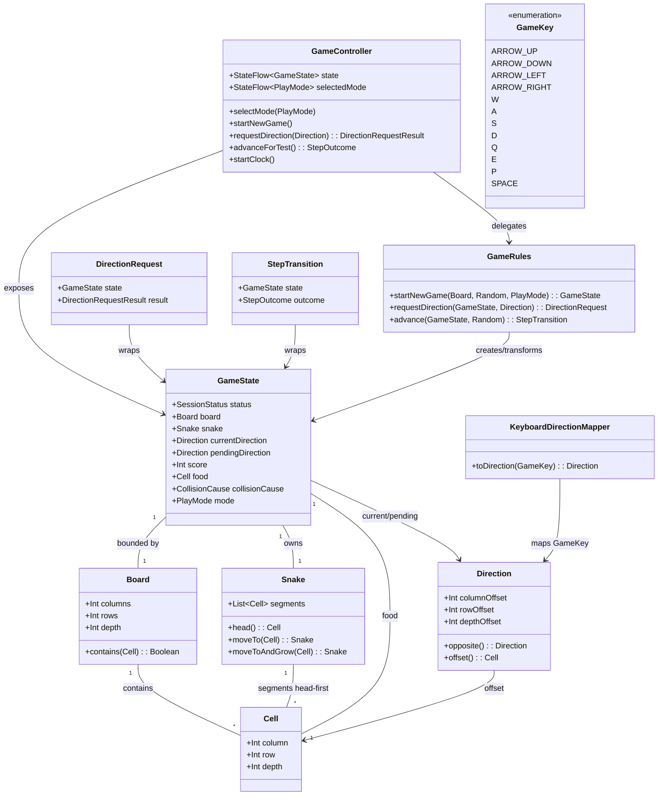

# STORY-002-002 Navigate and Score in 3D

## Requirements
- Enable controllable 3D navigation and scoring for an established Snake game without altering the existing 2D experience
- Make movement through depth understandable via responsive, target-appropriate controls (keyboard on desktop, visible touch controls)
- Preserve the familiar food → growth (+1 segment) → score (+10) loop and replacement-food invariant in three dimensions
- Deliver bounded 3D play with visibly distinguishable depth, snake, food, score, and valid movement options during normal play

## Entities

## Approach
1. Domain Extension:
   - Extend `Direction` with FORWARD (depth -1) and BACKWARD (depth +1) including `depthOffset`, `opposite()` pairing FORWARD↔BACKWARD, and `offset()` returning Cell with depth. Keep column/row offsets 0 for depth moves.
   - Existing `Cell(depth)` and `Board(depth)` already support 3D; default 3D board is 20x20x3, validation requires depth >=2 for THREE_D.

2. Rules and Controller Activation:
   - Remove the intentional 3D blocks: delete `IGNORED_UNSUPPORTED_MODE` guard in `GameRules.requestDirection` and `UNSUPPORTED_MODE` guard in `GameRules.advance`; delete THREE_D guard in `GameController.startClock`. Reuse the same pendingDirection, reversal (opposite), wall/self collision, food collection, and +10 scoring logic for all six directions.
   - Keep `GameRules` as single source of truth; no new rules class. Keep `Board.contains` and `randomUnoccupiedCell` (already iterates depth) unchanged.

3. Input and Presentation:
   - Add GameKey.Q and GameKey.E for depth axis (Q→FORWARD, E→BACKWARD); update `KeyboardDirectionMapper.toDirection` to cover six directions without aliasing P/SPACE pause.
   - Update `GameScreen.handleKeyboardEvent` to dispatch to `onDirection` for 3D directions (currently swallows); keep pause handling via P/SPACE. Wire `ThreeDControls` to `onDirection` like `DirectionControls`: enable buttons, pass `selectedDirection = state.pendingDirection`, highlight selected, change semantics to `Move forward/backward...` with Selected/Not selected stateDescription, remove disabled "Unavailable" text.
   - Preserve pendingDirection feedback: show "Turn accepted: <direction>" slot in ACTIVE for both modes. Keep `ThreeDSnakeBoard` layered rendering as-is; movement across layers provides visible depth distinguishability.

4. Business Logic:
   - Step semantics: effectiveDirection = pendingDirection ?: currentDirection; nextHead = head + offset; if food cell → moveToAndGrow + score+10 + replacement food on unoccupied cell; else moveTo; clear pendingDirection. Reversal rejected via `requested == currentDirection.opposite()` with IGNORED_REVERSAL.
   - Continuation: no input → advance uses last currentDirection (AC2). Replacement invariant: exactly one food, never on snake, inside board. Accumulation: n cycles add n segments and 10n points.

## Structure

### Inheritance Relationships
1. `Direction` enum defines six values (UP/DOWN/LEFT/RIGHT/FORWARD/BACKWARD) with offset and opposite behavior; `Cell`/`Board`/`Snake`/`GameState` remain data classes.
2. `GameRules` singleton object defines session invariants and transitions; `GameController` exposes StateFlow session state.
3. `KeyboardDirectionMapper` singleton maps `GameKey` to `Direction`; `GameKey` enum is the input abstraction.

### Dependencies
1. `GameScreen` calls `GameController.requestDirection` via `onDirection` callback and `GameRules` via controller.
2. `GameController` depends on `GameRules` for requestDirection/advance/startNewGame and on `MovementClock` for ticks; `GameRules` depends on `Direction`, `Board`, `Cell`, `Snake`, `GameState`.
3. `GameScreen` depends on `KeyboardDirectionMapper`/`GameKey` for key handling and on `GameState` for rendering ThreeDSnakeBoard/DirectionControls/ThreeDControls.

### Architecture Boundaries
1. Presentation/UI Boundary: `GameScreen`, `ThreeDSnakeBoard`, `ThreeDControls`/`DirectionControls` render mode-aware board, score, pending feedback, and dispatch direction intents; no business rules beyond mapping keys to Direction.
2. Application/Service Boundary: `GameRules` owns direction validation, reversal, pending gating, step advancement, food/score invariants; `GameController` owns lifecycle, generation-guarded clock, and StateFlow exposure. Both live in `commonMain` for cross-target consistency.
3. Persistence/Integration Boundary: Not touched (best-score persistence is out of scope per STORY-002-002 scope out).
4. Error-Handling Boundary: `DirectionRequestResult` (ACCEPTED/IGNORED_*) and `StepOutcome` (MOVED/FOOD_COLLECTED/etc.) are returned to controller/UI; no exceptions for valid gameplay rejections.

## Operations

### Update Model - Direction
1. Responsibility: Provide six-directional movement vocabulary with correct offsets and opposition.
2. Attributes: `columnOffset: Int`, `rowOffset: Int`, `depthOffset: Int` (private constructor params)
3. Methods:
   - `opposite(): Direction` — Logic: UP↔DOWN, LEFT↔RIGHT, FORWARD↔BACKWARD (exhaustive when)
   - `offset(): Cell` — Logic: return Cell(column=columnOffset, row=rowOffset, depth=depthOffset)
4. Constraints: FORWARD = (0,0,-1), BACKWARD = (0,0,1); existing four keep depth 0; exhaustive when coverage after addition.

### Update Input - GameKey
1. Responsibility: Represent keyboard keys including depth keys.
2. Attributes: enum values `ARROW_UP, ARROW_DOWN, ARROW_LEFT, ARROW_RIGHT, W, A, S, D, Q, E, P, SPACE`
3. Constraints: Q/E reserved for depth; P/SPACE remain pause-only.

### Update Input - KeyboardDirectionMapper
1. Responsibility: Map GameKey to Direction for keyboard targets.
2. Methods:
   - `toDirection(key: GameKey): Direction?` — Logic: ARROW_UP/W→UP, ARROW_DOWN/S→DOWN, ARROW_LEFT/A→LEFT, ARROW_RIGHT/D→RIGHT, Q→FORWARD, E→BACKWARD, P/SPACE→null; no other side effects.
3. Constraints: Single exhaustive when; null for non-direction keys.

### Update Rules - GameRules.requestDirection
1. Public Contract: `requestDirection(state: GameState, requested: Direction): DirectionRequest`
2. Core Behavior:
   - Input Validation: if status != ACTIVE → IGNORED_INACTIVE, return unchanged state.
   - Business Logic: if requested == state.currentDirection.opposite() → IGNORED_REVERSAL; else if state.pendingDirection != null → if same as requested → ACCEPTED (idempotent), else IGNORED_PENDING_TURN; else → state.copy(pendingDirection=requested) with ACCEPTED.
   - Note: Remove the `if (mode == THREE_D) return IGNORED_UNSUPPORTED_MODE` block entirely.
3. Dependencies: Direction.opposite, GameState
4. State Boundary: Pure function, no clock/side-effects.

### Update Rules - GameRules.advance
1. Public Contract: `advance(state: GameState, random: Random = Default): StepTransition`
2. Core Behavior:
   - Input Validation: if status != ACTIVE → NOT_ACTIVE.
   - Business Logic: effectiveDirection = pendingDirection ?: currentDirection; offset = effectiveDirection.offset(); nextHead = head + offset; if !board.contains(nextHead) → gameOver BOUNDARY; if nextHead in snake.segments → gameOver SELF_COLLISION; if nextHead == food → grownSnake=moveToAndGrow(nextHead), replacementFood=randomUnoccupiedCell (iterate depth 0..depth-1), if null → FOOD_COLLECTION_BLOCKED, else FOOD_COLLECTED with score+10, pendingDirection=null, currentDirection=effectiveDirection; else MOVED with moveTo.
   - Note: Remove the `if (mode == THREE_D) return UNSUPPORTED_MODE` block; reuse 2D path verbatim.
3. Dependencies: Board.contains, Snake.moveTo/moveToAndGrow, randomUnoccupiedCell
4. Constraints: Depth-aware offset already included; exactly one food maintained.

### Update Controller - GameController.startClock
1. Responsibility: Tick-driven advancement for ACTIVE sessions in both modes.
2. Core Behavior: Remove `state.value.mode == PlayMode.THREE_D` guard; keep closed/ACTIVE/isActive guards and generation capture. Logic: `if (closed || status != ACTIVE || movementJob?.isActive == true) return; generation=sessionGeneration; movementJob=scope.launch { movementClock.ticks(interval).collect { advanceForGeneration(generation) } }`
3. Dependencies: MovementClock, GameRules.advance via advanceForGeneration

### Update UI - GameScreen
1. Responsibility: Render distinguishable 3D space and expose six-direction controls with feedback.
2. Methods/Changes:
   - `ThreeDControls(selectedDirection: Direction?, onDirection: (Direction)->Unit)` — Logic: mirror DirectionControls but for six values: take Two rows (Up/Down/Left and Right/Forward/Backward or similar accessible grid), each button calls onDirection(controlToDirection); highlight when selectedDirection == mapped Direction; semantics contentDescription "Move <direction>" and stateDescription Selected/Not selected; enabled=true.
   - `ThreeDControlButton` — enable, remove "Unavailable until 3D movement is implemented" stateDescription.
   - ACTIVE branch: For THREE_D, show pending feedback Text "Turn accepted: <direction>" same as 2D (allocate slot, semantics "Accepted turn: ..."). Pass pendingDirection to ThreeDControls.
   - `handleKeyboardEvent` — Logic: if 3D, map key via KeyboardDirectionMapper.toDirection and call onDirection(direction) like 2D (instead of swallowing); preserve P/SPACE pause handling before direction mapping.
   - `Direction.label()` — add FORWARD→"Forward", BACKWARD→"Backward" (or reuse threeDControlLabel) for semantics labels.
   - `controlHint` — keep "3D controls: Up, Down, Left, Right, Forward, Backward" for THREE_D.
   - `Key.toGameKey()` — add Key.Q→GameKey.Q, Key.E→GameKey.E.
3. Constraints: No new rendering library; keep ThreeDSnakeBoard layered offset rendering; maintain contentDescription semantics for accessibility.

## Norms
1. Framework Metadata: Kotlin Multiplatform commonMain; no annotations needed. Keep Compose UI changes in `composeApp/src/commonMain/kotlin/com/example/snake/game/ui/GameScreen.kt`.
2. Dependency Management: Constructor injection via GameController; StateFlow for selectedMode/state; MovementClock injected for testability.
3. Error Handling: Use `DirectionRequestResult` (ACCEPTED, IGNORED_INACTIVE, IGNORED_REVERSAL, IGNORED_PENDING_TURN) and `StepOutcome` (MOVED, FOOD_COLLECTED, BOUNDARY_COLLISION, SELF_COLLISION, etc.) — do not throw for expected rejections; handle at UI by ignoring and preserving current direction.
4. Data Validation: `GameState` and `Board` require checks remain (score>=0, food inside board and not on snake, depth constraints). Validate via `require` in model init.
5. Logging: No new logging required; keep existing behavior.
6. Documentation Standards: Keep KDoc on GameRules.startNewGame; add concise comment on Direction depth axis (FORWARD depth -1, BACKWARD depth +1).

## Safeguards
1. Functional Constraints: Exactly one food item always; snake grows exactly one segment per food; score increases exactly 10 per food; movement is exactly one cell per step; reversal requests are ignored without ending session; pendingDirection gating allows at most one queued turn.
2. Performance Constraints: Movement tick interval 150ms (DEFAULT_MOVEMENT_INTERVAL_MILLIS) must remain; direction request handling must be synchronous and immediate for steering responsiveness.
3. Security Constraints: No network/account; local-only session; no sensitive data exposure.
4. Integration Constraints: Common code must behave identically on desktop, Android, and Wasm; input mappings via GameKey/KeyboardDirectionMapper shared across targets; touch and keyboard both produce same Direction values.
5. Business Rule Constraints: 3D session default board 20x20x3, centered head at (columns/2, rows/2, depth/2), body extending left (-1, -2 column) at same depth; score starts 0; food unoccupied; mode fixed during ACTIVE session (handled by prior story).
6. Error Handling Constraints: IGNORED_* and NOT_ACTIVE/FOOD_COLLECTION_BLOCKED are not errors to display; GAME_OVER collisions are handled as state transitions with collisionCause, but game-over presentation/restart remain out of scope for this story — do not add restart/pause/best-score logic.
7. Technical Constraints: Do not introduce new data layer, persistence, or rendering dependencies; reuse existing Board/Cell/Snake/GameState/SnakeBoard patterns; update exhaustive when branches for Direction after extending.
8. Data Constraints: Cell coordinates non-negative and < Board dimensions; Board depth 1 for TWO_D, >=2 for THREE_D; food must satisfy Board.contains and not in snake.segments.
9. API/Boundary Constraints: Keyboard Q/E for FORWARD/BACKWARD, P/SPACE for pause, WAD/Arrows for planar; touch ThreeDControls provide all six directions; contentDescription must include "Move <direction>" and "Bounded ... 3D snake space ..." for accessibility; selected stateDescription must be "Selected"/"Not selected".
